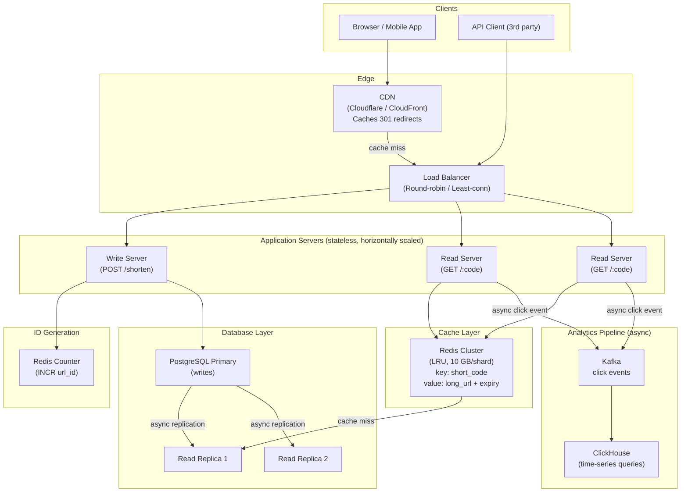
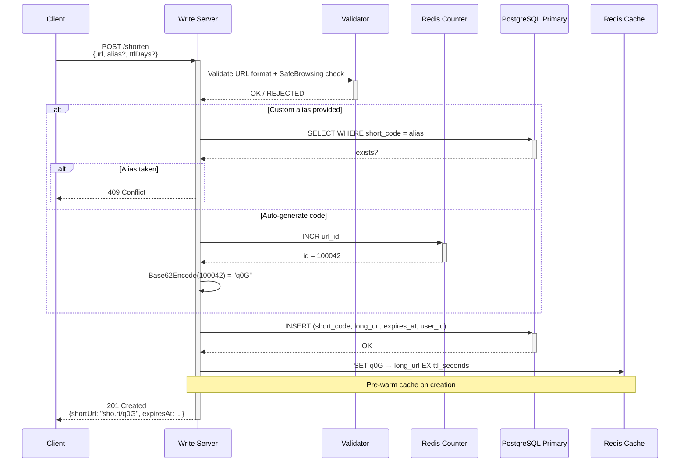
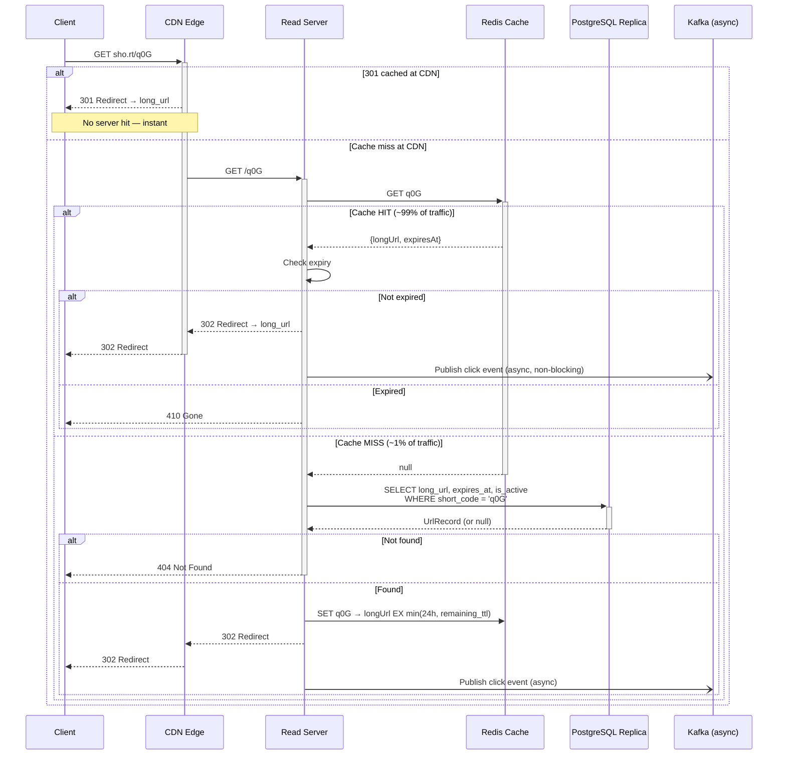
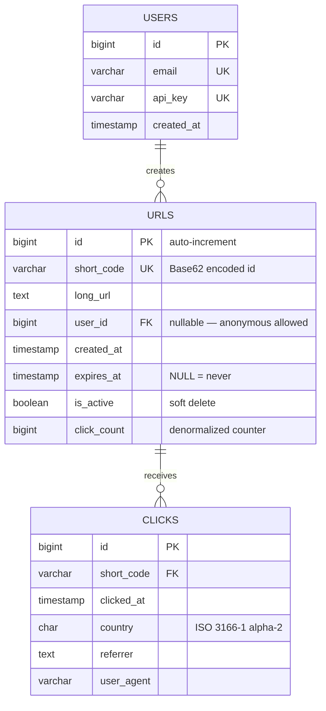
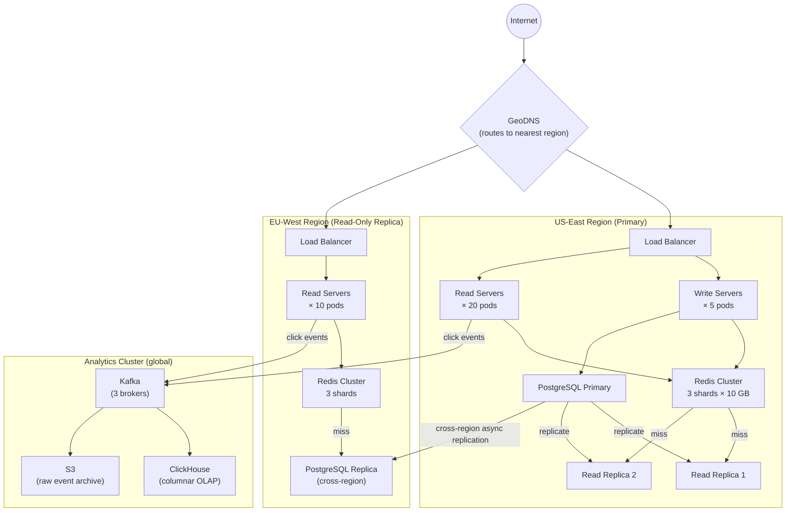

# URL Shortener — Architecture Diagrams

---

## 1. High-Level System Architecture



---

## 2. Write Path — Create Short URL



---

## 3. Read Path — Redirect



---

## 4. Data Model



---

## 5. Scaled-Out Architecture (Production)



---

## 6. Base62 Encoding Visual

```
Auto-increment ID → Base62 → Short Code

ID        Base10    Base62 (7 chars, zero-padded)
──────────────────────────────────────────────────
1         1         0000001
1,000     1,000     0000G8
62        62        000000Z   ← one rollover
3,844     3,844     0000100   ← 62^2
100,000   100,000   000q0G
1,000,000 1,000,000 004c92
3.5T      3.5×10¹²  zzzzzzz   ← 7-char max

Alphabet: 0123456789abcdefghijklmnopqrstuvwxyzABCDEFGHIJKLMNOPQRSTUVWXYZ
```

---

## 7. Cache Flow Decision Tree

```
GET /:code
    │
    ▼
Redis.GET(code)
    │
    ├── HIT ──► check expiry ──► expired? ──► 410 Gone
    │                    │
    │                    └──► valid ──► 302 Redirect ──► async log click
    │
    └── MISS
            │
            ▼
        DB.SELECT(code)
            │
            ├── NOT FOUND ──► 404
            │
            ├── FOUND + expired ──► 410 Gone
            │
            └── FOUND + valid
                    │
                    ▼
                Redis.SET(code, url, EX = min(86400, remaining_seconds))
                    │
                    ▼
                302 Redirect ──► async log click
```
