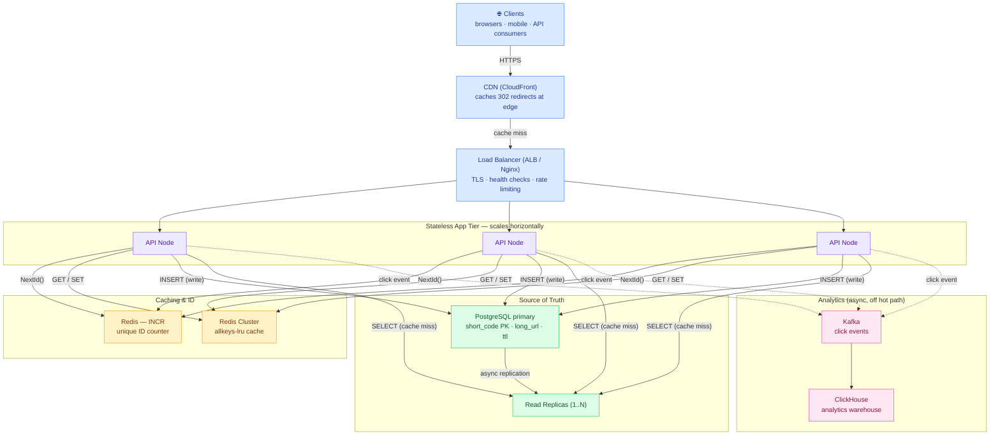
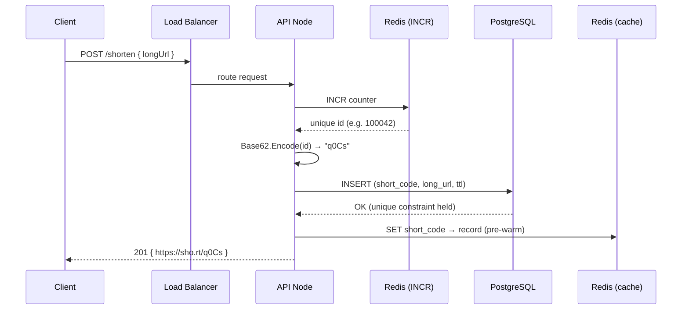
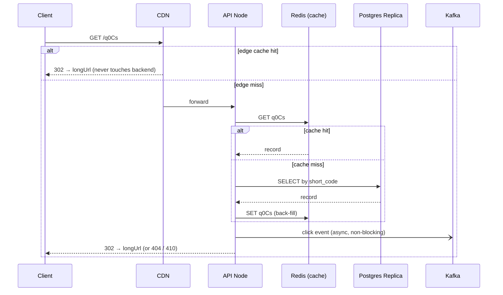

# URL Shortener — High-Level Design (System Architecture)

This is the **system-level** view: the production infrastructure (load balancers, Redis,
Postgres, Kafka, CDN). For the class-level view see [LLD.md](LLD.md); for the
code-component view see [Architecture.excalidraw](Architecture.excalidraw).

> **How to view the diagrams below:** open this file in VS Code's Markdown preview
> (`Cmd+Shift+V`). If they don't render, install the **Markdown Preview Mermaid Support**
> extension (`bierner.markdown-mermaid`). They also render automatically on GitHub.

---

## System Architecture

---

## ① Shorten (write path) — `POST /shorten`

## ② Redirect (read path) — `GET /{code}`  ·  ~99% of traffic

---

## Why each component exists

| Component | Role | Maps to in code |
|-----------|------|-----------------|
| **CDN** | Cache 302s at the edge; absorb read spikes for viral links | *(prod-only)* |
| **Load Balancer** | Spread load, TLS termination, rate-limit | *(prod-only)* |
| **API Nodes** | Stateless app servers; scale horizontally | `UrlShortenerService` |
| **Redis (ID gen)** | Atomic `INCR` for collision-free unique IDs | `IdGenerator` |
| **Redis (cache)** | `allkeys-lru`; serve hot redirects without a DB hit | `LruCache` |
| **PostgreSQL** | Durable source of truth; unique constraint on `short_code` | `UrlRepository` |
| **Read replicas** | Scale read throughput on cache miss | *(single store in demo)* |
| **Kafka → ClickHouse** | Async analytics, kept off the redirect hot path | `ClickAnalytics` |

## Key HLD design decisions

- **Read : Write ≈ 100 : 1** → optimize hard for reads: CDN + cache-first, replicas for the rest.
- **Cache-aside pattern** → app checks Redis, falls back to Postgres, back-fills cache.
  Pre-warmed on write so the very first redirect is already a hit.
- **Analytics is async** → clicks publish to Kafka and never block the 302. A redirect stays
  fast even if the analytics pipeline is down.
- **Centralized ID generation** (Redis `INCR`) → guarantees global uniqueness. At extreme
  scale, shard the counter or switch to a Snowflake-style generator.
- **Stateless app tier** → any node serves any request; all state lives in Redis / Postgres,
  so scaling out is just adding nodes behind the load balancer.

## Capacity sketch (back-of-envelope)

| Metric | Estimate |
|--------|----------|
| New URLs | ~100 M / day → ~1,160 writes/sec |
| Redirects | ~10 B / day → ~115 K reads/sec (100:1 ratio) |
| Code space | Base62, 7 chars = 62⁷ ≈ 3.5 trillion codes (~96 yrs of headroom) |
| Storage | ~500 bytes/row × 100 M/day ≈ 50 GB/day → cold-tier old links |
