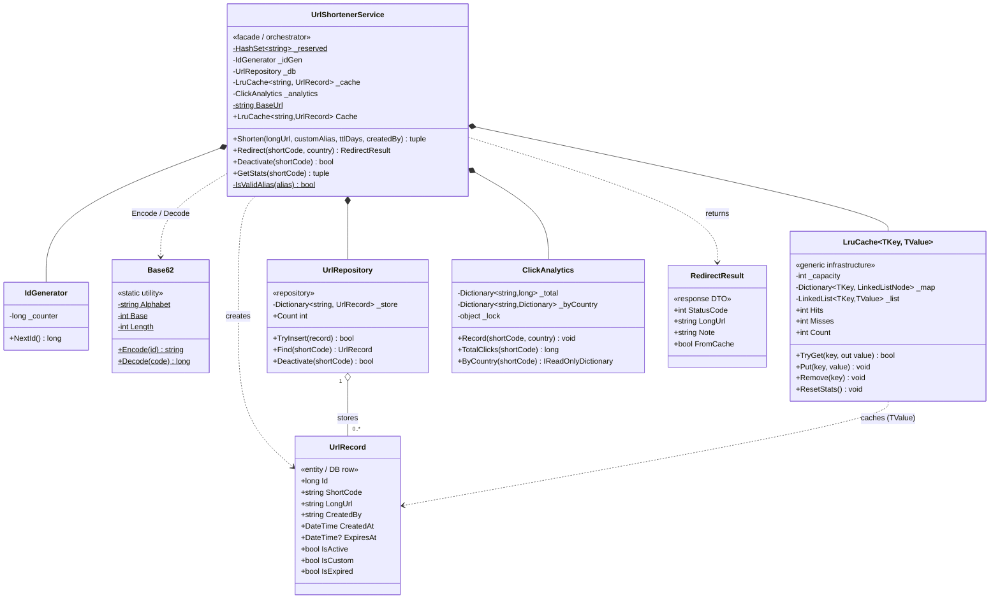

# URL Shortener — Low-Level Design (UML Class Diagram)

This is the **class-level** view of the URL Shortener. For the high-level component/data-flow
view, see [Architecture.excalidraw](Architecture.excalidraw).

> **How to view the diagram below:** open this file in VS Code's Markdown preview
> (`Cmd+Shift+V`). If the diagram doesn't render, install the
> **Markdown Preview Mermaid Support** extension (`bierner.markdown-mermaid`).
> It also renders automatically on GitHub.

---

## Class Diagram



---

## Reading the relationships

| Notation | Relationship | In this design |
|----------|--------------|----------------|
| `*--`  | **Composition** (owns, shared lifetime) | `UrlShortenerService` `new`s `IdGenerator`, `UrlRepository`, `ClickAnalytics`, and `LruCache` in its constructor. When the service dies, they die. |
| `..>`  | **Dependency** (uses, no stored field) | The service calls `Base62.Encode/Decode` statically; it *creates* `UrlRecord`s and *returns* `RedirectResult`s. |
| `o--`  | **Aggregation** (holds, independent lifetime) | `UrlRepository` holds `0..*` `UrlRecord`s in its `_store` dictionary. |

## Stereotype roles (the "why" behind each class)

- **`UrlShortenerService` — Facade.** The single public entry point. Controllers/CLI talk only to
  this; the four collaborators are private. This is what keeps the API surface small.
- **`Base62` — Static utility.** Pure functions, zero state → no instance needed, trivially testable.
- **`UrlRepository` — Repository.** Hides persistence behind `TryInsert/Find/Deactivate`. Swap the
  backing `Dictionary` for PostgreSQL and nothing above it changes.
- **`LruCache<TKey,TValue>` — Generic infrastructure.** Domain-agnostic and reusable; the `Dictionary
  + LinkedList` pairing is what buys O(1) `Get` *and* O(1) eviction.
- **`UrlRecord` vs `RedirectResult` — Entity vs DTO.** Deliberate split between *what is stored*
  (the full row) and *what is returned to the caller* (just status + destination).

## Call flow at a glance

```
Shorten():    IdGenerator.NextId ─▶ Base62.Encode ─▶ UrlRepository.TryInsert ─▶ LruCache.Put
Redirect():   LruCache.TryGet ──hit──▶ ClickAnalytics.Record ─▶ 302
                     └─────miss─▶ UrlRepository.Find ─▶ LruCache.Put ─▶ ClickAnalytics.Record ─▶ 302
Deactivate(): LruCache.Remove ─▶ UrlRepository.Deactivate (soft-delete) ─▶ 410 on next read
```
