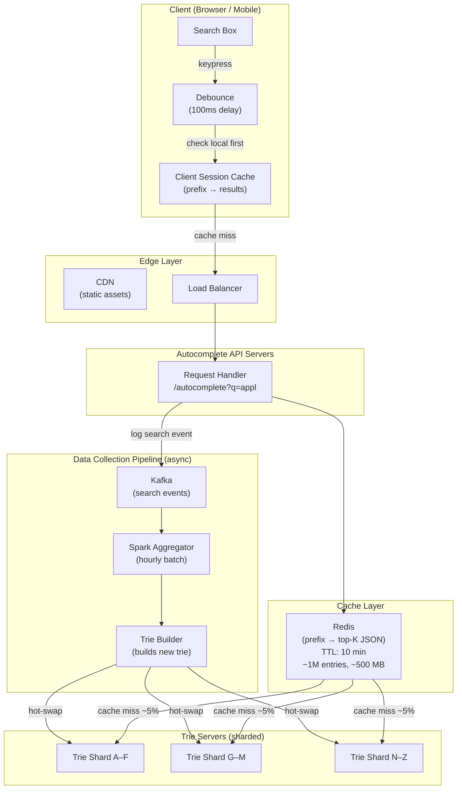
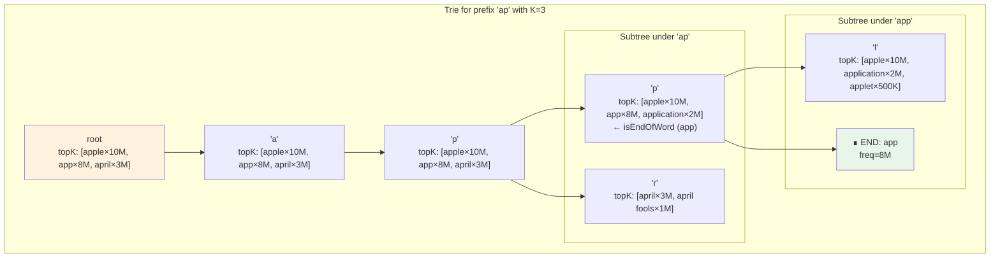
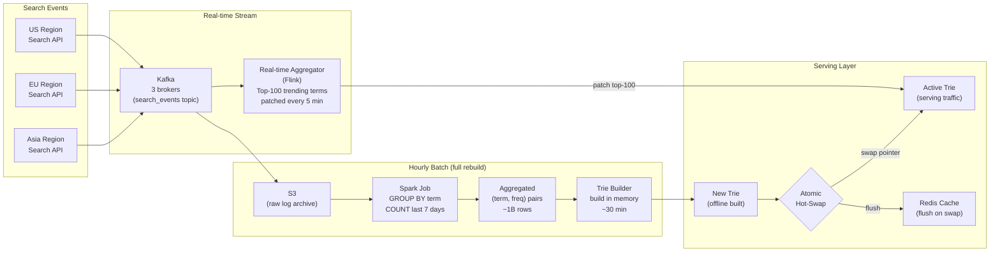
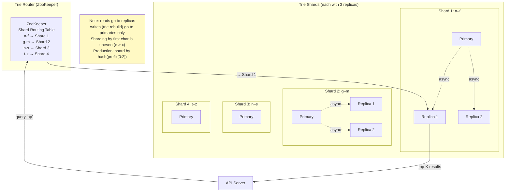

# Search Autocomplete — Architecture Diagrams

---

## 1. High-Level System Architecture



---

## 2. Trie Node Structure (Pre-computed Top-K)



```
Query: Search("ap")
  Walk: root → ['a'] → ['p']
  Return ['p'].topK = [apple×10M, app×8M, april×3M]
  Cost: O(2) = O(prefix_length) — no subtree traversal needed!

Without pre-computed topK:
  Walk: root → ['a'] → ['p']
  DFS entire subtree to collect all words
  Sort → take top K
  Cost: O(prefix_length + subtree_size × log subtree_size) — slow at scale
```

---

## 3. Typeahead Request Flow (User Types "app")

```mermaid
sequenceDiagram
    participant U as User
    participant B as Browser
    participant CC as Client Cache
    participant LB as Load Balancer
    participant API as API Server
    participant Redis as Redis Cache
    participant Trie as Trie Server

    U->>B: types 'a'
    B->>B: debounce timer starts (100ms)

    U->>B: types 'p' (within 100ms)
    B->>B: reset debounce timer

    U->>B: types 'p' (within 100ms)
    B->>B: reset debounce timer

    Note over B: 100ms passes — send request

    B->>CC: check cache for "app"
    CC-->>B: MISS (first time)

    B->>+LB: GET /autocomplete?q=app
    LB->>+API: route request

    API->>+Redis: GET "app"
    alt Cache HIT (95% of traffic)
        Redis-->>API: [apple, app store, application, ...]
        API-->>LB: 200 OK — results
        LB-->>B: results
        B->>CC: store "app" → results
        B-->>-U: display 5 suggestions (< 10ms)
    else Cache MISS (5% of traffic)
        Redis-->>-API: null
        API->>+Trie: lookup("app")
        Trie-->>-API: topK from trie node
        API->>Redis: SET "app" results EX 600
        API-->>LB: 200 OK — results
        LB-->>-B: results
        B->>CC: store "app" → results
        B-->>U: display 5 suggestions (< 100ms)
    end

    Note over B,CC: User backspaces to "ap"
    B->>CC: check cache for "ap"
    CC-->>B: HIT (was cached this session) — instant!
    B-->>U: display suggestions instantly (0ms)
```

---

## 4. Data Collection and Trie Update Pipeline



---

## 5. Distributed Trie Sharding



---

## 6. Ranking Score Calculation

```
For each completion candidate:

  score = base_frequency
        × recency_multiplier      (1.0 for today, 0.5 for 7 days ago)
        × personalization_boost   (2.0 if user searched this before)
        × trending_boost          (1.5 if search rate doubled last hour)

Example: user types "py"
  Candidate          base_freq   recency   personal  trending   score
  ─────────────────────────────────────────────────────────────────────
  python             5,000,000   1.0       1.0       1.0        5,000,000
  python tutorial    3,000,000   1.0       2.0       1.0        6,000,000  ← user searched before
  python download    2,000,000   1.0       1.0       1.5        3,000,000  ← trending
  pypi               1,500,000   1.0       1.0       1.0        1,500,000
  pytorch            1,000,000   1.0       1.0       1.0        1,000,000

  Ranking: python tutorial > python > python download > pypi > pytorch
```

---

## 7. Cache Decision Tree

```
GET /autocomplete?q={prefix}
    │
    ▼
Client session cache?
    ├── HIT  → return instantly (0ms, no network)
    └── MISS
            │
            ▼
        Redis.GET(prefix)
            ├── HIT  → return results (< 1ms)
            └── MISS
                    │
                    ▼
                Route to correct Trie shard
                    │
                    ▼
                Walk trie O(prefix_length)
                    │
                    ▼
                Return node.topK
                    │
                    ├──→ Redis.SET(prefix, results, EX 600)
                    └──→ return to client (< 5ms trie, < 10ms total)
```
