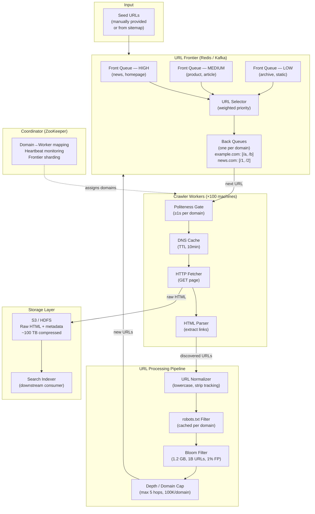
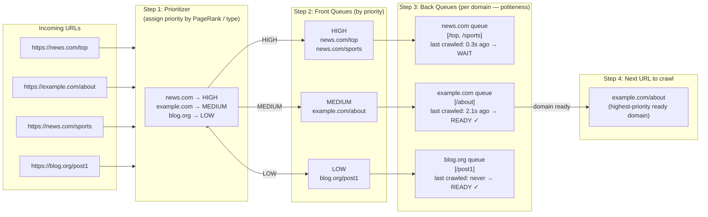
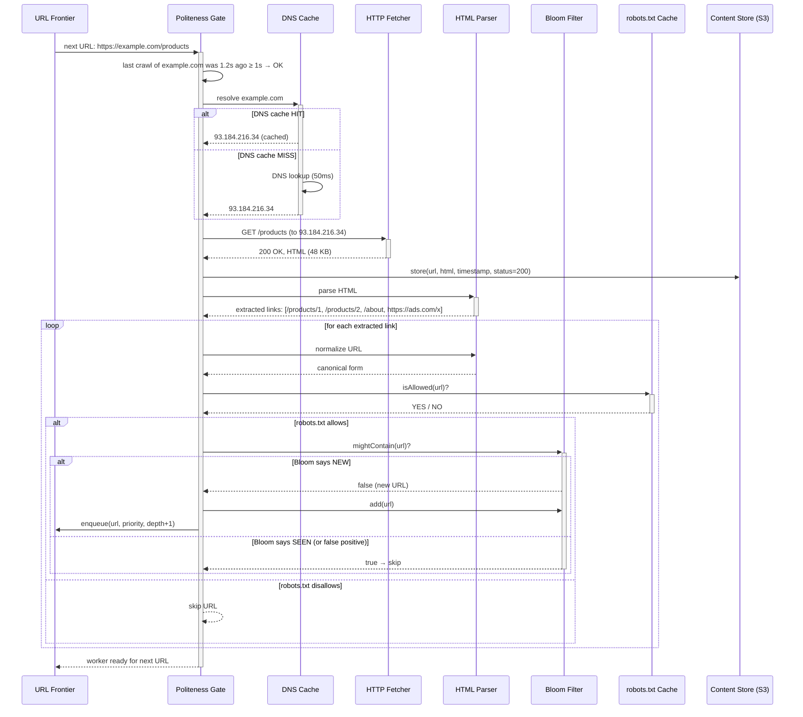
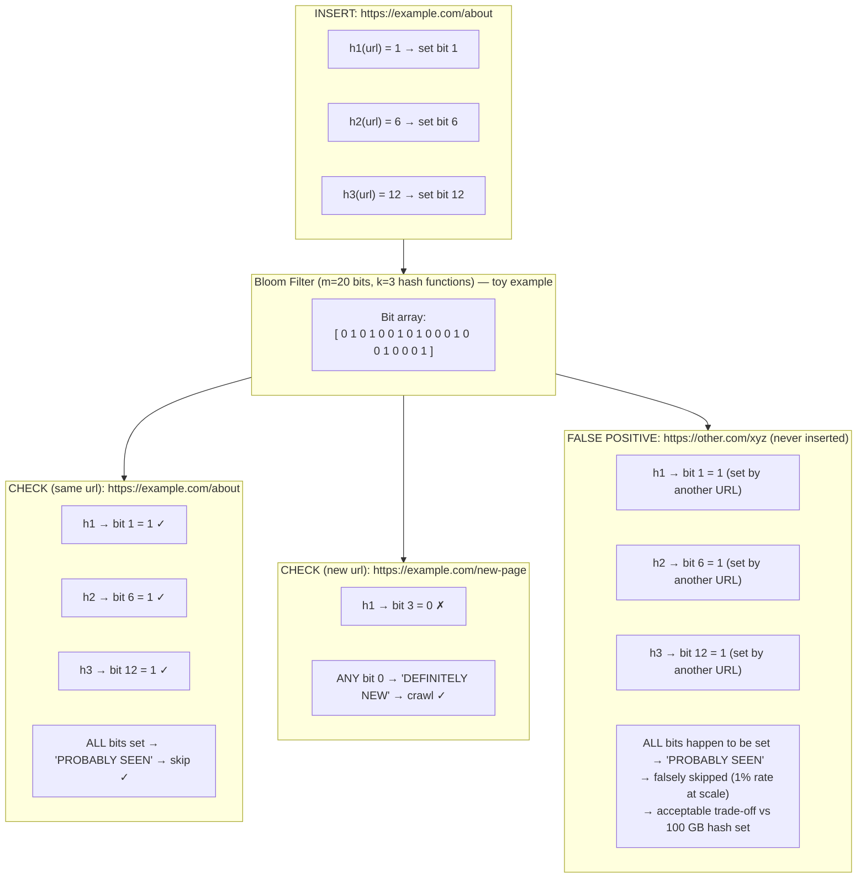
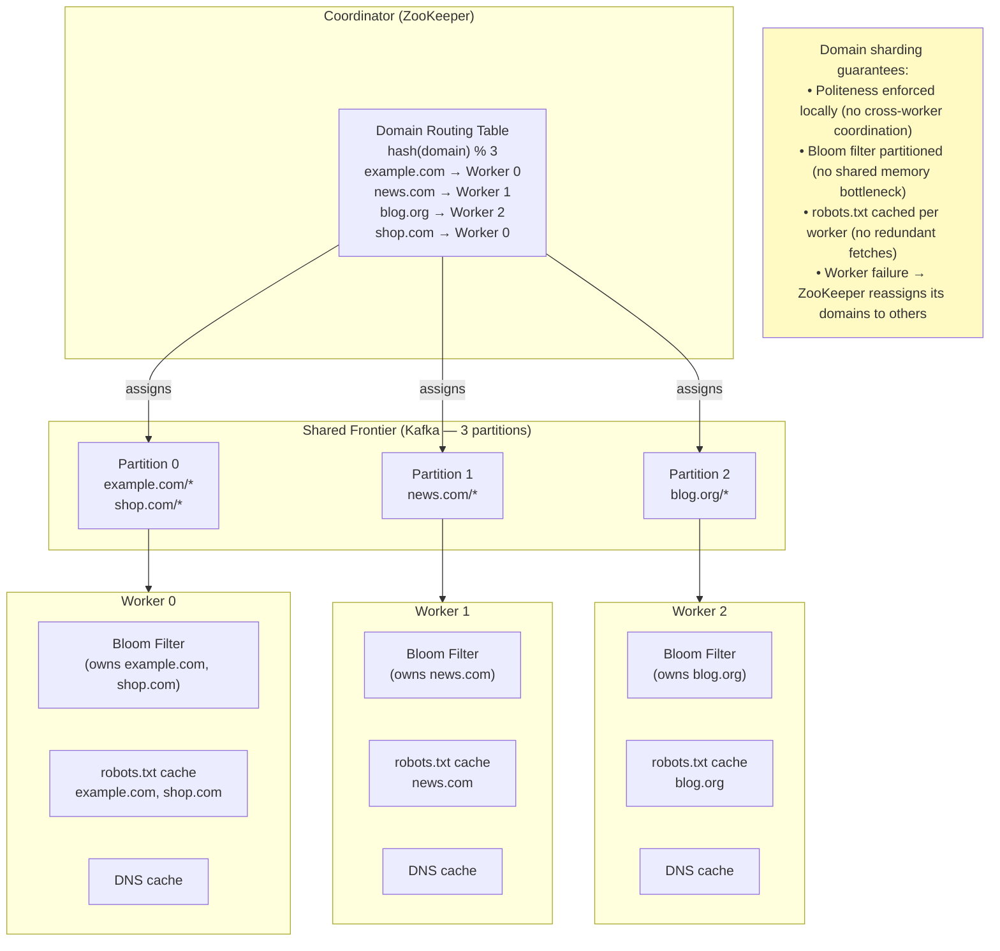
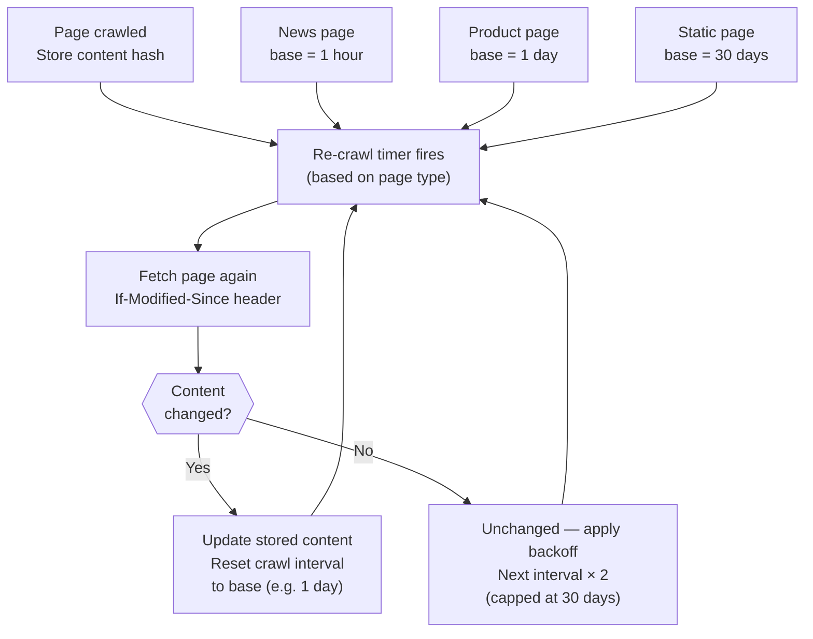

# Web Crawler — Architecture Diagrams

---

## 1. High-Level System Architecture

---

## 2. URL Frontier — Two-Level Queue Deep Dive

---

## 3. Crawl Loop — Single Worker Sequence

---

## 4. Bloom Filter — How Deduplication Works

---

## 5. Distributed Crawling — Domain Sharding

---

## 6. URL Normalization Pipeline

```mermaid
flowchart LR
    Raw["Raw URL from HTML\nHTTP://Example.COM:80/Page?b=2&a=1&utm_source=email#top"]

    Step1["1. Lowercase scheme + host\nhttp://example.com:80/Page?b=2&a=1&utm_source=email#top"]
    Step2["2. Remove default port\nhttp://example.com/Page?b=2&a=1&utm_source=email#top"]
    Step3["3. Remove fragment\nhttp://example.com/Page?b=2&a=1&utm_source=email"]
    Step4["4. Remove tracking params\nhttp://example.com/Page?b=2&a=1"]
    Step5["5. Sort query params\nhttp://example.com/Page?a=1&b=2"]
    Step6["6. Lowercase path\nhttp://example.com/page?a=1&b=2"]
    Canonical["Canonical URL\nhttp://example.com/page?a=1&b=2\n→ Bloom filter check"]

    Raw --> Step1 --> Step2 --> Step3 --> Step4 --> Step5 --> Step6 --> Canonical
```

---

## 7. Freshness — Re-crawl Decision

