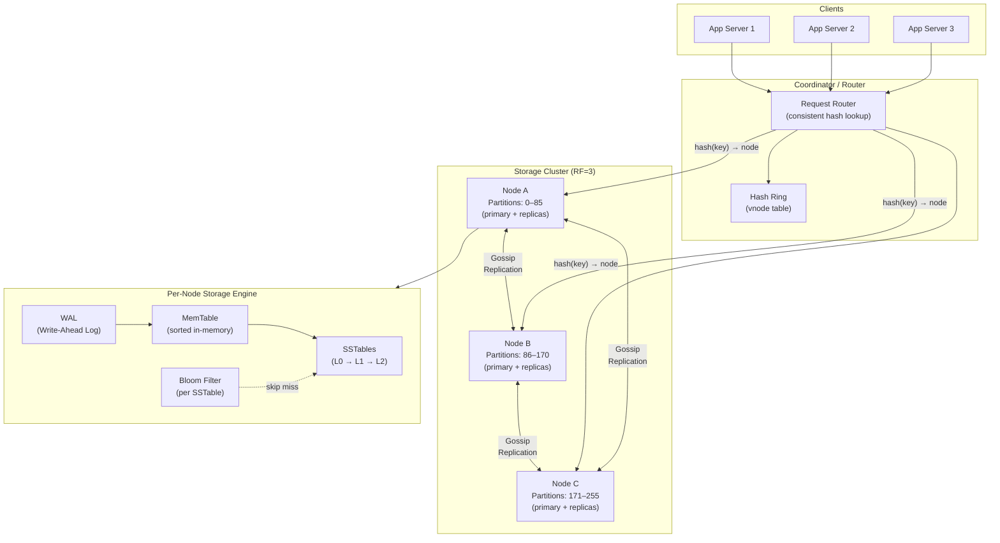
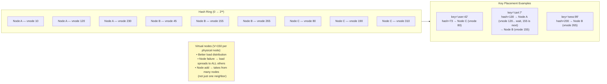
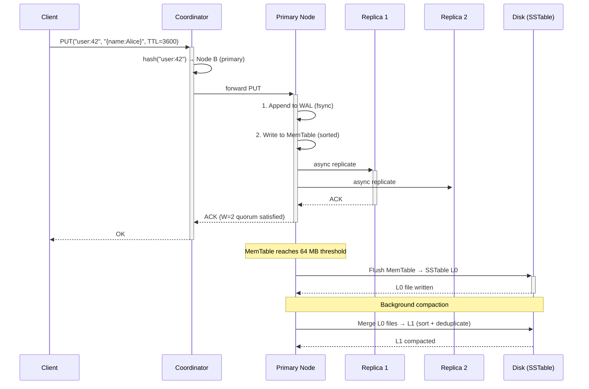
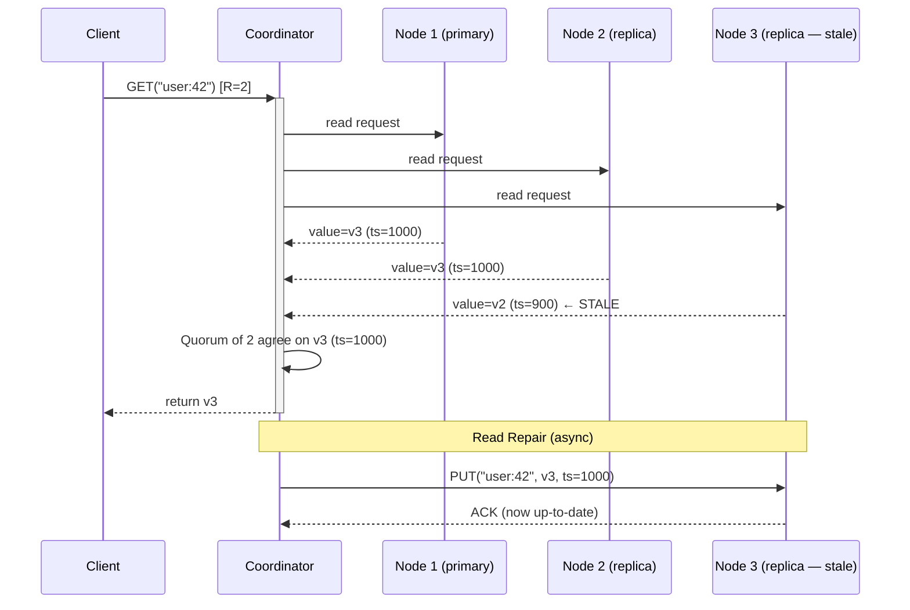
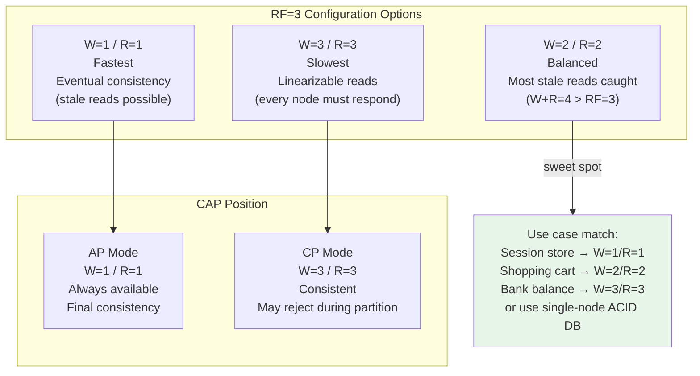
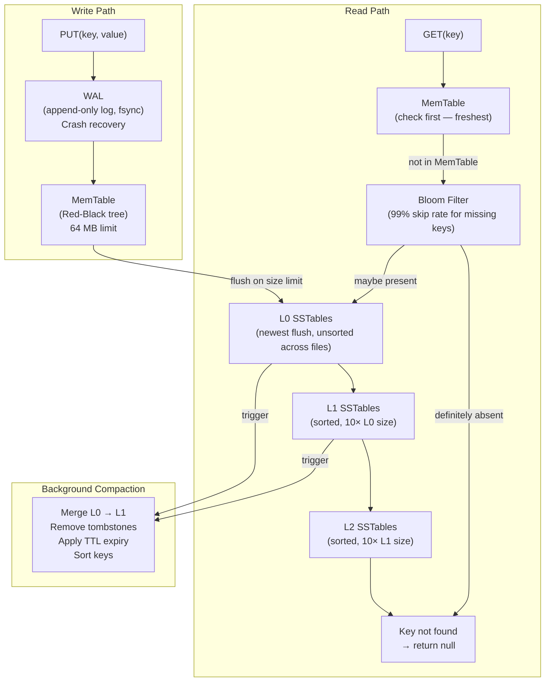
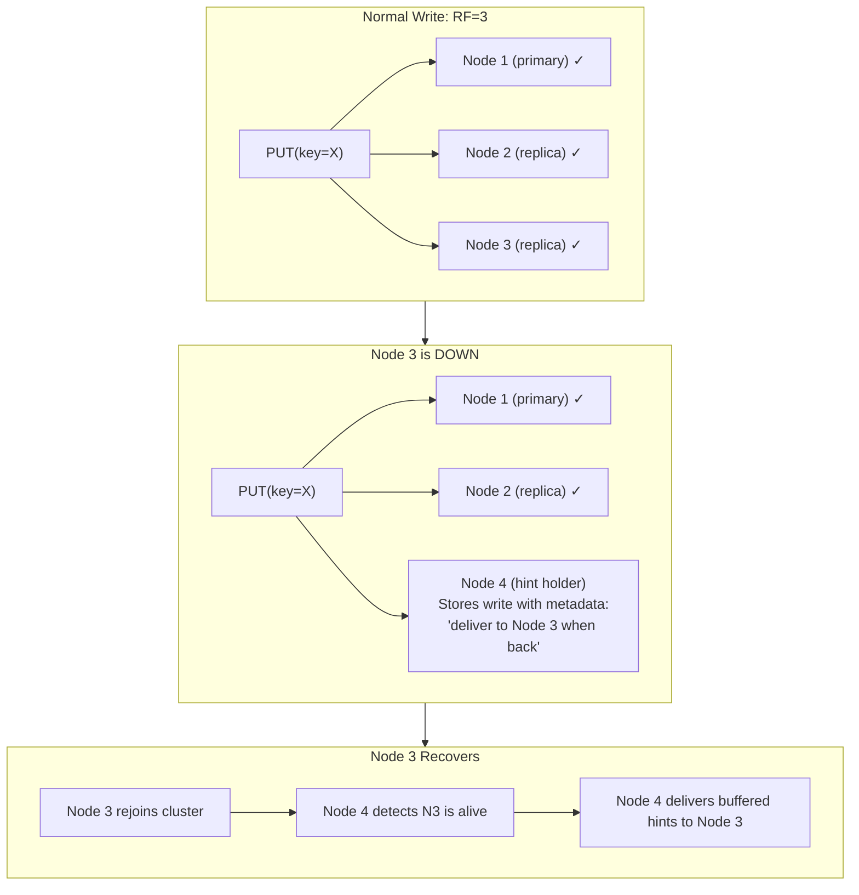

# Distributed KV Store — Architecture Diagrams

---

## 1. High-Level System Architecture



---

## 2. Consistent Hashing Ring



---

## 3. Write Path — LSM Tree



---

## 4. Read Path — Quorum Read with Read Repair



---

## 5. Replication — Quorum vs Consistency Trade-off



---

## 6. Node Storage Engine — LSM Layers



---

## 7. Failure Detection — Gossip Protocol

```mermaid
sequenceDiagram
    participant A as Node A
    participant B as Node B
    participant C as Node C
    participant D as Node D (failing)

    Note over A,D: Normal operation — every 3s
    A->>B: gossip({A:alive@t=100, D:alive@t=97})
    B->>C: gossip({A:alive@t=100, B:alive@t=100, D:alive@t=97})
    C->>A: gossip({B:alive@t=100, C:alive@t=100, D:alive@t=97})

    Note over D: Node D crashes (t=100)

    A->>B: gossip({A:alive@t=103, D:alive@t=97})
    Note over A,B: D not heard from for 9s (3×T) → suspect
    B->>C: gossip({D:suspect@t=109})
    C->>A: gossip({D:suspect@t=109})

    Note over A,B,C: After 2 more rounds without D → mark DOWN
    A->>A: Reassign D's partitions\n(hinted handoff activated)
```

---

## 8. Hinted Handoff — Write During Node Failure


