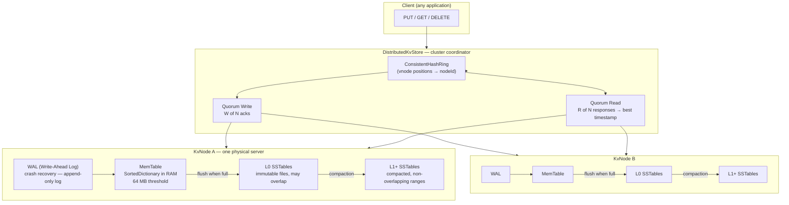
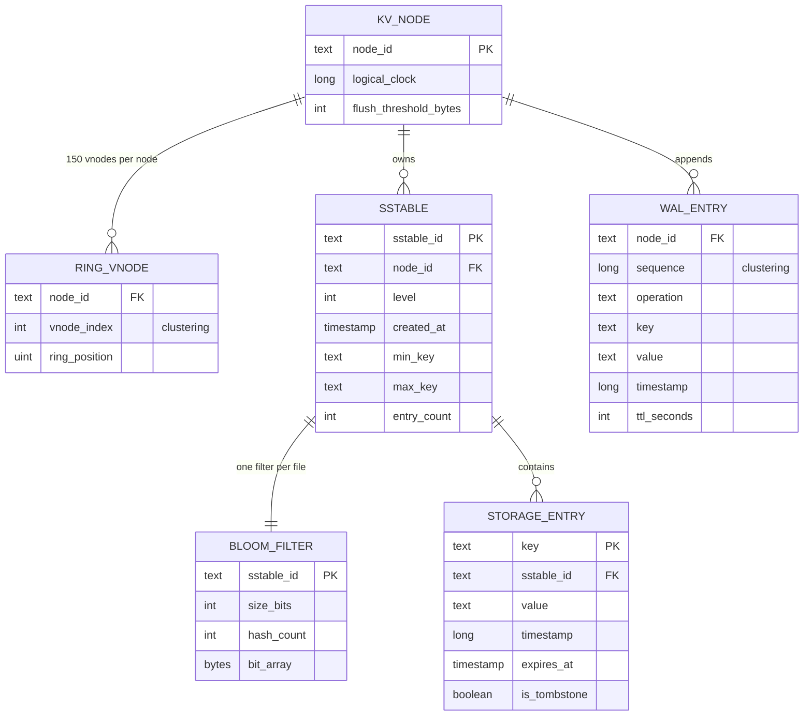
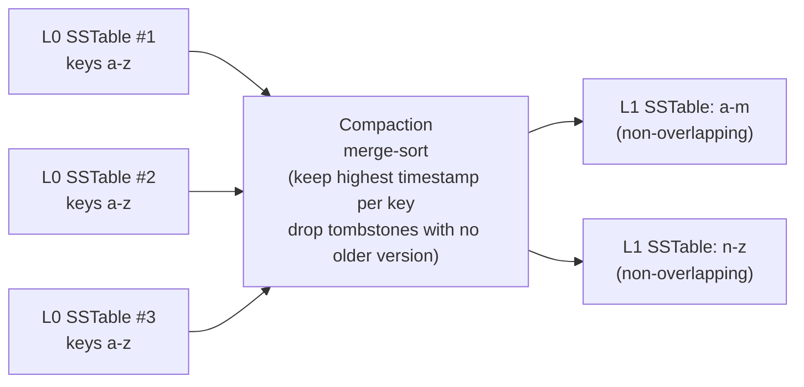

# Distributed KV Store — Storage Design

This document is different from the other `DB_DESIGN.md` files in this repo. Those projects
**use** external databases (Cassandra, Redis). This project **is** a database — a distributed
key-value store built on LSM Trees and consistent hashing. So this document covers the
**internal storage design**: what data structures live where, what gets written to disk, and
how the cluster coordinates.

---

## Storage layer map



---

## Core data model — the `StorageEntry` schema

Every key the store holds is wrapped in a `StorageEntry`. This is the universal record format
at every tier (MemTable, SSTable, WAL). The **key** is stored separately as the dictionary /
file lookup term; the entry is the value side.

| Field | Type | Nullable | Purpose |
|-------|------|----------|---------|
| `Value` | string | yes (null for tombstones) | The user-visible payload |
| `Timestamp` | long | no | Logical clock tick assigned at write time — the conflict-resolution key |
| `ExpiresAt` | DateTime? | yes | TTL deadline (absolute). `null` = live forever. Checked lazily on read |
| `IsTombstone` | bool | no | `true` means "this key was deleted". The null-value sentinel propagated through compaction |

**Entry lifecycle:**
```
PUT  "user:1" = "Alice"  TTL=3600s
  → StorageEntry { Value="Alice", Timestamp=42, ExpiresAt=now+3600s, IsTombstone=false }

PUT  "user:1" = "Bob"                     ← overwrite — new entry with higher timestamp
  → StorageEntry { Value="Bob",  Timestamp=43, ExpiresAt=null,       IsTombstone=false }

DELETE "user:1"
  → TombstoneEntry { Value=null,  Timestamp=44, ExpiresAt=null,      IsTombstone=true  }
```

A tombstone is never a missing key — it is an **explicit record of deletion** that travels
through the system just like a value, overwriting any older version it encounters.

---

## ER Diagram



---

## Per-node storage: MemTable (RAM tier)

```
Structure:   SortedDictionary<string key, StorageEntry>
Threshold:   64 MB in production (1 KB in this demo)
Contents:    the N most recent writes that have not yet been flushed to disk
```

**Why `SortedDictionary` (not `Dictionary`)?**
Flushing to SSTable requires writing entries in sorted key order so the SSTable can be
binary-searched. A `SortedDictionary` (red-black tree) keeps entries sorted at all times —
O(log N) per insert — so flush is a free sequential scan. An unsorted structure would pay
O(N log N) to sort at every flush.

**Runtime snapshot (3 writes, 1 KB demo threshold):**
```
_data = {
    "rate:user:42"  → { Value="5",     Timestamp=3, ExpiresAt=2026-06-08T16:00:00, IsTombstone=false }
    "user:1"        → { Value="Bob",   Timestamp=2, ExpiresAt=null,                IsTombstone=false }
    "user:1"        → TombstoneEntry   Timestamp=4   ← delete received after overwrite
}
_sizeBytes ≈ 800    ShouldFlush = false   (threshold=1024)

Next write crosses 1024 → FlushMemTable() seals this as an L0 SSTable → _data.Clear()
```

**Logical clock (not wall clock):**
Every write increments a per-node counter (`Interlocked.Increment`). This guarantees
strict ordering on one node without needing synchronized clocks. In production, nodes
exchange their clocks on gossip messages and advance to `max(local, received)` — a
Hybrid Logical Clock (HLC) that is both monotone and roughly wall-clock-aligned.

---

## Per-node storage: SSTable (disk tier)

SSTables are **immutable sorted files** written once when the MemTable flushes. The demo
simulates them as `SortedDictionary` instances in memory. In production each SSTable is a
file on disk with this layout:

```
┌────────────────────────────────────┐
│  Data Blocks  (variable size)      │  sorted (key, StorageEntry) pairs
│  block_0 | block_1 | block_2 | ... │  each block ≈ 4 KB, compressed (Snappy/LZ4)
├────────────────────────────────────┤
│  Index Block                       │  one entry per data block:
│  (first_key_in_block → byte_offset)│  enables O(log B) binary search to the right block
├────────────────────────────────────┤
│  Bloom Filter Block                │  100 000-bit array, 7 hash functions
│  (bit_array for all keys)          │  false-positive rate ≈ 0.8% at 10K keys
├────────────────────────────────────┤
│  Footer  (fixed 48 bytes)          │  byte offsets of: index block, bloom filter block
└────────────────────────────────────┘
```

**Two-step lookup:**
1. **Bloom filter** (in RAM, loaded on SSTable open): `MightContain(key)` → if false, skip
   this entire file. Zero disk I/O. In the demo, ~99% of "key not in this SSTable" probes
   return false here, skipping the simulated dictionary lookup.
2. **Binary search on index block**: find the data block range for the key, read it,
   binary-search within. O(log N) I/O, not O(N).

**Levels:**

| Level | Written by | Key-range overlap? | Search strategy |
|-------|-----------|-------------------|----------------|
| L0 | MemTable flush | Yes (multiple L0 files may have the same key) | All L0 files searched newest→oldest |
| L1 | Compaction from L0 | No (L1 files have disjoint ranges) | Binary search to find the ONE file that could hold the key |
| L2+ | Compaction from L1 | No | Same — one file per level |

Reading searches L0 (all files, newest→oldest) then L1 (one file), L2 (one file), ... The
first hit wins. Bloom filters make most levels skip in O(1).

---

## Per-node storage: Bloom filter parameters

Each SSTable carries one Bloom filter built at flush time, never updated (immutability):

```
Size:           100 000 bits  (≈ 12.5 KB per SSTable — negligible RAM cost)
Hash functions: 7
Expected keys:  ~10 000 per SSTable
False-positive: ≈ (1 − e^(−k·n/m))^k ≈ (1/2)^7 ≈ 0.78%
```

**Formula for optimal hash count:** `k = (m/n) × ln2 = (100 000 / 10 000) × 0.693 ≈ 7`

Each hash function uses a different seed with the Knuth multiplicative constant
(`2 654 435 761 = ⌊2³²/φ⌋`), which has excellent bit-spreading properties and produces
independent bit positions from a single polynomial rolling hash.

---

## Per-node storage: Write-Ahead Log (WAL)

> **Not implemented in the demo** but referenced in `SSTable.cs` as a production requirement.

Before any write touches the MemTable, it is appended to a sequential log file (the WAL):

```
WAL entry format (one line per operation):
  sequence_number | operation | key | value | timestamp | ttl_seconds
  ─────────────────────────────────────────────────────────────────────
  00001 | PUT    | user:1   | Alice | 41 | null
  00002 | PUT    | user:1   | Bob   | 42 | null
  00003 | DELETE | user:1   |       | 43 | null
  00004 | PUT    | rate:u42 | 5     | 44 | 3600
```

**On crash recovery:** the node replays all WAL entries since the last SSTable flush,
rebuilding the MemTable to its state at the moment of crash. The WAL is truncated after
each successful flush — only entries for the current (unflushed) MemTable need to survive.

**Without WAL:** a crash after a write reaches the MemTable but before the SSTable is written
loses that write permanently. With WAL the write is durable the instant it hits the log file
(one sequential append — faster than any random write).

---

## Per-node storage: Compaction

Compaction is a background merge-sort that keeps the SSTable count bounded and reclaims
space from obsolete versions and expired tombstones.



**Merge-sort algorithm:** stream all input SSTables simultaneously in sorted key order.
When the same key appears in multiple input files, emit only the one with the highest
timestamp. Drop tombstones whose older versions have already been swept (i.e., the key
does not appear in any lower-level file).

**Space reclamation:** before compaction, an overwritten key `user:1` exists in one L0 file
(the new value) and one older L0 file (the old value). After compaction, only the new value
remains. Disk space used by the old value is reclaimed when the old SSTable file is deleted.

---

## Cluster-level storage: consistent hash ring

The ring is the cluster's routing table — a `SortedDictionary<uint, string>` mapping
ring positions to node IDs. It lives in memory on the coordinator and every node that
needs to route requests.

```
Ring contents with 3 nodes, 150 vnodes each (450 total entries):

Position (uint)  │  Node
─────────────────┼────────
0x001A_3BC2      │  node-A   (vnode #0)
0x0049_FF12      │  node-C   (vnode #0)
0x0072_1834      │  node-B   (vnode #0)
0x00A3_55D1      │  node-A   (vnode #1)
...              │  ...
0xFFE8_2210      │  node-B   (vnode #149)

GetNode("user:42"):
  Hash("user:42") = 0x0060_1200
  Walk clockwise from 0x0060_1200 → first hit is 0x0072_1834 → node-B is the primary

GetNodes("user:42", count=3):
  Walk clockwise, collect first 3 distinct physical nodes: [node-B, node-A, node-C]
  → these 3 nodes each store a copy of "user:42"
```

**Ring position formula:** `MD5("nodeId#vnodeN")[0..3]` — first 4 bytes of MD5 as uint32.
MD5 is chosen for stability (same output on every machine, every restart) not cryptography.
`GetHashCode()` is randomized per process in .NET and cannot be used.

**Virtual node count:** 150 per physical node. With large enough vnode counts, the law of
large numbers ensures each node owns ≈1/N of the ring, bounding load imbalance to < 10%.

---

## Cluster-level storage: node membership & gossip

> **Gossip protocol not implemented in the demo** (down-nodes are simulated via `_downNodes` set).

In production each node maintains a membership table and exchanges it with random neighbours
every few seconds:

```
Node membership table (per node, gossip-replicated):
  node_id  │  address        │  status   │  last_heartbeat   │  tokens (vnode positions)
  ─────────┼─────────────────┼───────────┼───────────────────┼────────────────────────────
  node-A   │  10.0.0.1:7000  │  UP       │  2026-06-08T15:42 │  [0x001A, 0x00A3, ... × 150]
  node-B   │  10.0.0.2:7000  │  UP       │  2026-06-08T15:42 │  [0x0072, 0xFFE8, ... × 150]
  node-C   │  10.0.0.3:7000  │  DOWN     │  2026-06-08T15:10 │  [0x0049, ...      × 150]
```

A node is presumed dead if its `last_heartbeat` exceeds a configurable timeout (e.g. 30 s).
The coordinator skips dead nodes during writes (falls through to the next ring candidate)
and during reads (reduces effective R if too many nodes are down).

---

## Read path — newest tier first

```
GET "user:1" (on node-B)

  1. MemTable.TryGet("user:1")
       → found? return immediately (most recent writes are here)
       → tombstone? return (not found) + timestamp
       → expired?  return (not found)

  2. L0 SSTables, newest → oldest (creation order reversed):
       SSTable #3: BloomFilter.MightContain("user:1") → false → SKIP (no disk I/O)
       SSTable #2: BloomFilter.MightContain("user:1") → true
                   SortedDictionary.TryGet("user:1")  → found: Value="Bob", ts=43
                   → tombstone? No. Expired? No. → RETURN ("Bob", ts=43)

  3. (never reached — first hit wins)
```

In a cluster, `DistributedKvStore.Get` runs this on R=2 nodes, picks the response with the
highest timestamp (last-writer-wins), then silently writes the winner to any node that
returned a stale response (read repair).

---

## Write path — RAM first, disk eventually

```
PUT "user:1" = "Carol"  (cluster write)

  Coordinator:
    1. ring.GetNodes("user:1", RF=3)  → [node-B, node-A, node-C]
    2. node-B.Put("user:1", "Carol")  → ack 1
    3. node-A.Put("user:1", "Carol")  → ack 2   ← W=2 quorum met, STOP
       (node-C gets the write later via read repair — not waited for)

  Per node (e.g. node-B):
    4. WAL append: "PUT user:1 Carol ts=44"   ← durable before touching RAM
    5. MemTable.Put("user:1", StorageEntry{Value="Carol", Timestamp=44})
    6. _sizeBytes += len("user:1") + len("Carol") + 32
    7. ShouldFlush? if yes → FlushMemTable():
         a. new SSTable(MemTable.GetSortedEntries(), level=0)
            → builds _data (SortedDictionary) + BloomFilter in one pass
         b. _l0SSTables.Add(newSSTable)
         c. MemTable.Clear()
         d. WAL truncated up to this flush point
```

---

## Key design decisions

- **LSM Tree instead of B-Tree.** B-Trees write data in-place on disk — each write is a
  random disk seek, capped at ~1 K IOPS on spinning disks. LSM Trees batch writes into
  MemTable and flush as sequential appends — 10–100× faster on disk. The trade-off is
  read amplification (must check multiple SSTables) and compaction cost. For write-heavy
  workloads (which most KV stores are), LSM wins.
- **Tombstones instead of in-place delete.** SSTables are immutable files — there is no
  mechanism to remove a key from the middle of a sealed file. Tombstones propagate through
  the system like ordinary writes, eventually causing compaction to discard all older
  versions when it can confirm no lower-level copy remains.
- **Logical clock instead of wall clock.** Wall clocks on different machines drift by
  milliseconds. Two writes that arrive in different orders on two replicas could compare
  as simultaneous, making "last writer wins" undefined. A per-node logical counter is
  strictly monotone on that node and can be merged across nodes with `max()`. Production
  uses Hybrid Logical Clocks (HLC = max(wall, logical) + counter) to keep the clock both
  monotone and interpretable as wall time.
- **Consistent hashing instead of modulo.** `hash(key) % N` remaps ~(N-1)/N of all keys
  when a node is added — a full reshuffle. Consistent hashing moves only ≈1/N of keys.
  Virtual nodes (150 per server) ensure even load distribution even with small cluster sizes.
- **Bloom filter per SSTable.** Without Bloom filters, a GET for a key that does not exist
  must scan every L0 SSTable and one SSTable per higher level — O(L0 count + levels) disk
  reads. With filters, each "definitely absent" probe takes O(1) in RAM. At 0.8% false
  positives, 99.2% of absent-key probes skip the SSTable entirely.
- **Quorum (W + R > N) instead of sync-all.** Requiring all N replicas to ack every write
  means one slow or dead node blocks every write (100% availability requires 100% uptime).
  Quorum requires only W < N acks — the cluster tolerates N − W simultaneous failures on
  writes and N − R on reads while still guaranteeing that the write and read quorums overlap
  by at least one node.
- **Read repair instead of eager anti-entropy.** Fixing stale replicas on every quorum read
  is "free" — the coordinator already has the latest value and the lagging replicas' addresses.
  A separate background anti-entropy job is also used in production (Merkle tree comparison),
  but read repair handles the common case (one write missed a replica) with zero extra
  round-trips.

---

## Capacity sketch

| What | Estimate |
|------|----------|
| MemTable (per node) | 64 MB cap; ~200 K entries at 300 B/entry avg |
| L0 SSTable file | same size as one MemTable flush ≈ 64 MB |
| L0 file count before compaction | 4–8 (triggers L0→L1 compaction above threshold) |
| SSTable on disk (compressed) | ~30 MB at 2:1 Snappy ratio |
| Bloom filter per SSTable | 100 000 bits = 12.5 KB — negligible |
| Ring memory | 450 uint→string entries (3 nodes × 150 vnodes) × ~50 B ≈ 22 KB |
| WAL file (unflushed writes) | ≤ 64 MB (truncated after each flush) |
| Read latency | MemTable hit: ~1 µs; L0 hit (Bloom skip): ~1 µs; L1 hit: ~1–5 ms disk seek |
| Write latency | WAL append + MemTable write: ~100 µs (sequential log + RAM) |
| Throughput (single node) | ~500 K writes/sec (RAM-bound), ~50 K reads/sec (Bloom + disk-bound) |
