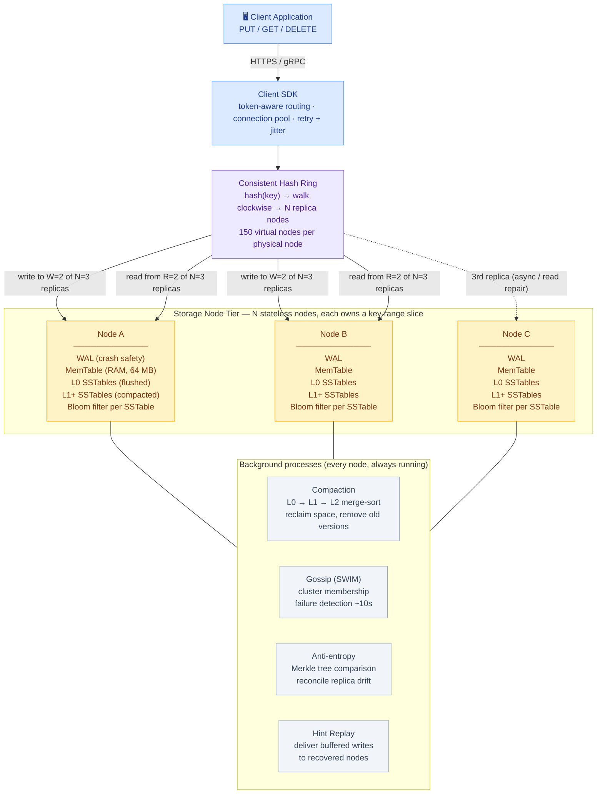
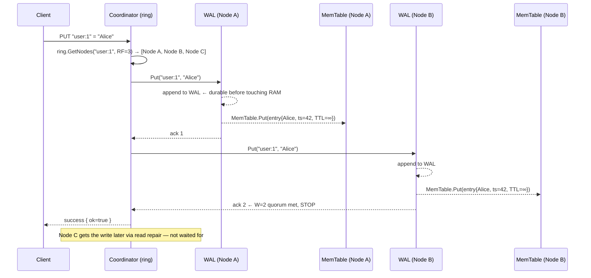
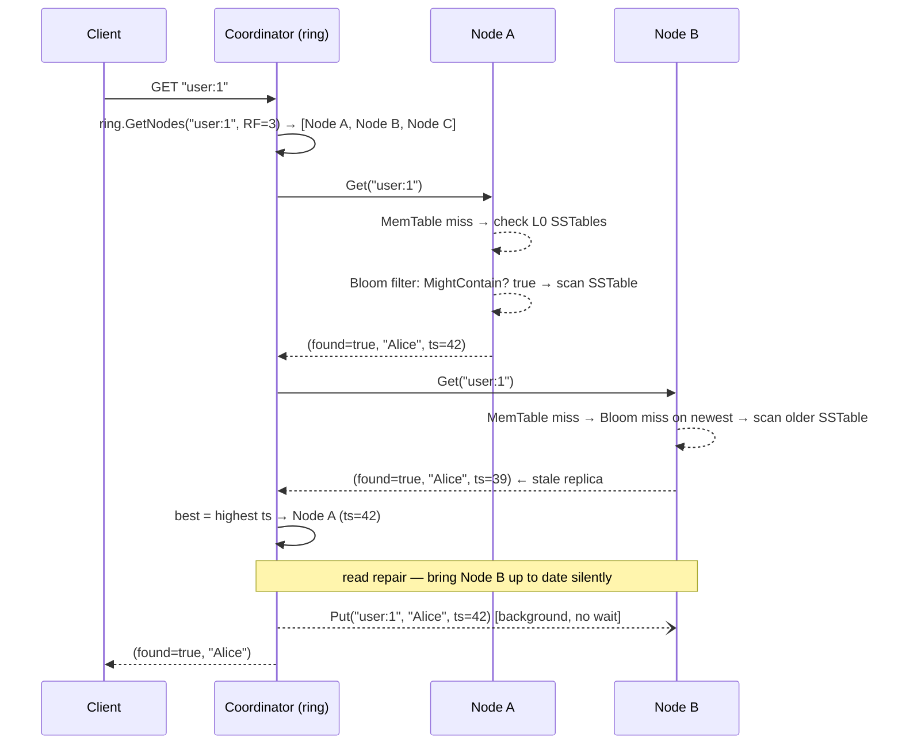
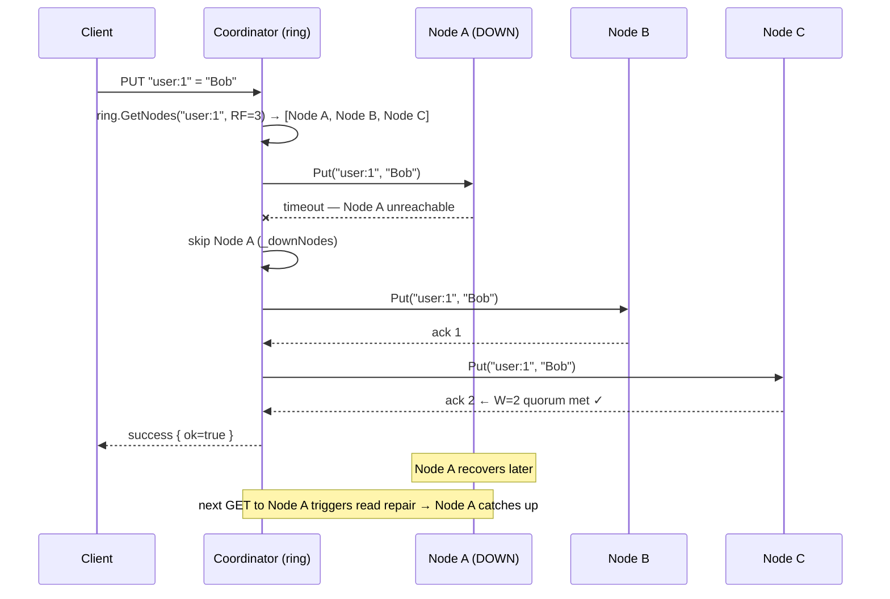
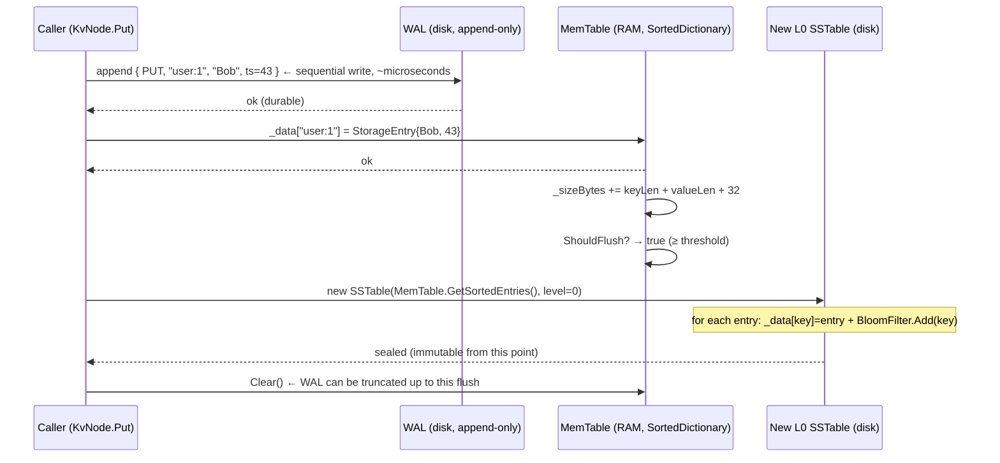

# Distributed KV Store — High-Level Design (System Architecture)

This is the **system-level** view: the production architecture behind a distributed
key-value store (think DynamoDB, Cassandra, or Riak). Two orthogonal concerns drive the
whole design: **where** a key lives (consistent hashing across N nodes) and **how** a node
stores it efficiently (LSM Tree — write to RAM first, flush to disk later). For the
class-level view see [LLD.md](LLD.md); for the storage schema see [DB_DESIGN.md](DB_DESIGN.md).

> **How to view the diagrams below:** open this file in VS Code's Markdown preview
> (`Cmd+Shift+V`). If they don't render, install the **Markdown Preview Mermaid Support**
> extension (`bierner.markdown-mermaid`). They also render automatically on GitHub.

---

## System Architecture



---

## ① Write path — `PUT "user:1" = "Alice"` (N=3, W=2)



---

## ② Read path — `GET "user:1"` with read repair (N=3, R=2)



---

## ③ Node failure — write survives with 2 of 3 replicas



---

## ④ LSM write and flush — inside one node



---

## Why each component exists

| Component | Role | Maps to in code |
|-----------|------|-----------------|
| **Client SDK** | Token-aware routing (hash key locally, call primary directly), connection pool, retry | *(prod-only)* |
| **Consistent Hash Ring** | Deterministic key → node assignment; adding/removing a node moves only ~1/N of keys | `ConsistentHashRing` |
| **Virtual nodes (150/server)** | Even load distribution even with small clusters; load proportional to vnode count | `ConsistentHashRing._virtualNodes` |
| **KvNode** | Self-contained LSM engine; knows nothing about other nodes | `KvNode` |
| **WAL** | Crash durability — MemTable survives process restart by replaying the log | *(prod-only, referenced in SSTable.cs)* |
| **MemTable** | RAM-speed write buffer; sorted so flush is a free sequential scan | `MemTable` |
| **L0 SSTable** | Immutable flush of MemTable; concurrent reads without locks | `SSTable` (level=0) |
| **L1+ SSTables** | Compacted, non-overlapping ranges; binary search to one file per level | `SSTable` (level≥1) |
| **Bloom filter** | Skip SSTables that definitely don't contain a key — zero disk I/O for a "no" | `BloomFilter` |
| **Quorum write (W)** | Write completes when W replicas ack — tolerates N−W simultaneous node failures | `DistributedKvStore.Put` |
| **Quorum read (R)** | Read from R replicas, return highest-timestamp — guaranteed to overlap write quorum | `DistributedKvStore.Get` |
| **Read repair** | Stale replica silently updated after a quorum read — lazy convergence at zero extra cost | `DistributedKvStore.Get` repair loop |
| **Tombstone** | Deletion marker that propagates through immutable files via normal write path | `TombstoneEntry` |
| **Logical clock** | Monotone per-node counter — conflict resolution without synchronized wall clocks | `KvNode._logicalClock` |
| **Compaction** | Merge L0 SSTables → non-overlapping levels; reclaim disk space from old versions | *(prod-only, referenced in SSTable.cs)* |
| **Gossip (SWIM)** | Decentralised failure detection; all nodes converge on membership in O(log N) rounds | *(prod-only, simulated via `_downNodes`)* |

---

## Key HLD design decisions

- **LSM Tree instead of B-Tree (write performance).** A B-Tree writes data in-place:
  every `PUT` is a random disk seek — capped at ~1 K IOPS on spinning disk, ~50 K on NVMe.
  An LSM Tree writes to RAM (MemTable) and flushes as sequential disk appends when the
  buffer fills — 10–100× faster. The trade-off is read amplification (check MemTable +
  multiple SSTable levels) and a background compaction cost.

- **Consistent hashing instead of modulo sharding (topology flexibility).** `hash(key) % N`
  remaps ≈(N−1)/N of all keys when N changes — a full cluster-wide reshuffle. Consistent
  hashing moves only ≈1/N of keys when one node is added or removed. This is why
  DynamoDB, Cassandra, and Riak all use it: you can scale the cluster without a multi-hour
  data migration.

- **Virtual nodes (150 per server) instead of one ring position (load balance).** One
  position per server means random hashing can leave one server with a huge arc and another
  with a tiny slice — 80/20 load splits. With 150 positions, the law of large numbers
  distributes load to within ±10% of even. It also means a failed node's load is absorbed
  by many successors instead of dumping everything on one neighbour.

- **W + R > N quorum (consistency guarantee).** With N=3, W=2, R=2: the write quorum
  (2 nodes) and read quorum (2 nodes) must share at least one node (2+2−3=1 overlap).
  That overlapping node always has the latest write. W + R ≤ N would allow reads to miss
  every node that received the write — stale reads possible. The W/R values are tunable:
  W=3 R=1 maximises read speed, W=1 R=3 maximises write speed, W=2 R=2 is the balanced
  default that tolerates one simultaneous node failure on both reads and writes.

- **Read repair instead of eager replication (convergence without coordination).** After a
  quorum read, any replica with a lower timestamp is silently updated. No dedicated sync
  process, no Paxos round — the cost is zero extra network round-trips because the
  coordinator already holds the authoritative value and the stale replica's address. Over
  time all replicas converge. A Merkle-tree anti-entropy job covers replicas that are never
  read.

- **Tombstones instead of in-place delete (immutability preserved).** SSTable files are
  sealed at creation — there is no mechanism to punch a hole in the middle of a file.
  A `DELETE` writes a `TombstoneEntry` through the normal write path. It propagates to
  replicas via quorum, overwrites older versions in MemTable, and compaction eventually
  discards all older copies once the tombstone reaches the lowest level.

- **Bloom filter per SSTable (avoid disk reads for absent keys).** A GET for a key that
  does not exist must otherwise probe every L0 SSTable sequentially. A 12.5 KB Bloom
  filter (100 K bits, 7 hash functions) gives a definitive "not here" for ~99.2% of absent
  probes — the SSTable file is not touched at all. This is the single biggest read latency
  win for write-heavy workloads where many keys are short-lived or frequently deleted.

- **Logical clock instead of wall clock (deterministic conflict resolution).** Wall clocks
  on different machines drift by milliseconds. Two nodes can assign the same timestamp to
  writes that actually happened at different times — "last writer wins" becomes ambiguous.
  A per-node monotone counter is always unambiguous: the higher counter wins. In production
  Hybrid Logical Clocks (HLC = max(wall, logical) + counter) keep this monotone property
  while also being interpretable as wall time.

---

## CAP theorem positioning

```
                    CA systems (single node)
                   /
                  /
Consistency ─────●─────── Partition tolerance
                  \
                   \
                    AP systems  ← this design (W=2 R=2)

With W=2 R=2 (default):
  → Partition-tolerant:  one node down → writes still land on W=2 of remaining nodes
  → Eventually consistent: the downed node re-syncs via read repair when it recovers
  → Not strictly linearisable: a brief window exists where replicas disagree

Tuning toward CP:  increase W and R  (W=3 R=2 → reject write if any node is down)
Tuning toward AP:  decrease W and R  (W=1 R=1 → never refuse, but stale reads possible)
```

---

## Capacity sketch

| Metric | Estimate |
|--------|----------|
| Write throughput (per node) | ~500 K ops/sec (RAM-bound, MemTable write) |
| Read throughput (per node) | ~50 K ops/sec (Bloom-filter-assisted, L0/L1 lookup) |
| MemTable size | 64 MB (flush threshold); 2× in memory during flush (active + immutable) |
| SSTable file size | ~30 MB after LZ4 compression (2:1 ratio on typical strings) |
| Bloom filter RAM | 12.5 KB × number of SSTables per node; negligible vs block cache |
| Replication overhead | (RF − 1) × write rate; RF=3 → 2× outbound network of raw write rate |
| Write amplification | ≈10× (MemTable→L0→L1→…→L6 compaction rewrites); typical for LSM |
| Read amplification | O(L0 files) + O(levels) with Bloom filters; typically 3–7 disk reads max |
| Quorum fault tolerance | Tolerates floor((N−1)/2) simultaneous node failures at W=R=ceil(N/2)+1 |
