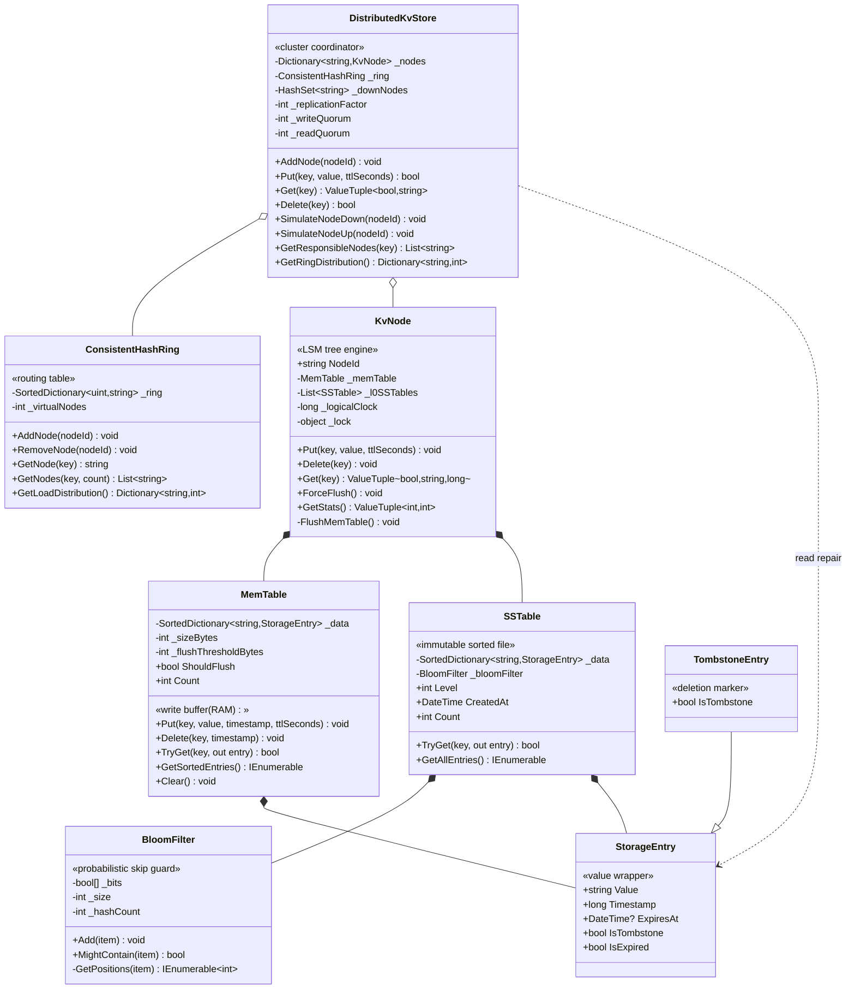

# Distributed KV Store — Low-Level Design (UML Class Diagram)

This is the **class-level** view of the Distributed KV Store. The defining structural
feature: the system is split into two clearly separated layers. The **cluster layer**
(`DistributedKvStore` + `ConsistentHashRing`) handles routing and replication. The
**node layer** (`KvNode` + `MemTable` + `SSTable` + `BloomFilter`) is a self-contained
LSM Tree storage engine that knows nothing about other nodes — it just stores and retrieves
keys. Each layer can be understood and tested independently.

> **How to view the diagram below:** open this file in VS Code's Markdown preview
> (`Cmd+Shift+V`). If it doesn't render, install the **Markdown Preview Mermaid Support**
> extension (`bierner.markdown-mermaid`). It also renders automatically on GitHub.

---

## Class Diagram



---

## Reading the relationships

| Notation | Relationship | In this design |
|----------|--------------|----------------|
| `o--` | **Aggregation** (holds, shared lifetime) | `DistributedKvStore` constructor-creates both `ConsistentHashRing` and the `KvNode` map. The ring is shared across all Put/Get/Delete calls — it is the single routing authority. Nodes are created via `AddNode` and outlive any single operation. |
| `*--` | **Composition** (owns, same lifetime) | `KvNode` owns its `MemTable` and `List<SSTable>` — they are created inside `KvNode`'s constructor and die with it. `SSTable` owns its `BloomFilter` — built in `SSTable`'s constructor and sealed permanently. Both `MemTable` and `SSTable` own their `StorageEntry` collections. |
| `--|>` | **Inheritance** (is-a) | `TombstoneEntry` extends `StorageEntry`. It shadows `IsTombstone` to always return `true` and passes `null` as `Value`. The `new` keyword (not `override`) is intentional: the base property is not `virtual`, so only code that holds a `TombstoneEntry` reference sees `true`. Code that holds a `StorageEntry` reference must use `entry.IsTombstone` after checking the runtime type. |
| `..>` | **Dependency** (uses, no stored field) | `DistributedKvStore.Get` inspects `StorageEntry.Timestamp` from each node's response to decide which replica is authoritative and which need read repair — but it holds no stored reference to `StorageEntry`. |

---

## The structural story (the "why" behind the shape)

- **Two fully decoupled layers.** `DistributedKvStore` knows about nodes but not about
  how they store data. `KvNode` knows about MemTables and SSTables but not about the ring
  or quorum. You can swap out the routing strategy (`ConsistentHashRing` → a lookup table)
  or the storage engine (`KvNode` → a B-Tree node) without touching the other layer.

- **`ConsistentHashRing` is the cluster's only shared state.** Every routing decision — which
  node is primary, which two are replicas — is answered deterministically by the ring. No
  central directory server, no leader election, no gossip needed just to route a single key.
  Any coordinator with the same ring state produces identical routing decisions.

- **`KvNode` is a complete, standalone LSM Tree.** Given just a `KvNode`, you can run a
  fully functional single-node KV store. `MemTable` is the fast write target; `SSTable` is
  the immutable disk representation; `BloomFilter` is `SSTable`'s guard against wasted
  reads. The three classes form a strict pipeline: writes flow MemTable → SSTable (on flush);
  reads check MemTable → SSTables newest-first (on lookup).

- **`StorageEntry` carries three orthogonal concerns in one object.**
  `Timestamp` solves distributed conflict resolution (which replica's version wins?).
  `ExpiresAt` solves TTL (when does the value become invisible?).
  `IsTombstone` solves deletion on immutable files (how do you delete from a file you
  can't modify?). All three are checked on every read at every tier — one consistent code
  path regardless of whether the entry came from MemTable or SSTable.

- **`TombstoneEntry` makes deletion intent explicit at the type level.** `MemTable.Delete`
  constructs a `TombstoneEntry` — a type mismatch would be a compile error, not a runtime
  bug. Code can use `entry is TombstoneEntry` for pattern matching instead of testing a
  boolean flag that any code could accidentally leave as `false`.

- **`BloomFilter` is sealed inside `SSTable`.** Nothing outside `SSTable` touches the filter
  directly. This encapsulation means `SSTable.TryGet` is the single gate that enforces the
  "bloom check before scan" invariant — callers cannot forget to check.

- **The logical clock is per-node, not per-cluster.** `KvNode._logicalClock` increments on
  every write on that node. Two nodes can produce the same timestamp number — they are
  logically independent counters. `DistributedKvStore.Get` resolves ties by timestamp and
  the convention that a higher timestamp on any single replica wins. In production, Hybrid
  Logical Clocks would make these globally comparable.

---

## Call flow at a glance

```
WRITE  Put("user:1", "Alice", ttl=3600):

  DistributedKvStore:
    ring.GetNodes("user:1", RF=3)          → [node-A, node-B, node-C]
    node-A.Put("user:1", "Alice", 3600)    → ack 1
    node-B.Put("user:1", "Alice", 3600)    → ack 2  ← W=2 quorum, STOP
    return true  (node-C gets it via read repair later)

  KvNode (per reached node):
    ts = Interlocked.Increment(_logicalClock)     → e.g. 42
    _memTable.Put("user:1", entry{Alice,42,TTL})
    if _memTable.ShouldFlush → FlushMemTable():
        new SSTable(_memTable.GetSortedEntries(), level:0)
            → _bloomFilter.Add(key) for every key
        _l0SSTables.Add(newSSTable)
        _memTable.Clear()


READ   Get("user:1"):

  DistributedKvStore:
    ring.GetNodes("user:1", RF=3)          → [node-A, node-B, node-C]
    node-A.Get("user:1")                   → (found=true, "Alice", ts=42)
    node-B.Get("user:1")                   → (found=true, "Alice", ts=42)  ← R=2, STOP
    best = highest timestamp → node-A (ts=42)
    read repair: node-B ts=42 == best.ts → no repair needed
    return (true, "Alice")

  KvNode.Get (per reached node):
    _memTable.TryGet("user:1")             → miss (flushed)
    _l0SSTables[newest].TryGet("user:1"):
        _bloomFilter.MightContain("user:1") → true (might be here)
        _data.TryGet("user:1")              → hit: entry{Alice,42,TTL}
        IsExpired? → false
        IsTombstone? → false
        return (true, "Alice", 42)


DELETE  Delete("user:1"):

  DistributedKvStore: same fan-out as Put with W=2 quorum

  KvNode.Delete:
    ts = Interlocked.Increment(_logicalClock)     → e.g. 43
    _memTable.Delete("user:1", ts):
        _data["user:1"] = new TombstoneEntry(43)
        ← overwrites the live entry in MemTable

  KvNode.Get after delete:
    _memTable.TryGet("user:1")             → TombstoneEntry found
    entry is TombstoneEntry → return (false, null, 43)
    ← caller sees "not found" even though the key exists in MemTable
```

---

## Layer summary

```
┌─────────────────────────────────────────────────────────┐
│  DistributedKvStore                                     │  ← cluster layer
│    ConsistentHashRing: key → [nodeId, nodeId, nodeId]   │
│    quorum logic: W writes, R reads, read repair         │
├──────────────────────────────┬──────────────────────────┤
│  KvNode A (LSM Tree)         │  KvNode B (LSM Tree)     │  ← node layer (N instances)
│    MemTable (RAM)            │    MemTable (RAM)         │
│    └─ SortedDictionary       │    └─ SortedDictionary    │
│    L0 SSTables (disk)        │    L0 SSTables (disk)     │
│    └─ SSTable#1              │    └─ SSTable#1           │
│       └─ BloomFilter         │       └─ BloomFilter      │
│    └─ SSTable#2              │    └─ SSTable#2           │
│       └─ BloomFilter         │       └─ BloomFilter      │
└──────────────────────────────┴──────────────────────────┘
         shared type: StorageEntry / TombstoneEntry
```
