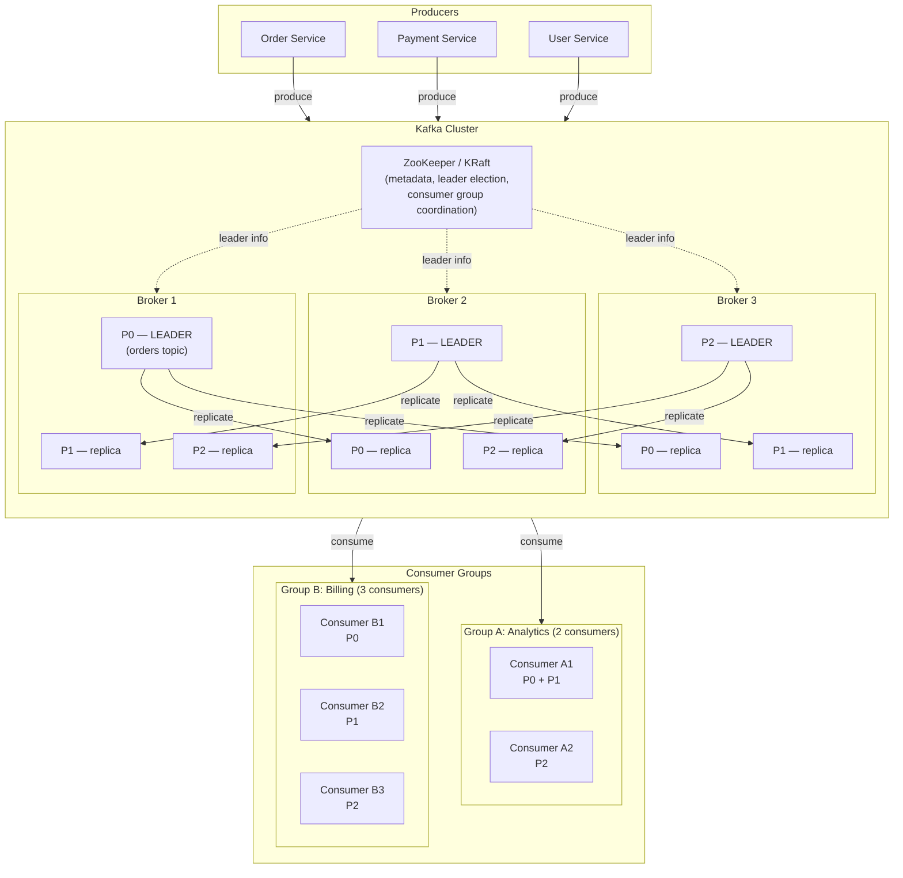
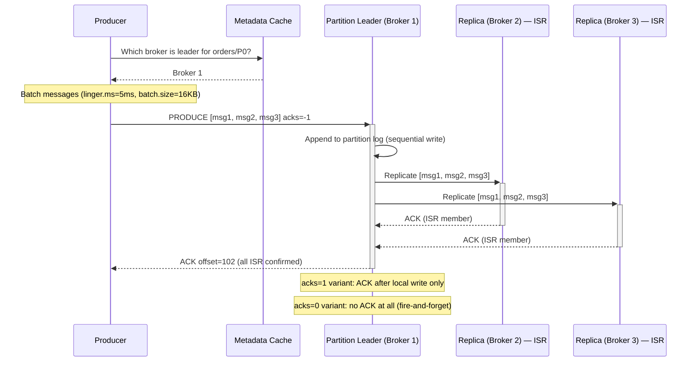
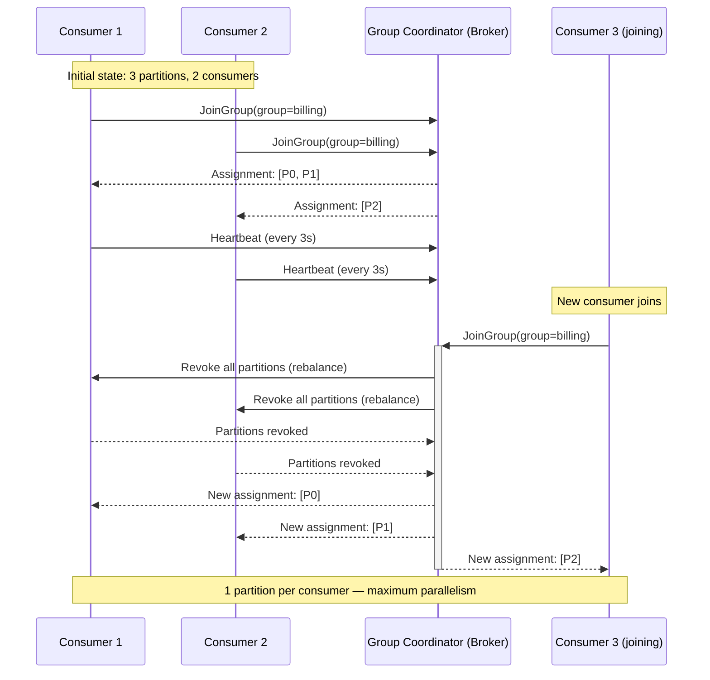
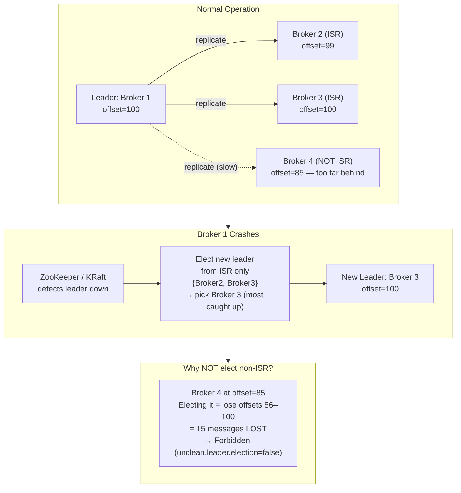
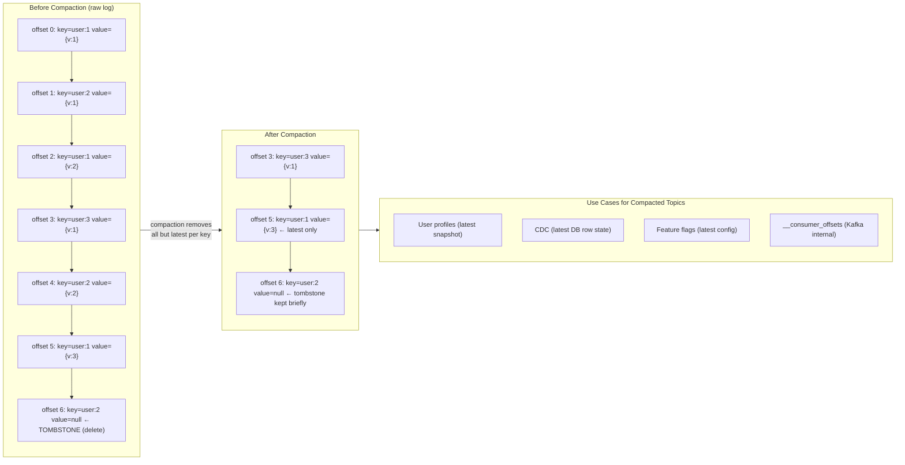
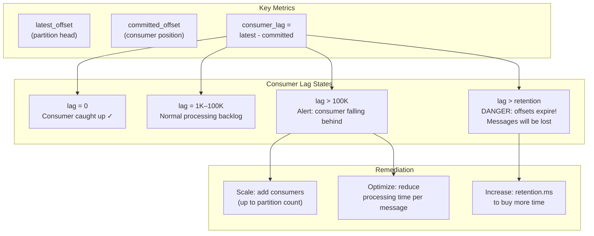

# Distributed Message Queue (Kafka) — Architecture Diagrams

---

## 1. High-Level System Architecture

---

## 2. Topic Partitions and Offset Model

```mermaid
flowchart LR
    subgraph Topic["Topic: orders (3 partitions)"]
        direction TB
        subgraph P0["Partition 0"]
            direction LR
            M0["offset 0\norder:101\nuser_id=A"]
            M1["offset 1\norder:104\nuser_id=A"]
            M2["offset 2\norder:110\nuser_id=A"]
            M0 --> M1 --> M2
        end
        subgraph P1["Partition 1"]
            direction LR
            N0["offset 0\norder:102\nuser_id=B"]
            N1["offset 1\norder:107\nuser_id=B"]
            N0 --> N1
        end
        subgraph P2["Partition 2"]
            direction LR
            O0["offset 0\norder:103\nuser_id=C"]
            O1["offset 1\norder:105\nuser_id=C"]
            O2["offset 2\norder:109\nuser_id=C"]
            O0 --> O1 --> O2
        end
    end

    subgraph Routing["Producer Key Routing"]
        R["hash(user_id) % 3\nuser_id=A → P0\nuser_id=B → P1\nuser_id=C → P2"]
    end

    subgraph Offsets["Consumer Group B Committed Offsets"]
        CO["B1 → P0: offset 2 (caught up)\nB2 → P1: offset 0 (lag=1)\nB3 → P2: offset 1 (caught up)"]
    end

    Routing --> Topic
    Topic --> Offsets
```

---

## 3. Write Path — Producer to Broker

---

## 4. Consumer Group — Partition Assignment and Rebalance

---

## 5. Delivery Guarantees Comparison

```mermaid
flowchart TB
    subgraph AtMostOnce["At-Most-Once"]
        direction LR
        AMO1["1. Consumer polls message"]
        AMO2["2. Commit offset"]
        AMO3["3. Process message"]
        AMO4["CRASH HERE → message LOST\n(offset already committed)"]
        AMO1 --> AMO2 --> AMO3
        AMO2 -.->|"crash after commit"| AMO4
    end

    subgraph AtLeastOnce["At-Least-Once (default)"]
        direction LR
        ALO1["1. Consumer polls message"]
        ALO2["2. Process message"]
        ALO3["3. Commit offset"]
        ALO4["CRASH AFTER PROCESS,\nBEFORE COMMIT →\nmessage re-processed\n(idempotent consumer needed)"]
        ALO1 --> ALO2 --> ALO3
        ALO2 -.->|"crash after process"| ALO4
    end

    subgraph ExactlyOnce["Exactly-Once (Kafka Transactions)"]
        direction LR
        EOT1["1. Begin transaction"]
        EOT2["2. Process message"]
        EOT3["3. Atomic: write output\n+ commit offset\nin one transaction"]
        EOT4["CRASH → transaction\nrolled back → retry\nfrom same offset"]
        EOT1 --> EOT2 --> EOT3
        EOT2 -.->|"crash = rollback"| EOT4
    end
```

---

## 6. ISR Replication and Leader Election

---

## 7. Log Compaction

---

## 8. Consumer Lag Monitoring

