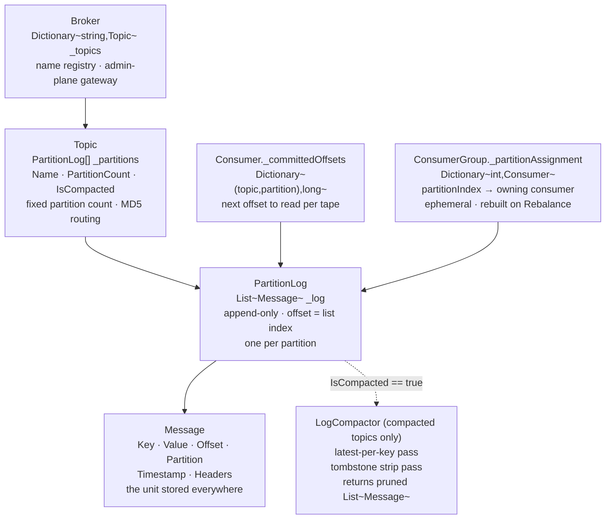
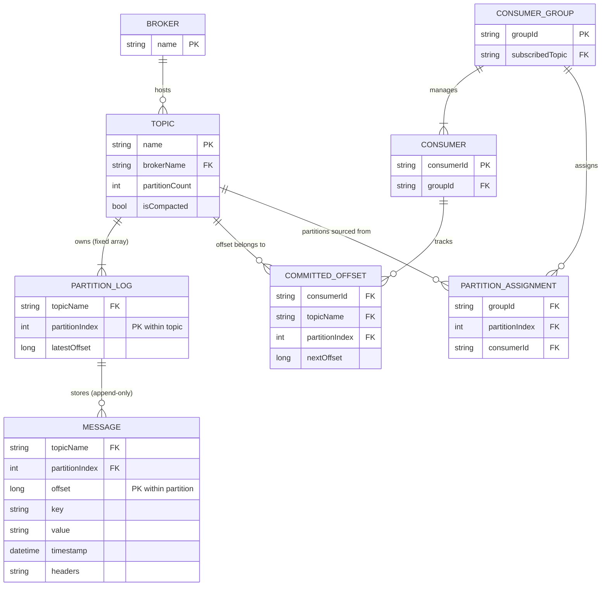

# Distributed Message Queue — Database Design

Unlike the Social Media Feed or Real-Time Chat projects that **use** external databases,
the Distributed Message Queue **is** a storage system. This document covers its internal
data model: what each class stores, how entities relate, and what the production
equivalent of each in-memory structure would be (segment files, `__consumer_offsets`,
ZooKeeper/KRaft). For the class-level view see [LLD.md](LLD.md); for system diagrams
see [HLD.md](HLD.md).

> **How to view the diagrams below:** open this file in VS Code's Markdown preview
> (`Cmd+Shift+V`). If they don't render, install the **Markdown Preview Mermaid Support**
> extension (`bierner.markdown-mermaid`). They also render automatically on GitHub.

---

## Storage layer map



---

## Storage technology map

| Data concern | Demo implementation | Production equivalent |
|---|---|---|
| **Message storage (per partition)** | `List<Message>` in `PartitionLog._log` (RAM) | Append-only segment `.log` files on disk + sparse `.index` and `.timeindex` files per segment |
| **Topic / partition metadata** | `Dictionary<string, Topic>` in `Broker._topics` (RAM) | ZooKeeper (Kafka ≤2.x) or KRaft Raft log (Kafka ≥3.0) — durable, replicated across brokers |
| **Consumer committed offsets** | `Dictionary<(topic, partition), long>` in `Consumer._committedOffsets` (RAM, lost on restart) | `__consumer_offsets` — an internal Kafka compacted topic; keyed by `(groupId, topic, partition)` |
| **Partition → consumer assignment** | `Dictionary<int, Consumer>` in `ConsumerGroup._partitionAssignment` (RAM, rebuilt on Rebalance) | Group coordinator broker — JoinGroup / SyncGroup protocol; assignment held in broker memory |
| **Compacted topic state** | `List<Message>` returned by `LogCompactor.Compact()` (in-memory result) | Background log-cleaner threads that rewrite segment files on disk; tombstones retained for `delete.retention.ms` before final removal |

---

## Message schema — the core storage unit

`Message` is the row that every storage layer holds, serves, and compacts.

| Field | Type | Assigned by | Purpose |
|---|---|---|---|
| `Key` | `string` (nullable) | Producer | Routing address — MD5-hashed to pick a partition. Null → round-robin. Identity for log compaction (latest write per key survives). |
| `Value` | `string` (nullable) | Producer | Payload. **Null = tombstone** — deletion signal for compacted topics. Consumer receiving null must remove the key from downstream state. |
| `Offset` | `long` | `PartitionLog.Append` (under lock) | Position in the partition log. 0-based, strictly increasing, immutable after assignment. `(topic, partition, offset)` is globally unique forever. |
| `Partition` | `int` | `PartitionLog.Append` | Which partition lane this message was written to. Stamped by the log — producers cannot set it. |
| `Timestamp` | `DateTime` | `Message` constructor (UTC now) | Wall-clock creation time. Used for time-range queries and `timeindex` lookups. Not used for ordering — `Offset` owns that. |
| `Headers` | `Dictionary<string, string>` | Producer | Out-of-band metadata without touching the payload: `schema-version`, `correlation-id`, `source-service`, tracing spans. |

---

## ER diagram



---

## Partition log storage (the append-only tape)

`PartitionLog._log` is the core data structure. Its invariants hold at every level:

```
PartitionLog._log  →  List<Message>  (never sorted, never removed from, never modified)

  ┌───────────────────────────────────────────────────────────────────────┐
  │  index 0      index 1      index 2      index 3      ...              │
  │  @offset=0    @offset=1    @offset=2    @offset=3                     │
  │  key="Alice"  key="Bob"    key="Alice"  key="Bob"                     │
  │  value="v1"   value="v1"   value="v2"   value=null (tombstone)        │
  └───────────────────────────────────────────────────────────────────────┘

  Invariant 1: msg.Offset == list index
               offset is set to _log.Count BEFORE Add — zero off-by-one, no extra counter
  Invariant 2: offsets are monotonically increasing — once written, never repeat
  Invariant 3: messages are immutable — no field changes after Append returns
  Invariant 4: LatestOffset == _log.Count  (the next slot, not the last slot)
```

**Offset = `_log.Count` (not `_log.Count - 1`):**
`LatestOffset` and `ReadFrom(fromOffset)` both use `_log.Count` as the "end" sentinel.
A consumer that commits `offset + 1` and calls `ReadFrom(committedOffset)` resumes from
the first unread slot — never re-reads the last message, never skips the next one.

**Production equivalent — Kafka segment files:**

```
/orders-2/                                 ← directory = one partition
  00000000000000000000.log    ← segment: raw record bytes, appended sequentially
  00000000000000000000.index  ← sparse: offset → byte-position in .log (every Nth record)
  00000000000000000000.timeindex  ← sparse: timestamp → offset (for time-based seeks)
  00000000000000170531.log    ← new segment rolls when active segment hits 1 GB
  00000000000000170531.index
```

The `.index` enables `O(log N)` binary search to any offset without scanning the entire
`.log` file. `List<T>[index]` achieves the same O(1) in the demo because the list IS
the index-addressable array.

---

## Consumer offset storage

```
Consumer._committedOffsets:
  Dictionary<(string topic, int partition), long>

  Example state for Consumer-A after processing:
    ("orders",   0) → 42   ← next Poll starts at offset 42
    ("orders",   2) → 8    ← next Poll starts at offset 8
    ("payments", 1) → 101  ← next Poll starts at offset 101
```

**Why composite key `(topic, partition)` not just `partition`:**
A consumer can be assigned partitions from multiple topics. Using just `partition` as key
would collide: "orders partition 2" and "payments partition 2" share slot `2` and would
corrupt each other's bookmark.

**Why `offset + 1` is stored:**
The committed value means "the next message I want." Storing the last-processed offset N
would cause a restart to re-fetch N. Storing N+1 skips N on restart — the correct
at-least-once contract. Crash before commit → re-process the batch (duplicate). Crash
after commit → batch is never re-processed (loss-free).

**Production equivalent — `__consumer_offsets` internal topic:**

```
Topic name:  __consumer_offsets   (internal, compacted)

Key:   groupId + topicName + partitionIndex   → the identity
Value: committedOffset + metadata             → the committed position

Because it is a compacted topic, only the latest commit per
(group, topic, partition) triple is retained — exactly the
LogCompactor.Compact() logic, applied at cluster scale.

On consumer restart:
  FetchOffset(groupId, topic, partition)  → reads from __consumer_offsets
  → returns last committed offset
  → consumer resumes exactly where it left off, on any machine
```

---

## Topic and partition metadata storage

```
Broker._topics:
  Dictionary<string, Topic>

  "orders"   → Topic {
      Name          = "orders"
      PartitionCount = 4            ← immutable after CreateTopic
      IsCompacted    = false
      _partitions    = [PL0, PL1, PL2, PL3]   ← fixed-size array
  }

  "profiles" → Topic {
      Name          = "profiles"
      PartitionCount = 4
      IsCompacted    = true         ← LogCompactor runs on writes
      _partitions    = [PL0, PL1, PL2, PL3]
  }
```

**Why `PartitionCount` is immutable:**
`GetPartitionIndex` hashes the key and takes `% PartitionCount`. Changing the count
changes the result for every key — messages written before the change and after it land
in different partition logs, and consumers processing one partition silently miss the
other half of a key's history. Immutability is enforced at construction time; no runtime
check is needed because the array itself cannot be resized.

**Production equivalent — ZooKeeper / KRaft:**

| Concern | Storage |
|---|---|
| Topic existence and config | `/brokers/topics/<name>` ZNode (ZooKeeper) or KRaft Raft log (Kafka ≥3.0) |
| Partition leader and ISR list | `/brokers/topics/<name>/partitions/<p>/state` |
| Broker membership | `/brokers/ids/<brokerId>` (ephemeral ZNode — disappears when broker dies) |
| Controller election | `/controller` (ephemeral ZNode held by the current controller) |

KRaft (Kafka Raft) replaces ZooKeeper entirely: topic and partition metadata is stored in
a dedicated Raft log replicated across controller nodes. This removes the external
ZooKeeper dependency and gives Kafka first-party durability guarantees for its own
metadata.

---

## Partition assignment storage

```
ConsumerGroup._partitionAssignment:
  Dictionary<int, Consumer>   ← partitionIndex → Consumer that exclusively owns it

  After Rebalance() with 3 consumers, 4 partitions:
    0 → Consumer-A
    1 → Consumer-B
    2 → Consumer-C
    3 → Consumer-A

  After Consumer-B leaves, Rebalance():
    0 → Consumer-A
    1 → Consumer-C
    2 → Consumer-A
    3 → Consumer-C
```

**Why ephemeral (not persisted):**
The assignment is always derivable from the current consumer roster and partition count
via round-robin. Persisting it would create a stale-on-restart problem: if consumer B
was assigned partition 2 yesterday but crashed, a persisted assignment would leave
partition 2 orphaned until a manual fix. Rebuilding from scratch on every `Rebalance()`
guarantees correctness regardless of prior state.

**Production equivalent — group coordinator:**

The group coordinator (a designated broker) holds the partition assignment in memory for
the group's lifetime. A `SyncGroup` RPC delivers each member its personal slice. When a
heartbeat timeout fires, the coordinator evicts the dead member and broadcasts a new
`JoinGroup` request to trigger a rebalance round.

---

## Compacted topic storage

For a compacted topic, `LogCompactor.Compact()` transforms a partition log:

```
Before compaction (PartitionLog._log):              After compaction:
┌───────────────────────────────────────────┐       ┌──────────────────────────┐
│  @0  key="Alice"  value="v1"              │       │                          │
│  @1  key="Bob"    value="v1"              │  →    │  @2  key="Alice" val="v2"│
│  @2  key="Alice"  value="v2"              │       │                          │
│  @3  key="Bob"    value=null (tombstone)  │       │  (Bob: absent)           │
└───────────────────────────────────────────┘       └──────────────────────────┘

Pass 1 — latest[key] wins:
  latest["Alice"] = @0  →  overwritten by @2   (v2 is the latest)
  latest["Bob"]   = @1  →  overwritten by @3   (tombstone is latest)

Pass 2 — strip tombstones (@3.Value == null → drop):
  result = [@2]

Invariant: key absent from compacted log  ⟺  latest write for that key was a tombstone
           There is no separate "deleted keys" set — absence IS the signal.
```

**Why tombstones survive Pass 1 before being stripped in Pass 2:**
If tombstones were dropped on first encounter, the older non-null entry (`@1 Bob=v1`)
would remain in the `latest` map and Bob would survive the compaction — never deleted.
The tombstone must win the `latest` race before being removed.

**Production equivalent — log cleaner threads:**

```
cleanup.policy=compact
  → Background thread scans the "dirty" portion of the log (since last compaction)
  → Builds an offset map: key → latest offset  (fits in bounded RAM, not full log)
  → Rewrites segments, keeping only records at their latest offset
  → Retains tombstones for delete.retention.ms (default 24h) so offline consumers
     still see the delete signal before it is permanently erased
  → Swaps in cleaned segments, deletes originals

cleanup.policy=compact,delete
  → Also age out segments older than retention.ms regardless of key content
  → Suitable for "current state + bounded history" topics
```

---

## Key design decisions

- **`offset = _log.Count` before `Add` — no separate counter.** After N appends,
  `_log.Count == N`. Setting `msg.Offset = _log.Count` before `_log.Add(msg)` gives
  0-based offsets identical to list indices — `_log[offset]` is always valid. A separate
  `_nextOffset` counter would need its own lock synchronization and risks drift if
  any code path increments one without the other. Removing the variable removes the bug.

- **`List<Message>` not `ConcurrentQueue<T>` (random-access reads).** A queue supports
  only FIFO dequeue — once dequeued the item is gone. `List<T>` supports `GetRange(from,
  count)` at O(1), which is how `ReadFrom(offset, maxCount)` serves any consumer at any
  historical position without removing messages or blocking writers beyond the per-partition
  lock window.

- **Per-partition lock (not a topic-wide lock).** `PartitionLog._lock` protects only the
  `_log` of one partition. Two producers writing to different partitions of the same topic
  never contend. For a topic with 12 partitions, throughput scales with partition count
  rather than being bottlenecked by a single monitor.

- **Composite `(topic, partition)` offset key (not just `partition`).** A `Consumer`
  instance can legally be assigned partitions from multiple topics. A key of just
  `partition` would cause "orders / partition 2" and "payments / partition 2" to share
  one committed-offset entry — silent data corruption. The composite key makes each tape's
  bookmark completely independent.

- **`CommitAll` stores `max(offset) + 1` per partition (not per message).** The committed
  value is the *next* offset to read, not the last one processed. Committing after the
  full batch (not after each message) reduces commit overhead. The `max` within each
  partition group correctly advances the bookmark to the highest offset seen — no
  intermediate uncommitted offsets are skipped.

- **Assignment rebuilt from scratch on Rebalance (no incremental diff).** An incremental
  approach must detect which assignments changed and apply a delta — more code, more edge
  cases. `_partitionAssignment.Clear()` followed by a full round-robin loop over
  `topic.PartitionCount` is O(partitions), deterministic, and correct from any starting
  state. Correctness at restart cost is far better than a stale assignment that silently
  leaves partitions unread.

- **Tombstone = `Message` with `Value == null` (deletion without in-place modification).**
  `PartitionLog` is append-only — there is no mechanism to punch a hole in the middle of
  `_log`. A delete is represented as an ordinary message through the normal write path.
  This means deletions flow through all the same channels as writes (same partition
  routing, same offset sequence, same compaction logic) without any special-case code.

---

## Capacity sketch

| Metric | Estimate |
|---|---|
| Message size (demo) | Key + Value + fixed fields ≈ 200–500 bytes per `Message` object |
| PartitionLog RAM | `msgCount × 500 bytes`; 1 M messages × 500 B ≈ 500 MB per partition |
| Committed offset RAM | One `long` (8 bytes) per `(topic, partition)` pair per consumer — negligible |
| Topic metadata RAM | One `Topic` + one `PartitionLog[]` per topic, regardless of message count — negligible |
| Partition assignment RAM | One `Dictionary` entry (pointer + int) per partition — negligible |
| Compaction read cost | O(all messages in partition); O(distinct keys) output; CPU-bound |
| Max consumer parallelism | Exactly `PartitionCount`; consumers above this ceiling are idle hot standbys |
| Duplicate window (at-least-once) | At most `maxMessages` per partition between last process and last commit |
| Offset commit write amplification | One `__consumer_offsets` write per batch commit; compaction keeps it O(distinct group × partition) |
| Production partition throughput | ~10–100 MB/s per partition (disk sequential write bound); ~1 M msg/s at 100 bytes/msg |
