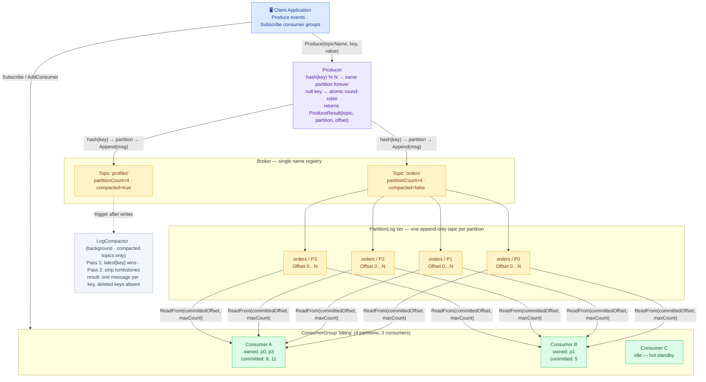
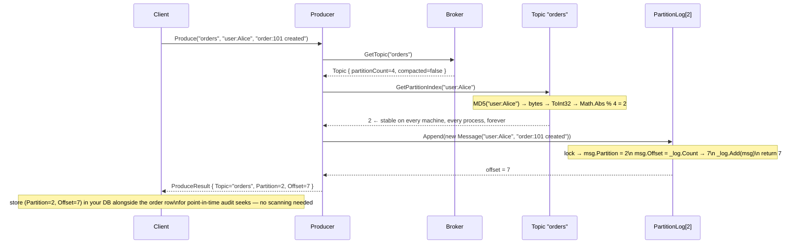
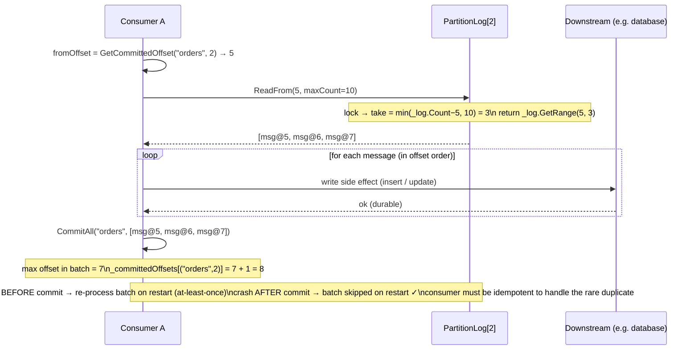
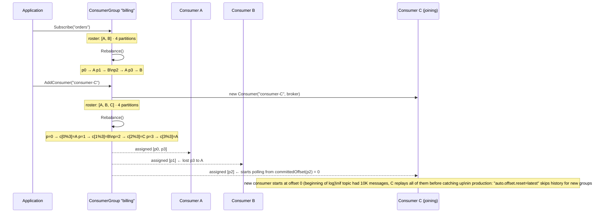
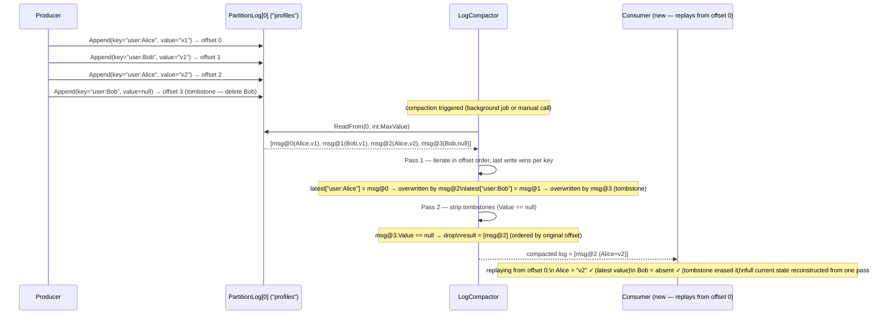

# Distributed Message Queue — High-Level Design (System Architecture)

This is the **system-level** view: the production architecture behind a distributed
message queue (think Apache Kafka or AWS Kinesis). Two orthogonal concerns drive the
whole design: **where** a message lands (deterministic hash routing to a stable partition)
and **how** it is stored efficiently (append-only partition log — write in offset order,
read by seeking to any offset). For the class-level view see [LLD.md](LLD.md); for the
storage schema see [DB_DESIGN.md](DB_DESIGN.md).

> **How to view the diagrams below:** open this file in VS Code's Markdown preview
> (`Cmd+Shift+V`). If they don't render, install the **Markdown Preview Mermaid Support**
> extension (`bierner.markdown-mermaid`). They also render automatically on GitHub.

---

## System Architecture



---

## ① Produce path — `Produce("orders", "user:Alice", "order:101 created")`



---

## ② Consume path — `Poll` → process → `Commit`



---

## ③ Consumer group rebalance — new consumer joins



---

## ④ Log compaction — `profiles` topic, compacted



---

## Why each component exists

| Component | Role | Maps to in code |
|-----------|------|-----------------|
| **Producer** | Routes messages to the correct partition (hash or round-robin); returns a receipt | `Producer` |
| **Broker** | Single name registry; throws on unknown topic so a missing `CreateTopic` surfaces immediately | `Broker` |
| **Topic** | Groups partitions under a name; owns the key→partition mapping via MD5 | `Topic` |
| **PartitionLog** | Append-only tape; `offset = _log.Count` before append — offsets are unique, sequential, and lock-free to read | `PartitionLog` |
| **Message.Key** | Routing address; same key → same partition → processing order guaranteed end-to-end | `Message.Key` |
| **Message.Value = null** | Tombstone deletion signal for compacted topics; tells compactor and consumers to remove the key | `Message.Value` |
| **Message.Offset** | Assigned by `PartitionLog` under lock — `(topic, partition, offset)` is globally unique forever | `PartitionLog.Append` |
| **Message.Headers** | Out-of-band metadata (schema version, correlation ID, source service) without touching the payload | `Message.Headers` |
| **Consumer** | Bookmark-based reader; committed offset = next offset to read; isolated per `(topic, partition)` pair | `Consumer` |
| **ConsumerGroup** | Round-robin partition assignment; one partition → one consumer enforces ordering; idle consumers are hot standbys | `ConsumerGroup` |
| **Rebalance** | Rebuilds the assignment map from scratch on every roster change — no stale assignments possible | `ConsumerGroup.Rebalance` |
| **LogCompactor** | Reduces a compacted partition to one message per key; tombstones cancel earlier values before being removed | `LogCompactor` |
| **MD5 for routing** | Stable across .NET versions, machines, and processes; `GetHashCode()` is not guaranteed deterministic | `Topic.GetPartitionIndex` |
| **`Interlocked.Increment`** | Lock-free atomic round-robin counter; no monitor contention on null-key writes | `Producer._roundRobinIndex` |
| **`Math.Abs` on MD5 bytes** | `BitConverter.ToInt32` can produce negative values; `Math.Abs` keeps the partition index valid without branching | `Topic.GetPartitionIndex` |

---

## Key HLD design decisions

- **Append-only log instead of in-place updates (write performance + replay).** Random
  writes on disk require seeks — capped at ~1 K IOPS on spinning disk, ~50 K on NVMe.
  Sequential appends saturate disk bandwidth (hundreds of MB/s). More importantly,
  immutability enables arbitrary replay: any consumer can seek to offset 0 and re-read
  the entire history without affecting any other consumer. In-place updates destroy the
  history that makes event sourcing, auditing, and consumer catch-up possible.

- **`offset = _log.Count` before append (no separate counter).** A `List<T>` in C# always
  has `Count == number of items appended`. Assigning `msg.Offset = _log.Count` *before*
  `_log.Add(msg)` gives 0-based offsets that exactly match list indices — no off-by-one,
  no extra counter to keep in sync, and `_log[offset]` is always valid. The lock that
  guards this assignment also prevents two concurrent appends from claiming the same slot.

- **Fixed partition count at topic creation (key→partition stability).** `hash(key) % N`
  produces a different result when N changes. If partition count could grow, "user:Alice"
  might route to partition 2 today and partition 5 tomorrow — messages written before and
  after the resize would end up in different logs, and a consumer processing partition 2
  would never see the post-resize events. Fixing the count at creation time means the
  key→partition mapping is an invariant that every producer, consumer, and test can rely on.

- **MD5 instead of `GetHashCode` (cross-process determinism).** The .NET specification
  explicitly does not guarantee that `GetHashCode()` returns the same value across
  different processes, app domains, or .NET versions. Two broker replicas hashing the same
  key could independently route it to different partitions — silently breaking ordering.
  MD5 is a fixed algorithm that produces the same bytes everywhere. Any other stable
  hash (SHA-256, xxHash) would work equally well; MD5 is fast and available without
  external dependencies.

- **Commit `offset + 1` (at-least-once delivery).** The committed offset means "the next
  message I want to read." Committing the offset that was just processed (N) would
  re-fetch N on restart — a duplicate. Committing N+1 skips N on restart — a loss. N+1
  is the correct contract: "I am done with N; give me N+1 next time." The cost is that
  a crash *before* the commit causes the batch to be re-processed. Consumers must be
  idempotent to handle the rare duplicate — a much easier constraint than recovering lost
  events.

- **One partition → one consumer (ordering guarantee).** If two consumers both read
  partition 3, they would race to process its messages: consumer A handles offset 10,
  consumer B handles offset 11, but A finishes last — downstream state is updated in the
  wrong order. Exclusive partition ownership means there is exactly one thread processing
  each partition at any time, so the append-order guarantee extends all the way to the
  side effect. The consequence is that partition count is the hard ceiling on consumer
  parallelism within a group.

- **Idle consumers as hot standbys (fast failover).** With N consumers and M partitions
  where N > M, the extra consumers own no partitions but remain in the group. When a peer
  crashes, the next `Rebalance()` immediately assigns the orphaned partitions to idle
  consumers — recovery time is one rebalance cycle (~seconds in Kafka, one method call
  here). This is more resilient than spinning up a new consumer on demand, which requires
  process startup and topic subscription before any messages can be processed.

- **Log compaction instead of TTL or infinite retention (state topics).** TTL-based expiry
  deletes data after a fixed age — a rarely-updated key (e.g. a user who hasn't logged in
  for 90 days) vanishes even though it represents valid current state. Infinite retention
  lets disk grow forever at O(all writes). Log compaction keeps disk proportional to
  O(distinct keys): each key's latest value always survives until an explicit delete
  (tombstone), so a new consumer can reconstruct the full current state of the world by
  replaying from offset 0, regardless of when it started.

---

## Consistency and delivery guarantees

```
Delivery semantics (tunable per producer):

  at-most-once   →  produce and forget; no retry on timeout
                    → possible loss on network failure; zero duplicates
                    → use for: metrics, low-value telemetry

  at-least-once  →  retry on timeout; commit offset AFTER processing  ← THIS DESIGN
                    → possible duplicate on crash-before-commit; zero loss
                    → use for: orders, payments (with idempotent consumers)

  exactly-once   →  producer ID + sequence number; broker deduplicates retries
                    → no loss, no duplicates; extra latency (~2×)
                    → use for: financial transfers, exactly-once aggregations

Ordering guarantees:

  Within one partition  →  strict append order; one consumer; fully ordered ✓
  Across partitions     →  no ordering guarantee; different consumers, different speeds
  Global across topics  →  no ordering guarantee; design around it with event correlation IDs

Partition count trade-offs:

  More partitions  →  higher parallelism ceiling (more consumers possible)
                   →  more open file handles on broker
                   →  longer rebalance time (more work per Rebalance call)

  Fewer partitions →  simpler; faster rebalance
                   →  hard parallelism ceiling — can't add consumers beyond partition count
                   →  recommendation: choose a count with many divisors (12, 24, 48)
                      so you can run 1, 2, 3, 4, 6, or 12 consumers with no idle partitions
```

---

## Capacity sketch

| Metric | Estimate |
|--------|----------|
| Write throughput (per partition) | ~500 K msgs/sec (RAM-bound, lock contention is per-partition not per-topic) |
| Read throughput (per consumer) | ~1 M msgs/sec (sequential list slice, no disk I/O in this demo) |
| Partition log size | Unbounded (no retention in demo); production: TTL-based segment deletion or compaction |
| Consumer lag | `latestOffset − committedOffset`; alert when lag grows monotonically over time |
| Rebalance time | O(partitionCount); ~microseconds in demo; ~seconds in real Kafka (network round-trips) |
| Maximum consumer parallelism | = partitionCount; extra consumers sit idle as hot standbys |
| Compaction savings | Depends on update frequency; a topic with 1 M writes but 10 K distinct keys compacts 100× |
| Ordering guarantee scope | Strict within one partition; none across partitions or topics |
| Duplicate window | One batch (between last process and last commit); at-most `maxMessages` messages |