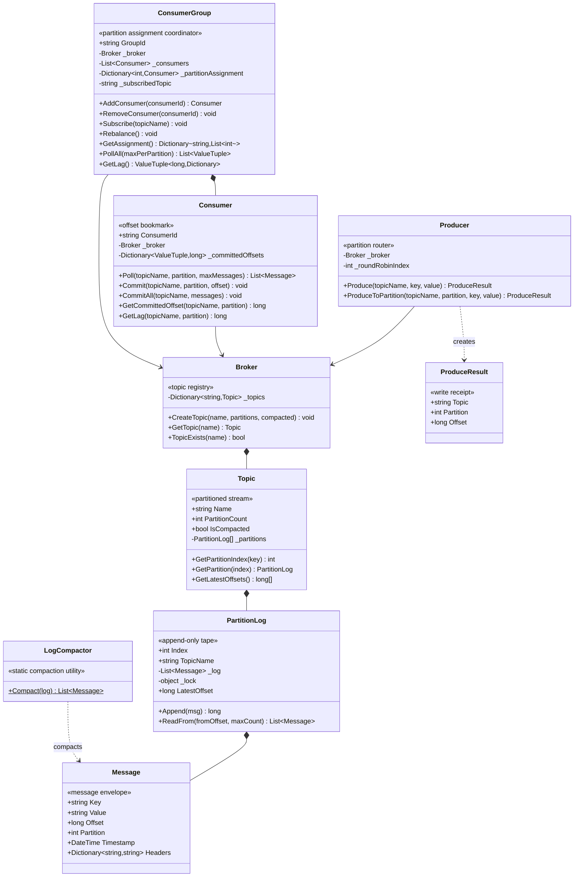

# Distributed Message Queue — Low-Level Design (UML Class Diagram)

This is the **class-level** view of the Distributed Message Queue. The defining structural
feature: the system is split into three clearly separated tiers. The **broker tier**
(`Broker` + `Topic` + `PartitionLog`) is a passive data store — it appends, indexes, and
serves messages with no knowledge of who is reading or writing. The **producer tier**
(`Producer`) handles routing: hash or round-robin to pick a partition. The **consumer tier**
(`Consumer` + `ConsumerGroup`) handles offset tracking and partition assignment. Each tier
is independently testable and can evolve without touching the others.

> **How to view the diagram below:** open this file in VS Code's Markdown preview
> (`Cmd+Shift+V`). If it doesn't render, install the **Markdown Preview Mermaid Support**
> extension (`bierner.markdown-mermaid`). It also renders automatically on GitHub.

---

## Class Diagram



---

## Reading the relationships

| Notation | Relationship | In this design |
|----------|--------------|----------------|
| `*--` | **Composition** (owns, same lifetime) | `Broker` creates every `Topic` via `CreateTopic` — topics die when the broker is discarded. `Topic` allocates all `PartitionLog` instances in its constructor — the array is fixed and never resized. `PartitionLog` appends `Message` objects into its internal `_log` — messages are immutable once written. `ConsumerGroup` creates `Consumer` instances via `AddConsumer` — consumers belong to and are managed by the group. |
| `-->` | **Association** (holds, independent lifetime) | `Producer`, `Consumer`, and `ConsumerGroup` each hold a `Broker` reference that is injected at construction. None of them owns the `Broker` — it outlives all of them and is shared. |
| `..>` | **Dependency** (uses, no stored reference) | `Producer.Produce` constructs a `ProduceResult` and immediately returns it — no stored field. `LogCompactor.Compact` takes a message collection as a parameter and returns a new collection — purely functional, zero stored state. |

---

## The structural story (the "why" behind the shape)

- **Three fully decoupled tiers.** `Broker/Topic/PartitionLog` is the passive storage tier:
  it appends, slices, and serves messages with no knowledge of who is reading or writing.
  `Producer` is the write-path router: it only needs to know which partition to target.
  `Consumer/ConsumerGroup` is the read-path coordinator: it only needs to know which offset
  to start from. You can replace any tier (e.g. swap hash routing for range-based routing
  in `Producer`) without touching the other two.

- **`Broker` is the single name registry.** Producers and consumers never construct a
  `Topic` directly — they always go through `Broker.GetTopic`. This ensures there is one
  canonical `Topic` object per name, so a producer and a consumer asking for "orders"
  get the exact same `PartitionLog` instances and share the same underlying log.

- **`Topic` owns a fixed partition array — never resized.** The `PartitionLog[]` is
  allocated once in `Topic`'s constructor. Increasing partition count later would break
  the key→partition mapping: `hash("user:Alice") % 4` ≠ `hash("user:Alice") % 8`, so
  Alice's events would silently route to a different partition after the resize and the
  ordering guarantee would be lost. The fixed count forces the decision to happen at
  topic creation time.

- **`PartitionLog` is the ordering primitive.** It is the smallest unit that carries the
  guarantee: "all messages in this log are in append order, offset-addressable, and
  immutable." `Offset = _log.Count` before the append makes offsets 0-based, strictly
  increasing, and identical to list indices — no separate counter, no off-by-one. All
  higher-level constructs (`Topic`, `Consumer`, `ConsumerGroup`) are conveniences layered
  on top of this guarantee.

- **`Consumer` owns offsets, not `PartitionLog`.** The partition log is append-only and
  shared — it has no concept of per-consumer position. Each `Consumer` maintains its own
  `_committedOffsets` dictionary keyed by `(topic, partition)`. Committing stores
  `offset + 1` (the *next* position), so a restart always reads from the correct next
  message rather than re-processing the last one. This is the standard at-least-once
  delivery contract: crash before commit → re-process the batch; crash after commit →
  never re-process.

- **`ConsumerGroup` is pure coordination logic.** It creates consumers, assigns partitions,
  and orchestrates `PollAll` — but it touches no message data itself. The assignment rule
  (round-robin: partition i → consumer[i % count]) is re-derived from scratch on every
  `Rebalance`, so the map is always consistent with the current roster. An idle consumer
  (more consumers than partitions) holds no partitions but stays in the roster — if a peer
  crashes, the next `Rebalance` immediately assigns the orphaned partitions to it, giving
  near-instant failover.

- **`LogCompactor` is intentionally stateless.** It has no fields and takes a message
  collection as a pure-function argument. This makes it trivially testable and safe to
  run concurrently on different partition logs without any shared state or locking.
  Tombstones (`Value == null`) survive the first pass to cancel earlier non-null entries
  for the same key; they are stripped only at the end, once their erasure job is done.

- **`Message` separates `Key` from `Value` for independent evolution.** `Key` is routing
  metadata: it determines which partition the message lands on and is the identity for
  compaction. `Value` is the payload: it can be `null` (tombstone) without making the
  message itself invalid. Conflating the two would mean a deletion signal could not carry
  an identity — compaction would be impossible.

- **`ProduceResult` makes the write address explicit.** The triple `(Topic, Partition,
  Offset)` is the message's permanent globally unique address. Storing this receipt
  alongside an application record (e.g. an order row in a database) enables point-in-time
  audit seeks without scanning the entire topic.

---

## Call flow at a glance

```
PRODUCE  producer.Produce("orders", "user:Alice", "order:101 created"):

  Producer:
    topic     = broker.GetTopic("orders")
    partition = topic.GetPartitionIndex("user:Alice")          → e.g. 2  (MD5 hash % 4)
    msg       = new Message("user:Alice", "order:101 created")
    offset    = topic.GetPartition(2).Append(msg)              → e.g. 7
    return ProduceResult { Topic="orders", Partition=2, Offset=7 }

  PartitionLog.Append (under lock):
    msg.Partition = 2
    msg.Offset    = _log.Count  → 7          (next slot = current length)
    _log.Add(msg)
    return 7


CONSUME  consumer.Poll("orders", partition=2, maxMessages=10):

  Consumer:
    fromOffset = GetCommittedOffset("orders", 2)               → e.g. 5  (last commit)
    messages   = broker.GetTopic("orders")
                       .GetPartition(2)
                       .ReadFrom(5, 10)                        → [msg@5, msg@6, msg@7]

  After processing each message:
    consumer.CommitAll("orders", [msg@5, msg@6, msg@7])
      → _committedOffsets[("orders",2)] = max(7) + 1 = 8


GROUP REBALANCE  group.AddConsumer("consumer-C"):
  (roster: consumer-A, consumer-B, newly consumer-C; topic has 6 partitions)

  ConsumerGroup.Rebalance():
    _partitionAssignment.Clear()
    p=0 → _consumers[0 % 3] = consumer-A
    p=1 → _consumers[1 % 3] = consumer-B
    p=2 → _consumers[2 % 3] = consumer-C
    p=3 → _consumers[3 % 3] = consumer-A
    p=4 → _consumers[4 % 3] = consumer-B
    p=5 → _consumers[5 % 3] = consumer-C


COMPACTION  LogCompactor.Compact(partitionLog.ReadFrom(0, int.MaxValue)):

  Pass 1 — latest[key] wins (later message overwrites earlier in map):
    msg@0: key="user:Alice" value="v1"   → latest["user:Alice"] = msg@0
    msg@1: key="user:Bob"   value="v1"   → latest["user:Bob"]   = msg@1
    msg@2: key="user:Alice" value="v2"   → latest["user:Alice"] = msg@2  (overwrites)
    msg@3: key="user:Bob"   value=null   → latest["user:Bob"]   = msg@3  (tombstone)

  Pass 2 — strip tombstones (their erasure job is done):
    latest["user:Bob"].Value == null → drop
    result = [msg@2]          (only Alice's latest value survives)
    ← consumer replaying from offset 0 sees Alice=v2, Bob absent — correct current state
```

---

## Layer summary

```
┌──────────────────────────────────────────────────────────────────────────────┐
│  Broker                                                                      │  ← name registry
│    Topic "orders"       Topic "payments"       Topic "profiles"(compacted)   │
├──────────────────────────────────────────────────────────────────────────────┤
│  PartitionLog[0]   PartitionLog[1]   PartitionLog[2]  ...                    │  ← storage (per topic)
│    [msg@0,msg@1…]    [msg@0,msg@2…]    [msg@0,msg@3…]                       │
├─────────────────────────────────────┬────────────────────────────────────────┤
│  Producer                            │  ConsumerGroup                         │  ← clients
│    key → hash % N  →  partition      │    Rebalance:  partition i → c[i%N]    │
│    null → round-robin  →  partition  │    consumer-A: [p0, p3]                │
│    returns ProduceResult (receipt)   │    consumer-B: [p1, p4]                │
│                                      │    consumer-C: [p2, p5]                │
│                                      │    Consumer: committed offset per (t,p)│
└─────────────────────────────────────┴────────────────────────────────────────┘
  LogCompactor (static, compacted topics only):
    full partition log  →  one message per key (latest), tombstones stripped
```
