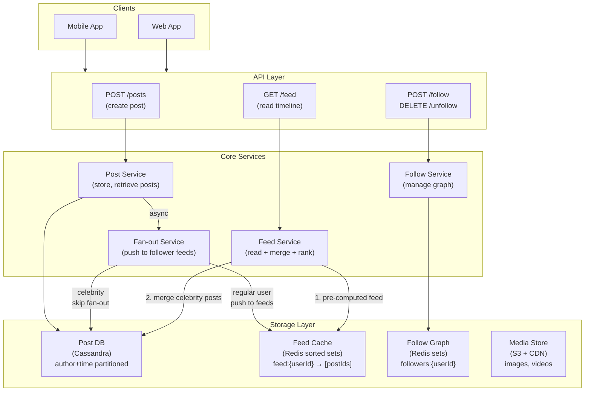
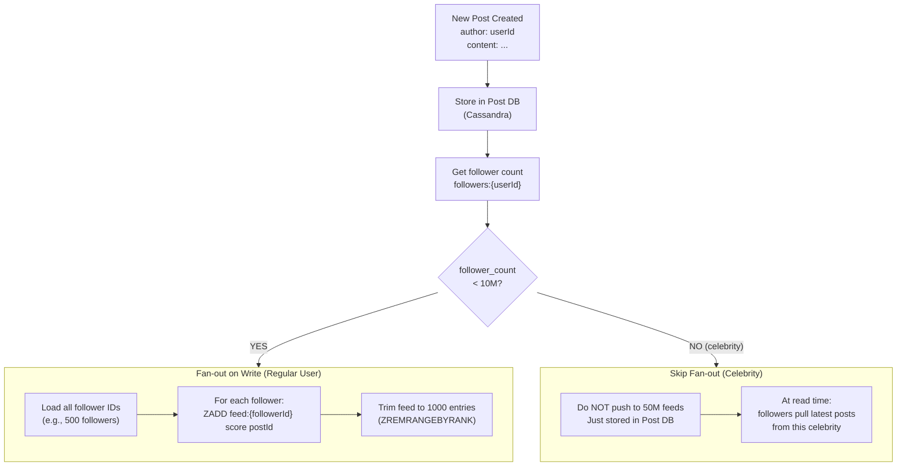
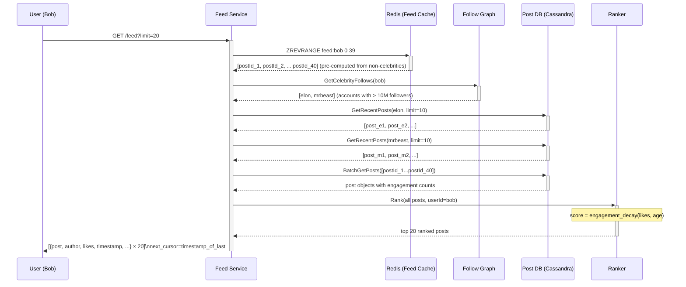
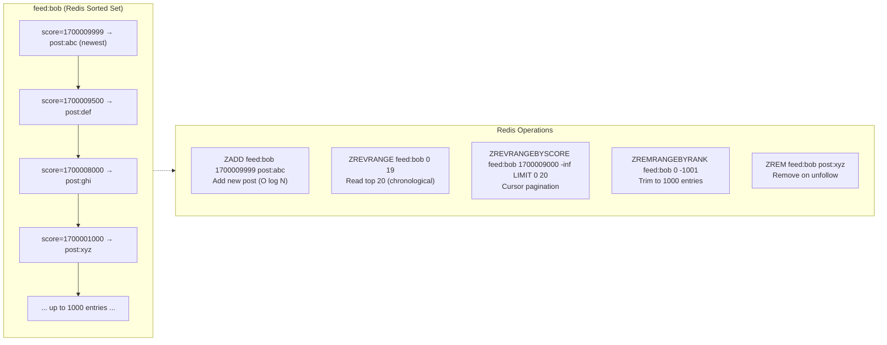
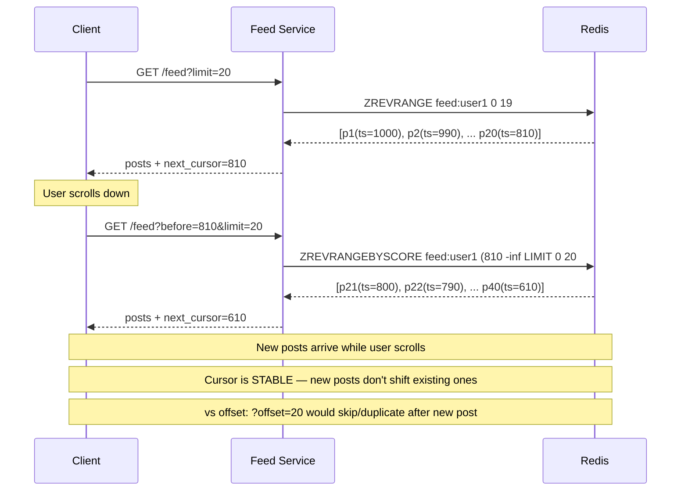
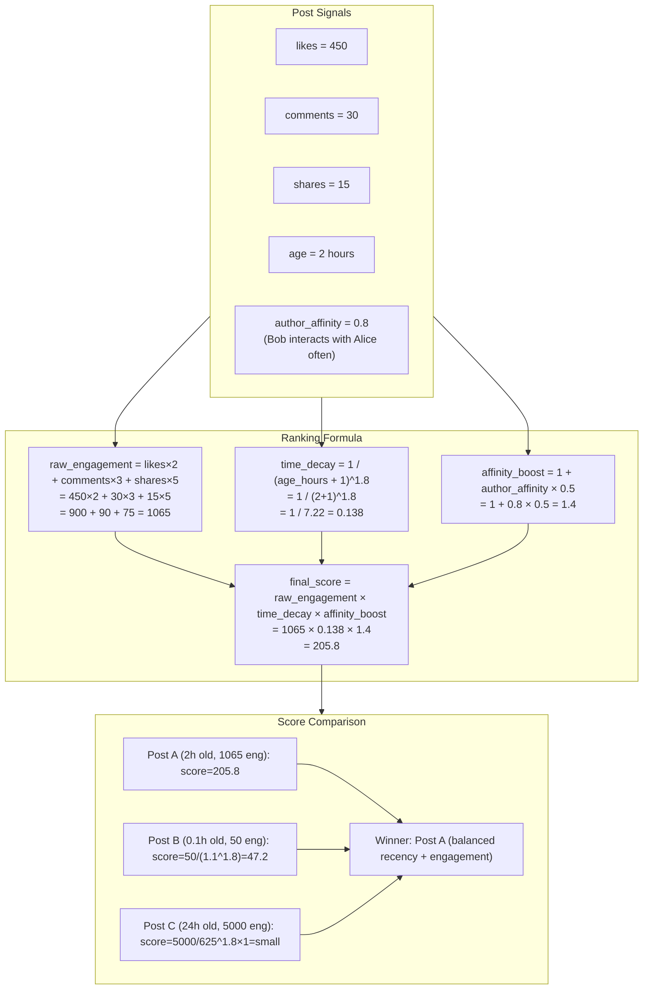
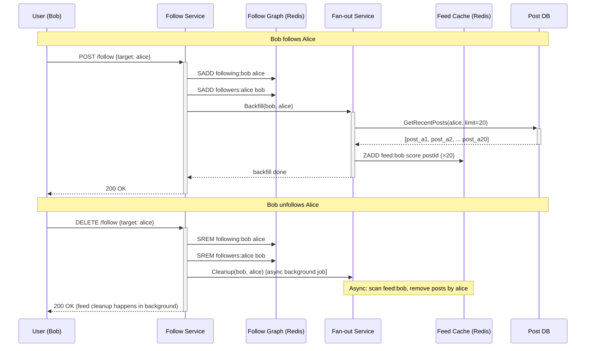
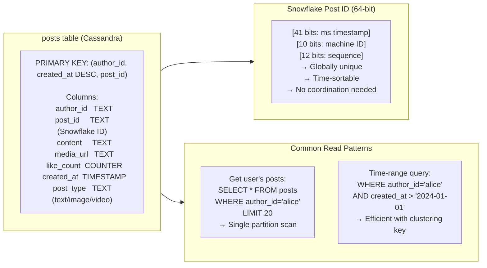

# Social Media Feed — Architecture Diagrams

---

## 1. High-Level System Architecture

---

## 2. Fan-out Decision: Regular User vs Celebrity

---

## 3. Feed Read Path — Hybrid Merge

---

## 4. Redis Feed Cache — Sorted Set Model

---

## 5. Cursor-Based Pagination

---

## 6. Ranking Score Model

---

## 7. Follow / Unfollow Flow

---

## 8. Post Data Model (Cassandra)

