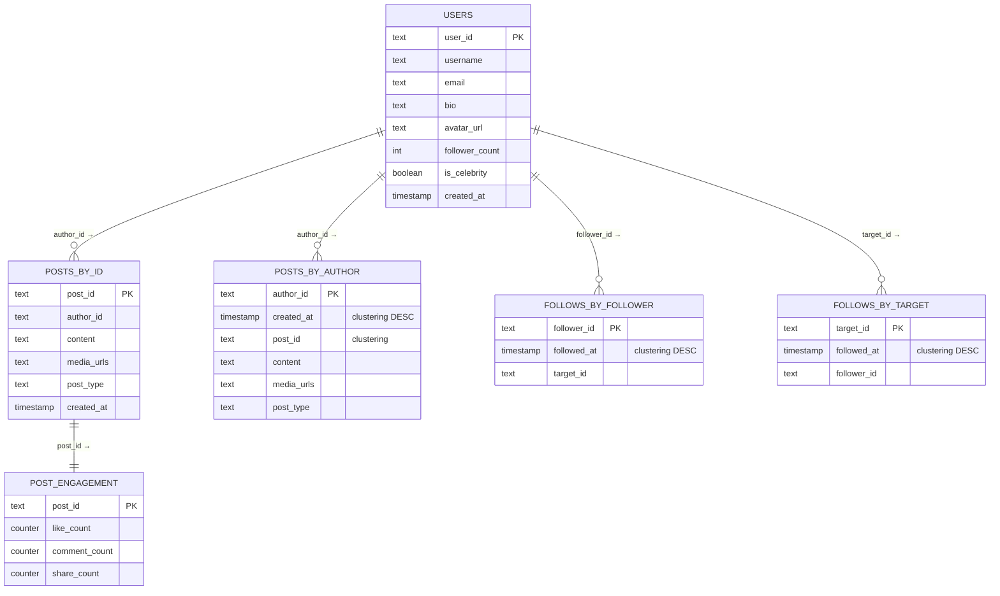

# Social Media Feed — Database Design

This document covers every storage layer the feed system touches: the **Cassandra tables**
that durably own all content, the **Redis data structures** that make reads instant, and the
reasoning behind each choice. For the service-level view see [HLD.md](HLD.md); for the
class-level view see [LLD.md](LLD.md).

> **How to view the diagrams below:** open this file in VS Code's Markdown preview
> (`Cmd+Shift+V`). If they don't render, install the **Markdown Preview Mermaid Support**
> extension (`bierner.markdown-mermaid`). They also render automatically on GitHub.

---

## Storage technology map

| Layer | Technology | What lives here | Why |
|-------|-----------|-----------------|-----|
| **Durable store** | Cassandra | Posts, users, follows, engagement counters | Wide-column; partition key = instant O(1) lookup even at petabyte scale; handles the 5,800 writes/sec post volume plus millions of counter increments/sec |
| **Feed cache** | Redis ZSET | Pre-built scored feed per user | ZREVRANGEBYSCORE is O(log N + page size); reading a page doesn't touch Cassandra at all |
| **Follow graph** | Redis SET | `followers:{id}` / `following:{id}` | SCARD (follower count for celebrity gate) is O(1); SMEMBERS for fan-out is O(N) but N is the follower set being iterated anyway |
| **Affinity scores** | Redis STRING | Per (user, author) float affinity boost | Written by the ML pipeline; read at ranking time; short TTL is fine — stale affinity degrades gracefully |

---

## Cassandra Schema

### Why Cassandra for posts?

Cassandra's data model forces you to design tables around **query patterns**, not
normalization. Because every query has a partition key, every lookup is O(1) regardless of
dataset size — exactly what you need at 580 K feed reads/sec. The flip side: the same post
is stored in two tables (write amplification), which is the deliberate trade.

### ER Diagram



---

### Table-by-table detail

#### `posts_by_id` — random-access hydration

```cql
CREATE TABLE posts_by_id (
    post_id    text      PRIMARY KEY,   -- Snowflake ID (time-sortable, globally unique)
    author_id  text,
    content    text,
    media_urls list<text>,              -- image / video CDN URLs; empty for text-only posts
    post_type  text,                    -- 'text' | 'image' | 'video' | 'link'
    created_at timestamp
);
```

**Query:** `SELECT * FROM posts_by_id WHERE post_id IN (...)` — feed hydration. A page of
20 IDs becomes a single multi-key fetch here; one round-trip, no joins.

**What is NOT here:** engagement counts (`like_count`, etc). They are written by millions of
users per second on viral posts. Storing them on the post row would turn every like into a
Cassandra `UPDATE` on the post partition — contention and hot-partition problems. They live
in `post_engagement` (counter table) instead.

---

#### `posts_by_author` — celebrity / backfill read path

```cql
CREATE TABLE posts_by_author (
    author_id  text,
    created_at timestamp,
    post_id    text,
    content    text,
    media_urls list<text>,
    post_type  text,
    PRIMARY KEY (author_id, created_at, post_id)
) WITH CLUSTERING ORDER BY (created_at DESC, post_id DESC);
```

**Query:** `SELECT * FROM posts_by_author WHERE author_id = ? LIMIT 20` — celebrity read
path. Cassandra stores all rows for one `author_id` on the same node, pre-sorted newest-first
by `created_at`. "Latest 20 posts by user X" is a single sequential scan of one partition —
no sort, no index, just reading the top of a sorted column family.

**Why duplicated from `posts_by_id`?** Cassandra has no secondary indexes that scale.
Answering "give me all posts by author X sorted by time" on `posts_by_id` would require a
full cluster scan (no partition key = scatter-gather across every node). The duplication is
the price of O(1) per-author reads.

---

#### `post_engagement` — high-write counters, kept separate

```cql
CREATE TABLE post_engagement (
    post_id       text     PRIMARY KEY,
    like_count    counter,
    comment_count counter,
    share_count   counter
);
```

**Query (write):** `UPDATE post_engagement SET like_count = like_count + 1 WHERE post_id = ?`
— atomic, distributed counter increment. Cassandra counter columns merge increments across
replicas without coordination, so a viral post getting 10,000 likes/second is fine.

**Query (read):** fetched alongside `posts_by_id` hydration to populate `Post.LikeCount` etc.
before ranking.

**Why a separate table (not columns on `posts_by_id`)?** Cassandra counter columns cannot
coexist with non-counter columns in the same table — it is a hard Cassandra constraint. This
forced separation is actually the right design: content and engagement have completely
different write patterns (content: once; engagement: constantly).

---

#### `users` — profile and celebrity flag

```cql
CREATE TABLE users (
    user_id         text      PRIMARY KEY,   -- Snowflake or UUID
    username        text,
    email           text,
    bio             text,
    avatar_url      text,
    follower_count  int,      -- approximate (periodically synced from Redis SCARD)
    is_celebrity    boolean,  -- true when follower_count crosses the threshold
    created_at      timestamp
);
```

`is_celebrity` is a **cached flag**, not the source of truth. The source of truth is
`SCARD followers:{userId}` in Redis (always current). `users.is_celebrity` is synced
periodically (e.g. every 5 minutes via a background job) so the fan-out worker can do a
quick Cassandra read during cold-start instead of hitting Redis.

---

#### `follows_by_follower` — "who does Alice follow?" (durable)

```cql
CREATE TABLE follows_by_follower (
    follower_id text,
    followed_at timestamp,
    target_id   text,
    PRIMARY KEY (follower_id, followed_at, target_id)
) WITH CLUSTERING ORDER BY (followed_at DESC, target_id ASC);
```

**Query:** `SELECT target_id FROM follows_by_follower WHERE follower_id = ?` — used to
**rebuild** Redis `following:{userId}` on cache miss or cold-start. During normal operation
the Redis SET is the fast path; this table is the source of truth.

---

#### `follows_by_target` — "who follows Bob?" (durable)

```cql
CREATE TABLE follows_by_target (
    target_id   text,
    followed_at timestamp,
    follower_id text,
    PRIMARY KEY (target_id, followed_at, follower_id)
) WITH CLUSTERING ORDER BY (followed_at DESC, follower_id ASC);
```

**Query:** `SELECT follower_id FROM follows_by_target WHERE target_id = ?` — used to rebuild
Redis `followers:{userId}`. Fan-out on write reads from the Redis copy (faster), not here.

**Why two follow tables?** Same reason as the two post tables: Cassandra forces you to choose
one partition key per table. `follows_by_follower` answers "who does X follow?";
`follows_by_target` answers "who follows X?" — opposite lookups, separate tables.

---

## Redis Schema

Redis has no formal schema — each key is a standalone data structure. The table below
documents every key pattern, its type, and the invariants the code maintains.

### Key patterns and data types

```
KEY PATTERN                     TYPE        MAX SIZE    TTL
─────────────────────────────────────────────────────────────────────
feed:{user_id}                  ZSET        1000 members   7 days idle
followers:{user_id}             SET         unbounded      no TTL
following:{user_id}             SET         unbounded      no TTL
celebrities                     SET         ~0.01% of DAU  no TTL
affinity:{user_id}:{author_id}  STRING      float64        24 hours
```

---

### `feed:{user_id}` — ZSET (the pre-built feed)

```
ZADD   feed:alice   9823.17   "post:777"
ZADD   feed:alice   9811.42   "post:634"
ZADD   feed:alice   9740.00   "post:521"
       ...

ZREVRANGEBYSCORE feed:alice +inf 9811.00 LIMIT 0 20   ← cursor page 2 (scores < 9811)
ZREMRANGEBYRANK  feed:alice 1000 -1                    ← trim to 1000 after every write
```

- **Score** = `FeedRanker.Score(post, affinity)` — a float encoding freshness × engagement × affinity.
  Higher = closer to top. This is computed once at fan-out write time, not at read time.
- **Member** = `post_id` string — the lightweight ID only. Content is fetched from
  `posts_by_id` at read time (hydration).
- **Cap** = 1,000 members. `ZREMRANGEBYRANK feed:{id} 1000 -1` after every `ZADD` trims
  the oldest off the bottom. Nobody scrolls past ~100; the cap keeps RAM bounded.
- **TTL** = 7 days of inactivity. If the key expires, the next read falls back to
  querying `posts_by_author` for each followed celebrity plus a Cassandra timeline query
  for regular follows — cold read, then cache is rebuilt.
- **Cursor pagination** = `ZREVRANGEBYSCORE … < cursor` (score below the last seen score)
  instead of `OFFSET N`. Score-based paging is immune to new posts arriving at the top
  between page requests — no posts skipped, no duplicates.

---

### `followers:{user_id}` and `following:{user_id}` — SETs (the follow graph)

```
SADD  followers:bob   "alice"
SADD  followers:bob   "carol"
SADD  following:alice "bob"
SADD  following:alice "eve"

SMEMBERS followers:bob           ← fan-out: "who needs bob's post?"
SCARD    followers:bob           ← celebrity gate: is SCARD >= 100000?
SMEMBERS following:alice         ← read path: "whose posts should alice see?"
SREM     followers:bob "carol"   ← both SETs updated atomically on unfollow
SREM     following:carol "bob"
```

- **`followers:{id}`** is the fan-out input: the set of users whose `feed:` ZSETs get a new
  entry when user `id` publishes.
- **`following:{id}`** is the read-path input: the set of authors whose posts appear in user
  `id`'s feed (split into celebrity vs regular subsets at read time).
- **No TTL.** These are the working copy of the social graph; losing them means the fan-out
  worker can't deliver posts. They are rebuilt from Cassandra (`follows_by_*`) on cold-start.
- **Celebrity gate:** `SCARD followers:{id} >= threshold` (threshold = 100K in production).
  Above this, `SADD celebrities {id}` is called (one-time, by a background follower-count watcher).

---

### `celebrities` — SET (celebrity index)

```
SADD celebrities "taylor_swift_id"
SADD celebrities "elon_musk_id"

SISMEMBER celebrities "user_id"   ← O(1) celebrity check (used at fan-out write time)
SINTER   following:alice celebrities  ← "which of alice's follows are celebrities?"
                                         → these authors' posts are pulled at read time
```

FeedService calls `SINTER following:{userId} celebrities` to get the celebrity subset of a
user's follows in one Redis command, without iterating all follows and checking each one.

---

### `affinity:{user_id}:{author_id}` — STRING (ML affinity boost)

```
SET  affinity:alice:bob   "0.82"   EX 86400   ← 24h TTL (ML pipeline refreshes daily)
SET  affinity:alice:eve   "0.31"   EX 86400

GET  affinity:alice:bob   → "0.82"            ← read at ranking time
```

- Written by the ML pipeline (not by the feed service). A float in [0.0, 1.0]: 0 = no
  affinity boost, 1 = maximum boost applied to `FeedRanker.Score`.
- **Missing key = 0.0 affinity** — the ranker treats a missing key as zero, not an error.
  New users or unfollowed authors naturally have no affinity data.
- **24h TTL** — stale affinity scores degrade ranking quality slightly but never break
  correctness. The ML pipeline refreshes them daily based on click/like patterns.

---

## Query pattern → table mapping

| Operation | Tables / Keys hit | Notes |
|-----------|-------------------|-------|
| **Publish a post** | `posts_by_id` INSERT, `posts_by_author` INSERT | Two writes, one post |
| **Fan-out (regular)** | `followers:{authorId}` → `feed:{followerId}` ZADD (× N) | Redis only, async |
| **Fan-out (celebrity)** | Skip — post already in `posts_by_author` | Pulled at read time |
| **Open feed — regular follows** | `feed:{userId}` ZREVRANGEBYSCORE → `posts_by_id` GetByIds | ZSET page + Cassandra hydration |
| **Open feed — celebrity follows** | `following:{userId}` SINTER `celebrities` → `posts_by_author` LIMIT 20 per celeb | 1 Redis + N Cassandra reads |
| **Rank feed** | `affinity:{userId}:{authorId}` GET per post | Redis STRING multi-get |
| **Like a post** | `post_engagement` counter UPDATE | Counter table, no contention |
| **Follow** | `follows_by_follower` INSERT, `follows_by_target` INSERT, `followers:{id}` SADD, `following:{id}` SADD | 2 Cassandra + 2 Redis |
| **Unfollow** | Same as follow in reverse + `feed:{userId}` scrub | `RemoveAuthorFromFeed` |
| **Cold-start (rebuild graph)** | `follows_by_follower` / `follows_by_target` full scan | Background job; rare |

---

## Key design decisions

- **Two Cassandra post tables, not one.** `posts_by_id` serves random hydration; `posts_by_author`
  serves the celebrity / backfill scan. No secondary indexes that scale exist in Cassandra for
  this access pattern — duplication is the only O(1) option.
- **Engagement in a counter table, not on the post row.** Cassandra counters are CRDTs: they
  merge concurrent increments without locking. A viral post at 10 K likes/sec would corrupt a
  regular column with concurrent writes; a counter column handles it natively.
- **Follows stored in Cassandra AND Redis.** Cassandra is the source of truth (durability);
  Redis is the hot path (speed). The Redis SETs are rebuilt from Cassandra on cold-start. This
  is the standard write-through cache pattern applied to graph edges.
- **Feed cache stores scores, not timestamps.** The score bakes in freshness, engagement, and
  affinity at write time. At read time the ranker just sorts by score descending — no floating
  point re-computation per read. This shifts cost to writes (which happen 100× less often than reads).
- **Score-based cursor, not offset.** `ZREVRANGEBYSCORE … < lastScore` is stable under
  concurrent inserts: new posts arrive at higher scores and don't shift the cursor. Offset
  pagination would skip posts inserted between pages.
- **Celebrity set in Redis.** `SINTER following:alice celebrities` is one Redis command. Without
  this set, FeedService would call `SISMEMBER celebrities` once per followed user to find the
  celebrity subset — N round-trips instead of one.

---

## Capacity sketch

| What | Estimate |
|------|----------|
| `posts_by_id` rows | ~10 B/day → ~3.6 T/year; Cassandra partitions by post_id across nodes |
| `post_engagement` rows | same cardinality as `posts_by_id` |
| `follows_by_*` rows | avg 500 follows/user × 500 M users = 250 B rows total |
| `feed:{userId}` ZSET | 1000 entries × ~30 B per entry × 500 M active users ≈ 15 TB Redis (sharded) |
| `followers:{id}` + `following:{id}` SETs | avg 500 edges/user × 2 sets × ~16 B per member × 500 M users ≈ 8 TB Redis |
| `affinity:*` STRINGs | only for active follow pairs; ~5 B keys × ~50 B each ≈ 250 GB |
