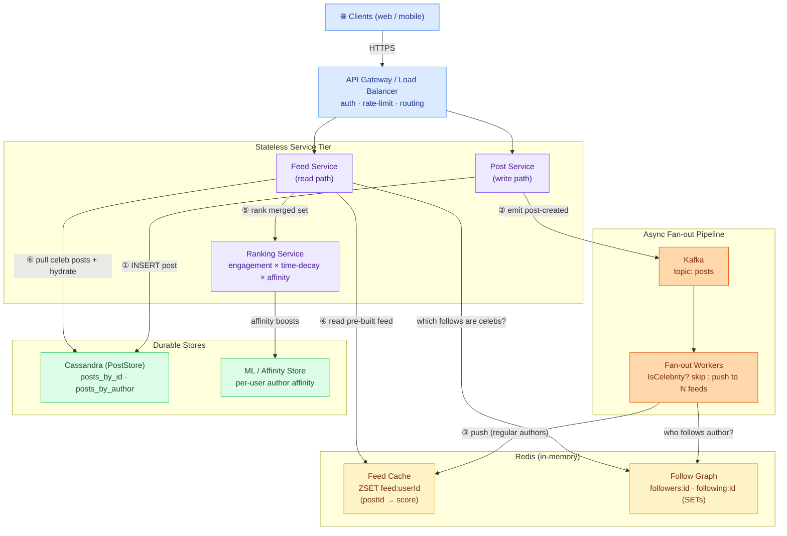
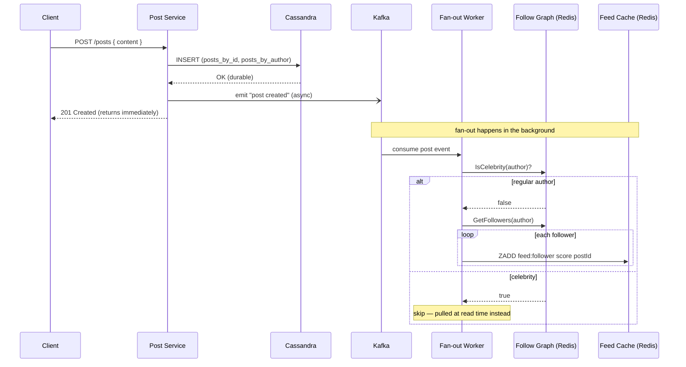
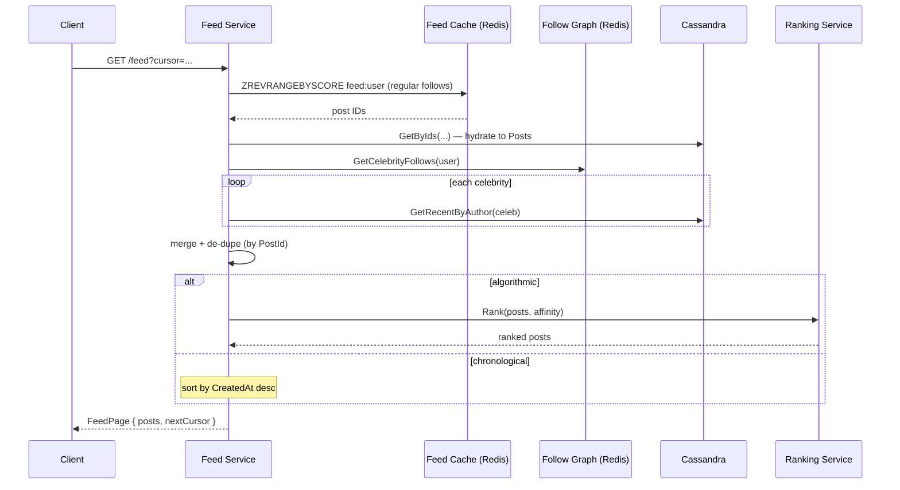

# Social Media Feed — High-Level Design (System Architecture)

This is the **system-level** view: the production infrastructure behind the hybrid fan-out
model (Kafka fan-out workers, Redis sorted sets, Cassandra). For the class-level view see
[LLD.md](LLD.md).

> **How to view the diagrams below:** open this file in VS Code's Markdown preview
> (`Cmd+Shift+V`). If they don't render, install the **Markdown Preview Mermaid Support**
> extension (`bierner.markdown-mermaid`). They also render automatically on GitHub.

---

## System Architecture

---

## ① Publish a post (write path) — `POST /posts`

## ② Open the feed (read path) — `GET /feed`

---

## Why each component exists

| Component | Role | Maps to in code |
|-----------|------|-----------------|
| **API Gateway / LB** | Auth, rate-limit, route to services | *(prod-only)* |
| **Post Service** | Handles writes; persists + emits event | `FanOutService.OnPost` |
| **Feed Service** | Assembles a read page (merge + rank) | `FeedService.GetFeed` |
| **Kafka** | Decouples posting from fan-out; absorbs spikes | *(`OnPost` → worker boundary)* |
| **Fan-out Workers** | Async consumers; push to regular feeds, skip celebs | `FanOutService` push loop |
| **Redis — Feed Cache** | One sorted set per user; instant reads | `FeedCacheRedis` |
| **Redis — Follow Graph** | `followers:` / `following:` SETs; celebrity gate | `FollowGraphRedis` |
| **Cassandra** | Durable posts; by-id + by-author indexes | `PostStoreCassandra` |
| **Ranking Service** | Engagement × time-decay × affinity scoring | `FeedRanker` |
| **ML / Affinity Store** | Per-user author-affinity boosts | `authorAffinity` param |

## Key HLD design decisions

- **Hybrid fan-out** — push for the many (regular authors), pull for the few (celebrities).
  Avoids both the celebrity write-storm (millions of feed writes for one post) *and* the slow
  "compute feed on every read" problem.
- **Fan-out is async via Kafka** — `POST /posts` returns the instant the post is durable;
  spreading it to millions of feeds happens in the background. A slow fan-out never blocks the author.
- **Feed cache stores IDs only** (sorted sets of `postId` + `score`); content is hydrated from
  Cassandra at read time. Keeps millions of feeds in RAM.
- **Cursor pagination via score** — `ZREVRANGEBYSCORE … < cursor` is immune to new posts arriving
  at the top (no skips/duplicates), unlike offset paging.
- **Cap feeds at ~1000 entries** — nobody scrolls past a few hundred; trim the tail on every write
  so memory stays bounded.
- **Ranking decoupled** — chronological vs algorithmic is just a different sort over the same merged
  set; switching modes needs no storage change.

## Capacity sketch (back-of-envelope)

| Metric | Estimate |
|--------|----------|
| Users | ~500 M DAU |
| Posts | ~500 M/day → ~5,800 writes/sec |
| Feed reads | ~50 B/day → ~580 K reads/sec (100:1 read-heavy) |
| Avg fan-out | ~500 followers → ~2.9 M feed-writes/sec (regular authors) |
| Feed cache | 1000 entries × ~30 B × 500 M users ≈ 15 TB Redis (sharded) |
