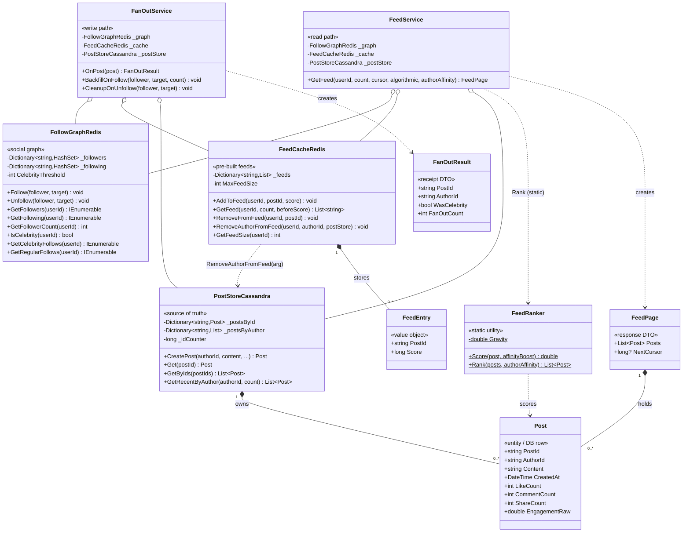

# Social Media Feed — Low-Level Design (UML Class Diagram)

This is the **class-level** view of the Social Media Feed. The defining structural feature:
three shared backing stores (`FollowGraphRedis`, `FeedCacheRedis`, `PostStoreCassandra`) are
injected into **both** `FanOutService` (write path) and `FeedService` (read path) — that
sharing *is* the hybrid fan-out architecture.

> **How to view the diagram below:** open this file in VS Code's Markdown preview
> (`Cmd+Shift+V`). If it doesn't render, install the **Markdown Preview Mermaid Support**
> extension (`bierner.markdown-mermaid`). It also renders automatically on GitHub.

---

## Class Diagram



---

## Reading the relationships

| Notation | Relationship | In this design |
|----------|--------------|----------------|
| `o--` | **Aggregation** (holds, independent lifetime) | `FanOutService` **and** `FeedService` are both constructor-injected the **same** `FollowGraphRedis`, `FeedCacheRedis`, and `PostStoreCassandra` instances (created once in `Main`). Shared substrate → aggregation, not composition. |
| `*--` | **Composition** (owns its contents) | `FeedCacheRedis` owns its `FeedEntry` lists; `PostStoreCassandra` owns its `Post` objects; `FeedPage` owns its `List<Post>`. |
| `..>` | **Dependency** (uses, no stored field) | `FeedService` → `FeedRanker` (static `Rank`); both services *create* result DTOs; `FeedCacheRedis.RemoveAuthorFromFeed` takes a `PostStoreCassandra` as a parameter. |

## The structural story (the "why" behind the shape)

- **Two services, one shared substrate.** `FanOutService` (write) and `FeedService` (read) are
  deliberately separate — the two halves of the hybrid model — but they operate on the **same
  three stores**. The writer pushes into `FeedCacheRedis`; the reader reads from it. That shared
  instance is the contract between them.
- **`FollowGraphRedis` is the decision-maker.** Its `IsCelebrity` gate is what both services branch
  on: the writer uses it to decide *push vs skip*; the reader uses `GetCelebrityFollows` /
  `GetRegularFollows` to decide *pull live vs read from cache*.
- **`PostStoreCassandra` is the single source of truth.** Everything else holds only `PostId`
  references; content is *hydrated* back from here at read time via `GetByIds`.
- **`FeedEntry` (value object) vs `Post` (entity).** The cache stores the tiny `(PostId, Score)`
  pair, never the full `Post` — that's what keeps millions of feeds in memory.
- **`FeedRanker` is stateless.** A static utility (pure scoring function); neither service stores a
  reference to it — it's a pure dependency.
- **Cross-store dependency:** `FeedCacheRedis.RemoveAuthorFromFeed` needs `PostStoreCassandra`
  passed in — the cache only knows `PostId`s, so it must ask the store "who wrote this?" to scrub
  an unfollowed author's posts.

## Call flow at a glance

```
WRITE  OnPost(post):
   FollowGraphRedis.IsCelebrity(author)
     ├─ false → for each follower: FeedCacheRedis.AddToFeed(...)   → FanOutResult(count=N)
     └─ true  → skip (post already in PostStoreCassandra)          → FanOutResult(celeb, 0)

READ   GetFeed(user):
   1. FeedCacheRedis.GetFeed(user, count*2, cursor)      → regular-follow post IDs
   2. PostStoreCassandra.GetByIds(...)                    → hydrate to Posts
   3. FollowGraphRedis.GetCelebrityFollows(user)
        → PostStoreCassandra.GetRecentByAuthor(celeb)     → live celebrity posts
   4. merge + de-dupe → FeedRanker.Rank (or sort by time) → FeedPage
```
