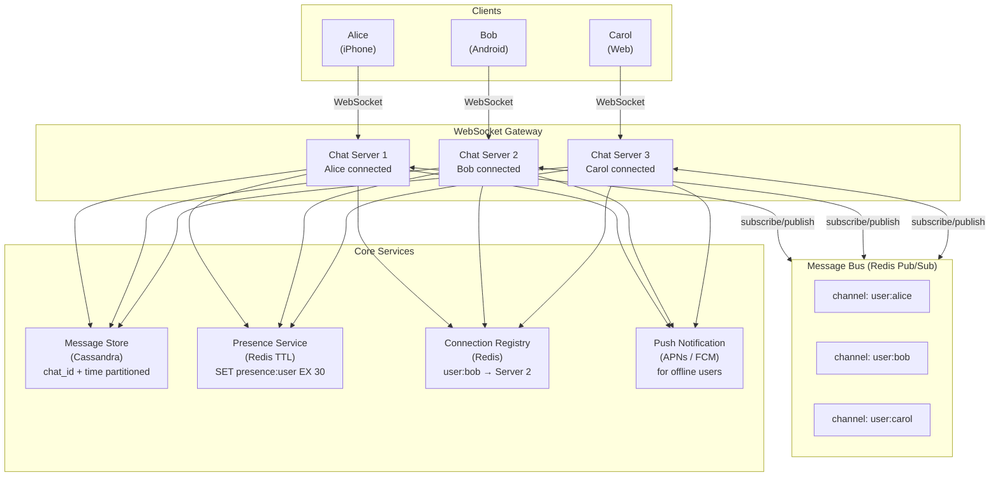
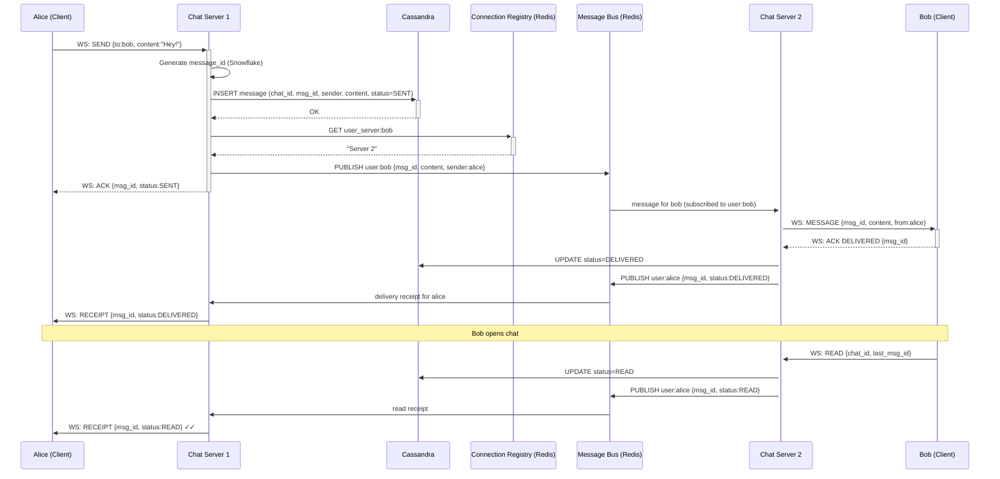
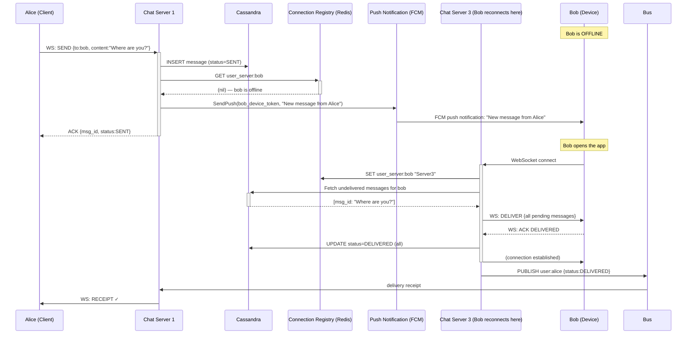
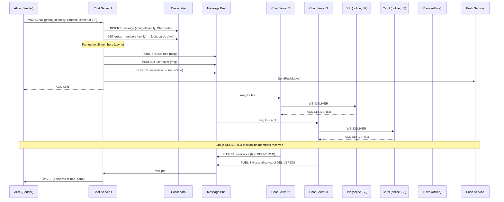
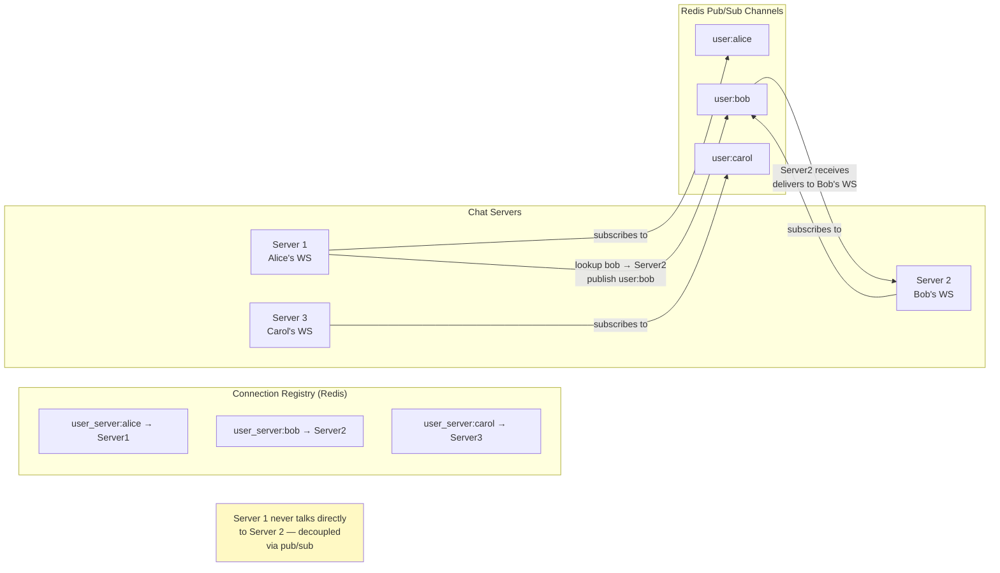
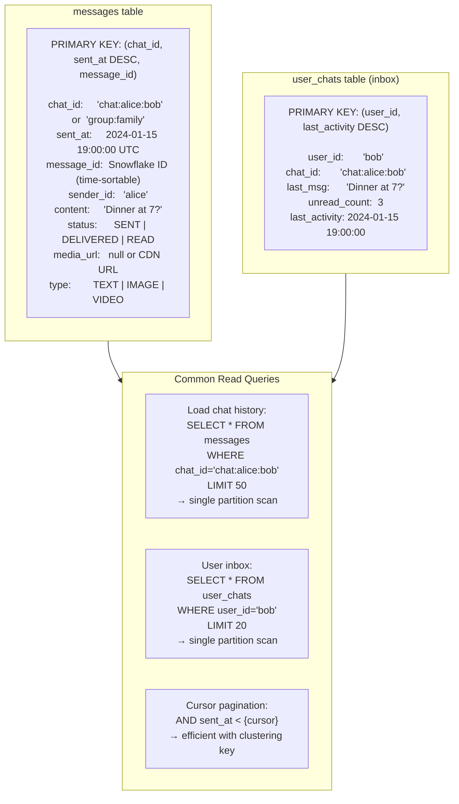
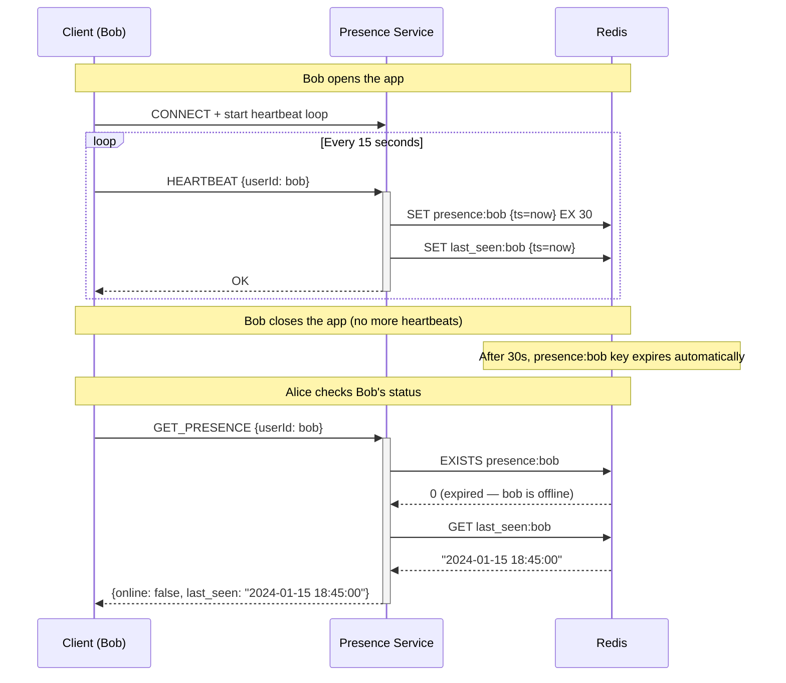
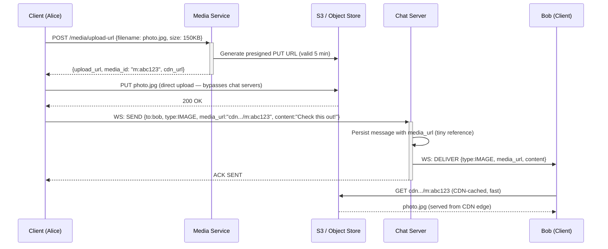

# Real-Time Chat — Architecture Diagrams

---

## 1. High-Level System Architecture

---

## 2. Online Message Delivery (Alice → Bob, Both Online)

---

## 3. Offline Message Delivery

---

## 4. Group Chat Fan-out

---

## 5. Cross-Server Routing via Registry

---

## 6. Message Storage Model (Cassandra)

---

## 7. Presence Service

---

## 8. Media Sharing Flow

