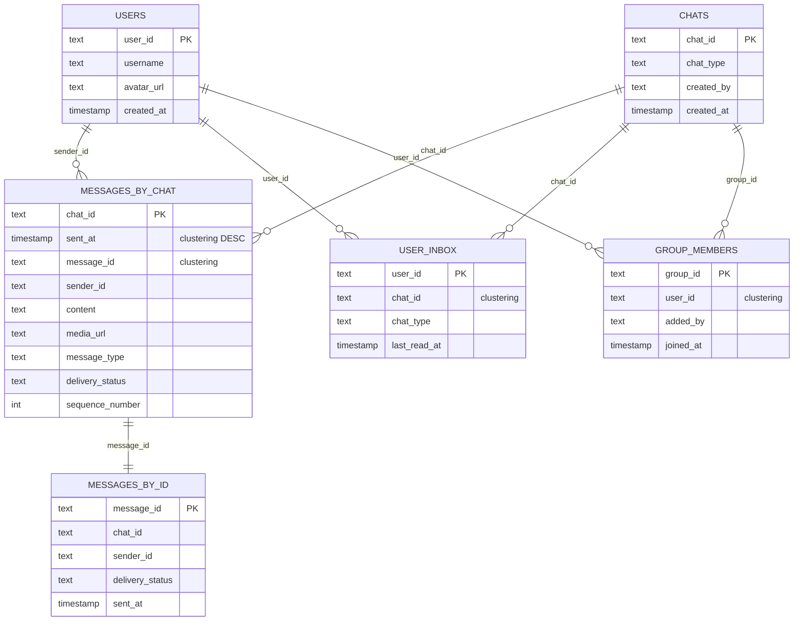

# Real-Time Chat — Database Design

This document covers every storage layer the chat system touches: the **Cassandra tables**
that durably own every message, the **Redis data structures** that power instant delivery
and presence, and the reasoning behind each choice. For the service-level view see
[HLD.md](HLD.md); for the class-level view see [LLD.md](LLD.md).

> **How to view the diagrams below:** open this file in VS Code's Markdown preview
> (`Cmd+Shift+V`). If they don't render, install the **Markdown Preview Mermaid Support**
> extension (`bierner.markdown-mermaid`). They also render automatically on GitHub.

---

## Storage technology map

| Layer | Technology | What lives here | Why |
|-------|-----------|-----------------|-----|
| **Durable store** | Cassandra | Messages, chats, users, group membership | Append-only writes at millions/sec; partition key = one node owns one chat; no cross-partition joins needed |
| **Connection registry** | Redis STRING | `userId → serverId` mapping for live WebSockets | O(1) lookup routes every message to the right server; short TTL auto-evicts crashed servers |
| **Presence** | Redis STRING (TTL) | Per-user heartbeat window + last-seen timestamp | Redis key expiry is the online/offline gate — no application-level cleanup code |
| **Group membership** | Redis SET | `group:{id}` → member set for fan-out | `SMEMBERS` is the hot path on every group message send; Cassandra is the cold durable backup |
| **Message bus** | Redis Pub/Sub | Ephemeral cross-server message delivery channels | No stored state — purely event routing; a new server subscribes its users and immediately receives |

---

## Cassandra Schema

### Why Cassandra for messages?

Chat history is **append-only and read by conversation**. Cassandra's partition model maps
perfectly: `chat_id` as the partition key means every message for one conversation lives on
the same node, pre-sorted by time. "Load the last 50 messages in this chat" is a single
sequential read of one partition — no joins, no indexes, no scatter-gather across nodes.

### ER Diagram



---

### Table-by-table detail

#### `messages_by_chat` — the primary message store

```cql
CREATE TABLE messages_by_chat (
    chat_id         text,
    sent_at         timestamp,
    message_id      text,            -- Snowflake ID (client-generated, time-sortable)
    sender_id       text,
    content         text,
    media_url       text,            -- CDN/S3 URL; null for Text messages
    message_type    text,            -- 'text' | 'image' | 'video' | 'file'
    delivery_status text,            -- 'sent' | 'delivered' | 'read'
    sequence_number int,
    PRIMARY KEY (chat_id, sent_at, message_id)
) WITH CLUSTERING ORDER BY (sent_at DESC, message_id DESC);
```

**Query — load history:** `SELECT * FROM messages_by_chat WHERE chat_id = ? AND sent_at < ? LIMIT 50`

The `before` cursor (`sent_at < ?`) is stable under concurrent inserts: new messages arrive
at later timestamps and never shift already-paged rows. The result set is reversed in the
application layer (`GetHistory` does `OrderBy(m => m.SentAt)` after the DESC fetch) to
present messages in chronological order for display.

**What is NOT here:** `delivery_status` updates (✓ → ✓✓ → ✓✓read) are not tracked per-recipient
in this table — that would require one row per (message, recipient), multiplying storage by
group size. Instead, the status stored here is the **aggregate** (the message is considered
Delivered once any recipient ACKs it). Per-recipient receipts live in a separate
`message_receipts` table (see design decisions section).

---

#### `messages_by_id` — O(1) receipt lookup

```cql
CREATE TABLE messages_by_id (
    message_id      text      PRIMARY KEY,
    chat_id         text,
    sender_id       text,
    delivery_status text,
    sent_at         timestamp
);
```

**Query — update receipt:** `UPDATE messages_by_id SET delivery_status = 'delivered' WHERE message_id = ?`

In the demo, `GetById` scans all messages O(total) to find one by ID — a known production gap
called out in `MessageStoreCassandra.cs`. This table fixes it: given only a `message_id`
(which the client includes in every ACK), a single-partition lookup updates the status
instantly regardless of which chat the message belongs to.

**Why not just use `messages_by_chat`?** That table's partition key is `chat_id`. To update
by `message_id`, you would need the `chat_id` too — but the client's ACK only knows the
`message_id`. Storing `chat_id` in the ACK would work, but clients don't naturally track it.
The duplicated `messages_by_id` table is the standard Cassandra solution: look up `chat_id`
here, then update there.

---

#### `user_inbox` — O(1) undelivered message lookup on reconnect

```cql
CREATE TABLE user_inbox (
    user_id     text,
    chat_id     text,
    chat_type   text,            -- 'dm' | 'group'
    last_read_at timestamp,
    PRIMARY KEY (user_id, chat_id)
);
```

**Query — reconnect drain:** `SELECT chat_id FROM user_inbox WHERE user_id = ?`  
→ for each `chat_id` → `SELECT * FROM messages_by_chat WHERE chat_id = ? AND sent_at > last_read_at`

This is the production fix for the demo's `GetUndelivered` which scans every message in the
store using `chatId.Contains(userId)` — O(total messages), completely unscalable. The
`user_inbox` table is an O(1) index: "which chats does this user belong to?" The reconnect
drain then queries only those chats for messages after `last_read_at`, making the cost
proportional to missed messages, not total history.

**Written:** once on chat creation (DM) or on `AddMember` (group). `last_read_at` is updated
as the user reads messages.

---

#### `chats` — conversation metadata

```cql
CREATE TABLE chats (
    chat_id    text      PRIMARY KEY,   -- "chat:alice:bob" (DM) or "group:abc123" (group)
    chat_type  text,                    -- 'dm' | 'group'
    created_by text,
    created_at timestamp
);
```

**Query:** `SELECT chat_type FROM chats WHERE chat_id = ?` — used to decide whether to look
up group membership (group) or parse the two participants from the chat_id string (DM).

In the demo, `ChatServer.GetRecipients` uses the `chat_id` string format heuristic
(`group:` prefix vs `chat:`) to distinguish chat types. In production, the `chats` table
owns this classification so the logic does not depend on naming conventions.

---

#### `group_members` — durable group membership

```cql
CREATE TABLE group_members (
    group_id  text,
    user_id   text,
    added_by  text,
    joined_at timestamp,
    PRIMARY KEY (group_id, user_id)
);
```

**Query:** `SELECT user_id FROM group_members WHERE group_id = ?` — used to rebuild
`GroupStoreRedis` on cold-start or cache miss.

`GroupStoreRedis` (`group:{id}` Redis SET) is the hot path: every group message send reads
from Redis, not Cassandra. This table is the source of truth that Redis is rebuilt from.
`AddMember` writes to both: Cassandra first (durable), then Redis (fast path). A cache miss
re-reads from Cassandra and re-populates the Redis SET.

---

#### `users` — user profiles

```cql
CREATE TABLE users (
    user_id    text      PRIMARY KEY,
    username   text,
    avatar_url text,
    created_at timestamp
);
```

**Query:** `SELECT username, avatar_url FROM users WHERE user_id IN (...)` — hydrated when
rendering a chat thread (show sender names and avatars alongside messages).

---

## Redis Schema

Redis has no formal schema — each key is a standalone data structure. The table below
documents every key pattern used in the system.

### Key patterns and data types

```
KEY PATTERN                TYPE      TTL           PURPOSE
──────────────────────────────────────────────────────────────────────────────────
conn:{user_id}             STRING    60 s (rolling) userId → serverId routing
presence:{user_id}         STRING    30 s (rolling) online gate (SETEX on heartbeat)
lastseen:{user_id}         STRING    none           last-active timestamp (persistent)
group:{group_id}           SET       none           member set for group fan-out
user:{user_id}             CHANNEL   ephemeral      pub/sub delivery channel (no storage)
```

---

### `conn:{user_id}` — STRING (connection registry)

```
SET   conn:alice   "Server1"   EX 60         ← WebSocket handshake → Register()
SET   conn:alice   "Server1"   EX 60         ← refreshed on every heartbeat
GET   conn:bob                               → "Server2"  (route message here)
GET   conn:dave                              → nil        (offline → push fallback)
DEL   conn:alice                             ← clean disconnect → Deregister()
```

- **Value** = `serverId` string (e.g., `"Server1"`). The chat server publishes to
  `user:{userId}` on the bus; the subscribed server receives it and pushes to the socket.
- **TTL = 60 s, rolling.** Every heartbeat resets the TTL via `SET … EX 60`. If a server
  crashes (no clean Deregister), the key expires automatically within 60 s — messages then
  fall through to push notification instead of routing to a dead server's channel. The demo
  stores this in `ConnectionRegistryRedis` with no TTL; the 60 s TTL is the production fix.
- **`nil` = offline.** `GET` returning nil is the normal branch to push notification —
  not an error, not a lookup failure, just the expected offline case.

---

### `presence:{user_id}` — STRING with rolling TTL (online gate)

```
SETEX presence:alice 30 "1"          ← Heartbeat() every ~10 s resets the window
SETEX presence:alice 30 "1"          ← next heartbeat (30 s window stays fresh)
EXISTS presence:alice                → 1  (online)
EXISTS presence:bob                  → 0  (key expired → offline)
DEL   presence:alice                 ← Disconnect() for instant offline on clean logout
```

- **TTL = 30 s.** Each heartbeat (every ~10 s) calls `SETEX presence:{id} 30 "1"`,
  resetting the countdown. If heartbeats stop (crash, network drop), the key expires and
  `EXISTS` returns 0 — the user is considered offline with zero application cleanup code.
- **The key's existence IS the presence flag.** There is no separate `is_online` column.
  Redis TTL self-corrects for crashes in a bounded window (at most 30 s stale).
- **Disconnect removes the key immediately.** A clean logout calls `DEL presence:{id}` so
  the user appears offline instantly without waiting 30 s for the TTL to fire.

---

### `lastseen:{user_id}` — STRING (no TTL)

```
SET lastseen:alice "2026-06-08T15:42:08Z"   ← updated on every Heartbeat()
SET lastseen:bob   "2026-06-08T15:40:12Z"   ← updated on Disconnect() (exact logout time)

GET lastseen:bob                            → "2026-06-08T15:40:12Z"
                                              → UI shows "last seen at 3:40 PM"
GET lastseen:erin                           → nil  → "never seen" (distinct from "long ago")
```

- **No TTL** — survives after `presence:` key expires. "Last seen 5 min ago" must remain
  queryable long after the user goes offline.
- **Updated on both Heartbeat and Disconnect.** Heartbeat updates bound crash-recovery
  staleness to one heartbeat interval (~10 s). Disconnect stamps the exact logout time.
- **`nil` vs a very old timestamp** are distinguished: `nil` means a user the system has
  never seen; an old timestamp means "was active, not seen recently."

---

### `group:{group_id}` — SET (group membership hot path)

```
SADD     group:family "alice" "bob" "carol" "dave"   ← CreateGroup()
SADD     group:family "eve"                          ← AddMember()
SMEMBERS group:family                                → { alice, bob, carol, dave, eve }
SREM     group:family "dave"                         ← RemoveMember()
EXISTS   group:family                                → 1  (is this a group chat?)
EXISTS   group:meeting-xyz                           → 0  (not a group → 1:1 DM)
```

- **Every group message send reads from this SET.** `ChatServer.GetRecipients` calls
  `GetMembers(chatId)`: a non-null result means group (fan out to all members minus sender);
  null means DM (parse the two participants from the `chat_id` string).
- **No TTL.** Group membership is permanent until an explicit remove. Losing this SET means
  the next group message falls through to `null` (treated as DM) — a correctness bug. The
  SET is rebuilt from `group_members` Cassandra table on cold-start.
- **`SMEMBERS` is O(N)** but N is the group size being iterated anyway for fan-out, so
  there is no wasted work.

---

### `user:{user_id}` — Pub/Sub channel (ephemeral, no stored state)

```
SUBSCRIBE   user:bob                    ← Server2 calls when Bob's WebSocket opens
UNSUBSCRIBE user:bob                    ← Server2 calls when Bob's WebSocket closes
PUBLISH     user:bob  <ChatMessage>     ← Server1 calls to route a message to Bob
                                          → Redis delivers to Server2's handler
                                          → Server2 pushes down Bob's WebSocket
                                          → returns 0 if nobody subscribed (Bob offline)
```

- **No data is stored.** Redis Pub/Sub channels are ephemeral: publish delivers to current
  subscribers and nothing is buffered. If Bob is offline (no subscriber), the message is
  not persisted by Redis — it must already be in Cassandra (`messages_by_chat`) so Bob can
  fetch it on reconnect.
- **Channel name = `user:{userId}`.** Predictable, cheap to construct, globally unique per
  user. No central registry of channel names needed.
- **Return value of PUBLISH** = subscriber count. `0` = nobody subscribed (offline) →
  `ChatServer` falls back to `PushNotificationServiceAPNsFCM`. This is why
  `MessageBusRedis.Publish` returns `bool`: it wraps the 0-vs-positive check.
- **Multi-device:** two WebSocket connections (phone + laptop) = two `SUBSCRIBE` calls on
  the same channel from two different servers. One `PUBLISH` fans out to both.

---

## Query pattern → table mapping

| Operation | Tables / Keys hit | Notes |
|-----------|-------------------|-------|
| **Send a message** | `messages_by_chat` INSERT, `messages_by_id` INSERT | Both written synchronously before delivery |
| **Deliver online** | `conn:{id}` GET → `user:{id}` PUBLISH | Redis only; Cassandra not touched |
| **Deliver offline** | `presence:{id}` TTL expired → APNs/FCM push | Redis only |
| **Load chat history** | `messages_by_chat` WHERE chat_id + sent_at < cursor | One partition scan |
| **Reconnect drain** | `user_inbox` → `messages_by_chat` WHERE sent_at > last_read | O(missed), not O(total) |
| **Update receipt (✓✓)** | `messages_by_id` UPDATE delivery_status | O(1) by message_id |
| **Fan-out group message** | `group:{id}` SMEMBERS → `conn:{id}` GET per member → `user:{id}` PUBLISH | Redis only; no Cassandra |
| **Register WebSocket** | `conn:{id}` SETEX, `presence:{id}` SETEX, `user:{id}` SUBSCRIBE | Three Redis ops |
| **Heartbeat** | `conn:{id}` SETEX (reset TTL), `presence:{id}` SETEX (reset TTL), `lastseen:{id}` SET | Three Redis ops every ~10 s |
| **Clean disconnect** | `conn:{id}` DEL, `presence:{id}` DEL, `lastseen:{id}` SET, `user:{id}` UNSUBSCRIBE | Four Redis ops |
| **Create group** | `chats` INSERT, `group_members` INSERT × N, `group:{id}` SADD × N | Cassandra + Redis |
| **Add member** | `group_members` INSERT, `group:{id}` SADD | Cassandra first, then Redis |
| **Cold-start (rebuild)** | `group_members` SELECT → `group:{id}` SADD | Background job; rare |

---

## Key design decisions

- **Partition by `chat_id`, not by `user_id`.** All messages for a conversation on one node
  means "load the last 50 messages" is one sequential scan. Partitioning by `user_id` would
  require a scatter-gather across shards to assemble one conversation — fatal at scale.
- **Two message tables, not one.** `messages_by_chat` serves the history read path (known
  `chat_id`); `messages_by_id` serves the receipt update path (known `message_id` only).
  Cassandra cannot answer both queries efficiently from a single table without one of them
  becoming a full-cluster scan.
- **`user_inbox` is the fix for the demo's O(total) `GetUndelivered`.** The demo comments
  call this out explicitly. The inbox index makes reconnect drain O(missed messages) instead
  of O(all messages ever stored) — mandatory at production scale.
- **Connection registry has a TTL; presence has a separate TTL.** `conn:` TTL (60 s)
  auto-evicts crashed servers so messages fall to push rather than routing to dead channels.
  `presence:` TTL (30 s) is the online/offline gate. They have different values because
  "is the WebSocket route still valid?" and "should we show the green dot?" are different
  questions with different tolerance for staleness.
- **`lastseen` has no TTL.** Online presence is a sliding window; last-seen is a permanent
  record. Redis would delete a TTL'd `lastseen` key while the user is offline — exactly
  when you most want "last seen at 3:40 PM" to remain queryable.
- **Pub/Sub delivers, Cassandra stores.** Redis Pub/Sub is fire-and-forget — nothing is
  buffered. If delivery fails, the message is not lost because it was persisted to
  `messages_by_chat` before any delivery attempt. The reconnect drain always recovers it.
  This is the "persist before deliver" invariant stated in HLD.md.
- **Group SET in Redis, durable in Cassandra.** `SMEMBERS` is called on every group message
  send — it must be in Redis (sub-millisecond). Cassandra is the rebuild source, not the
  hot path. Losing the Redis SET without Cassandra would be permanent data loss; losing Redis
  alone is just a cache miss that triggers a rebuild.

---

## Capacity sketch

| What | Estimate |
|------|----------|
| `messages_by_chat` rows | ~10 B messages/day → ~3.6 T/year; each partition (chat) on one Cassandra node |
| `messages_by_id` rows | same cardinality; small row (~200 B) |
| `user_inbox` rows | avg 20 chats/user × 500 M users = 10 B rows; tiny rows |
| `conn:*` keys | ~50 M concurrent online users × ~50 B/key ≈ 2.5 GB Redis |
| `presence:*` keys | same cardinality as `conn:*`; rolling 30 s TTL keeps count bounded |
| `lastseen:*` keys | ~500 M users × ~80 B/key ≈ 40 GB Redis |
| `group:*` SETs | avg 20 members × ~16 B × active groups; typically small |
| Pub/Sub throughput | ~115 K messages/sec (from HLD); Redis Pub/Sub handles ~1 M msgs/sec per node |
