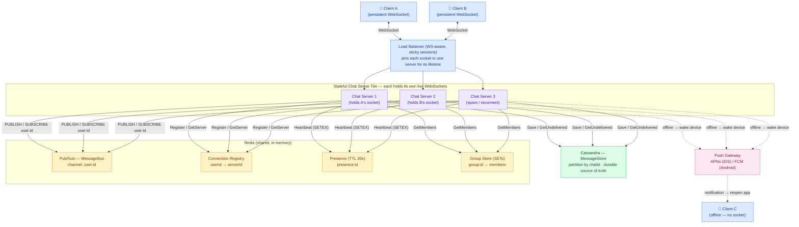
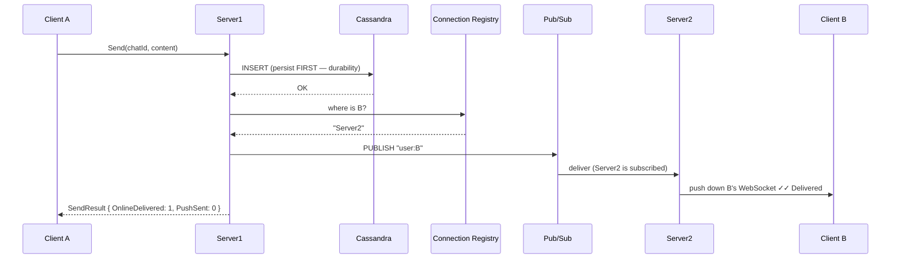
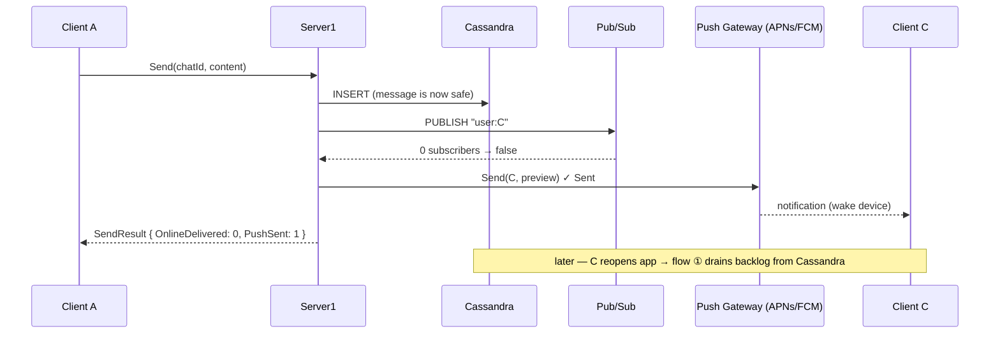

# Real-Time Chat — High-Level Design (System Architecture)

This is the **system-level** view: the production infrastructure behind the WebSocket + pub/sub
design (WebSocket gateways, Redis Pub/Sub, Cassandra, APNs/FCM). For the class-level view see
[LLD.md](LLD.md).

> **How to view the diagrams below:** open this file in VS Code's Markdown preview
> (`Cmd+Shift+V`). If they don't render, install the **Markdown Preview Mermaid Support**
> extension (`bierner.markdown-mermaid`). They also render automatically on GitHub.

---

## System Architecture



---

## ① Connect (open the app) — WebSocket handshake

```mermaid
sequenceDiagram
    participant C as Client
    participant S as Chat Server (Server1)
    participant REG as Connection Registry
    participant PRES as Presence (Redis)
    participant BUS as Pub/Sub (Redis)
    participant CASS as Cassandra

    C->>S: WebSocket handshake
    S->>REG: Register(user → Server1)
    S->>PRES: Heartbeat(user)  (SETEX, 30s TTL)
    S->>BUS: Subscribe("user:id")
    S->>CASS: GetUndelivered(user)
    CASS-->>S: backlog messages
    loop each backlog message
        S->>C: deliver (mark Delivered)
    end
    Note over C,S: socket stays open; client pings Heartbeat every ~10s
```

## ② Send to an ONLINE user — `A → B` (different servers)



## ③ Send to an OFFLINE user — `A → C`



---

## Why each component exists

| Component | Role | Maps to in code |
|-----------|------|-----------------|
| **Load Balancer (sticky)** | Pin each WebSocket to one server for its lifetime | *(prod-only)* |
| **Chat Servers** | Stateful; hold live WebSocket connections | `ChatServer` (× N) |
| **Redis Pub/Sub** | Cross-server message routing by channel | `MessageBusRedis` |
| **Connection Registry** | Global `userId → serverId` map | `ConnectionRegistryRedis` |
| **Presence (TTL)** | Online status via heartbeat expiry | `PresenceServiceRedis` |
| **Group Store** | Group membership SETs | `GroupStoreRedis` |
| **Cassandra** | Durable message history, partitioned by chatId | `MessageStoreCassandra` |
| **Push Gateway** | Wake offline devices (APNs/FCM) | `PushNotificationServiceAPNsFCM` |

## Key HLD design decisions

- **Persist before deliver** — every message hits Cassandra *first*, so a crash mid-delivery never
  loses it. Delivery is best-effort layered on top of durable storage.
- **Stateful servers, anonymous routing** — servers hold sockets but never know each other's
  addresses. Pub/sub channels (`user:{id}`) decouple them; a new server just subscribes its users
  and starts receiving. No service-discovery mesh.
- **Sticky load balancing** — a WebSocket is a long-lived connection pinned to one server; the LB
  must route the same socket's frames to the same server (unlike stateless HTTP).
- **Presence via TTL, not events** — heartbeats with a 30s Redis TTL self-correct for crashes /
  network drops that fire no disconnect event. Worst-case staleness is bounded.
- **Push is a wake-up, not delivery** — APNs/FCM is fire-and-forget; real delivery always happens
  via the backlog drain on reconnect. Push just tells the device to reconnect.
- **At-least-once + dedup** — backlog drain guarantees delivery; client-generated message IDs
  (Snowflake) let the server discard duplicates from retries.

## Capacity sketch (back-of-envelope)

| Metric | Estimate |
|--------|----------|
| Concurrent connections | ~50 M live WebSockets |
| Per server | ~50–100 K sockets → ~500–1,000 chat servers |
| Messages | ~10 B/day → ~115 K msg/sec sustained |
| Fan-out | group msg × members → one Redis PUBLISH per recipient |
| Storage | ~300 B/msg × 10 B/day ≈ 3 TB/day → Cassandra TTL / archival |
