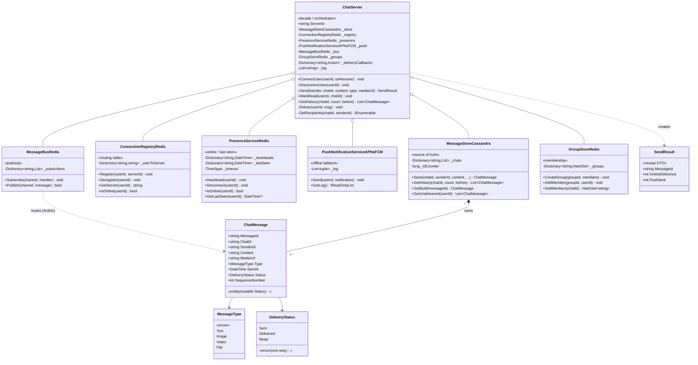

# Real-Time Chat — Low-Level Design (UML Class Diagram)

This is the **class-level** view of the Real-Time Chat system. The defining structural
feature: multiple `ChatServer` instances (Server1, Server2, Server3 in the demo) all share
the **same six backing services** — that shared substrate is exactly what makes cross-server
message routing work.

> **How to view the diagram below:** open this file in VS Code's Markdown preview
> (`Cmd+Shift+V`). If it doesn't render, install the **Markdown Preview Mermaid Support**
> extension (`bierner.markdown-mermaid`). It also renders automatically on GitHub.

---

## Class Diagram



---

## Reading the relationships

| Notation | Relationship | In this design |
|----------|--------------|----------------|
| `o--` | **Aggregation** (holds, shared) | Every `ChatServer` (Server1/2/3) is constructor-injected the **same** six service instances (created once in `Program.ResetSystem`). This sharing **is** the multi-server story — servers coordinate only through these, never directly. |
| `*--` | **Composition** (owns contents) | `MessageStoreCassandra` creates and owns its `ChatMessage` objects (via `Save`). |
| `..>` | **Dependency** (uses, no field) | `ChatServer.Send` *creates* a `SendResult`; `MessageBusRedis` *routes* `ChatMessage`s through `Action<ChatMessage>` handlers without storing them. |
| `-->` | **Association** (has-a) | `ChatMessage` holds a `MessageType` and a `DeliveryStatus`. |

> **Note — local vs shared state inside `ChatServer`:** `_deliveryCallbacks` and `_log`
> are **per-instance** (Server1's ≠ Server2's) — they're composed, owned, and die with that
> one server. The six services above are **shared**. That split is the crux of the design.

## The structural story (the "why" behind the shape)

- **One facade, six collaborators, N instances.** `ChatServer` stores no domain data itself —
  it's pure orchestration. You run **many** `ChatServer` instances behind a load balancer, and
  they coordinate *only* through the six shared services, never by calling each other.
- **Local state vs global state — the key distinction.** `_deliveryCallbacks` (how to reach a
  socket) is **local** to each server; `ConnectionRegistryRedis._userToServer` (which server owns
  a user) is **global**. Cross-server routing = look up the global registry → publish on the
  global bus → the *target* server's local callback fires.
- **`MessageStoreCassandra` is the source of truth.** It's the only component that *creates and
  owns* `ChatMessage` objects. Everything else passes references: `MessageBusRedis` routes them,
  `ChatServer` mutates `Status`, but the durable copy lives here.
- **`SendResult` is a pure return DTO; `ChatMessage` is the mutable entity** (its `Status` advances
  Sent → Delivered → Read). The same entity-vs-DTO split seen in the other projects.
- **The two enums encode invariants** — `DeliveryStatus` is a one-way machine (never moves
  backward); `MessageType` discriminates whether `Content` or `MediaUrl` carries the payload.

## Call flow at a glance

```
CONNECT  ConnectUser(userId, onReceive):
   ConnectionRegistryRedis.Register(userId, ServerId)   ← global routing entry
   PresenceServiceRedis.Heartbeat(userId)               ← mark online
   _deliveryCallbacks[userId] = onReceive               ← local socket handle
   MessageBusRedis.Subscribe("user:userId", Deliver)    ← start receiving
   MessageStoreCassandra.GetUndelivered(userId)         ← drain offline backlog

SEND     Send(sender, chatId, content):
   1. MessageStoreCassandra.Save(...)                   ← persist FIRST (durability)
   2. for each GetRecipients(chatId, sender):           ← group→members | 1:1→split chatId
        MessageBusRedis.Publish("user:recipient", msg)
          ├─ true  → OnlineDelivered++   (target server's Deliver fires its callback)
          └─ false → PushNotificationServiceAPNsFCM.Send(...) ; PushSent++
   → return SendResult(msgId, OnlineDelivered, PushSent)
```
