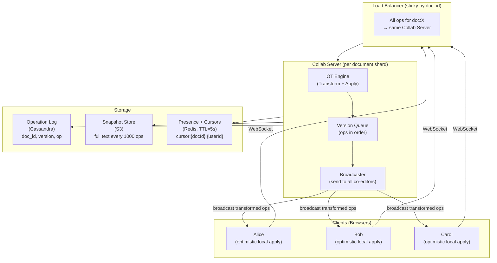
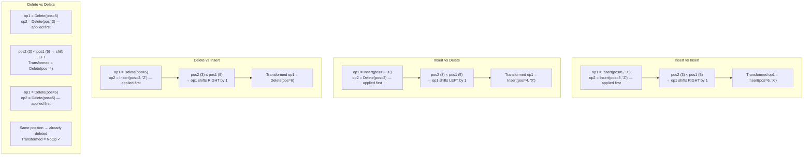
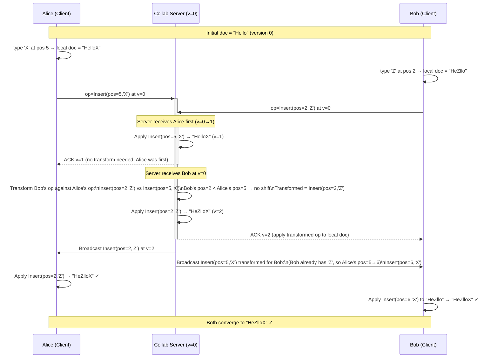
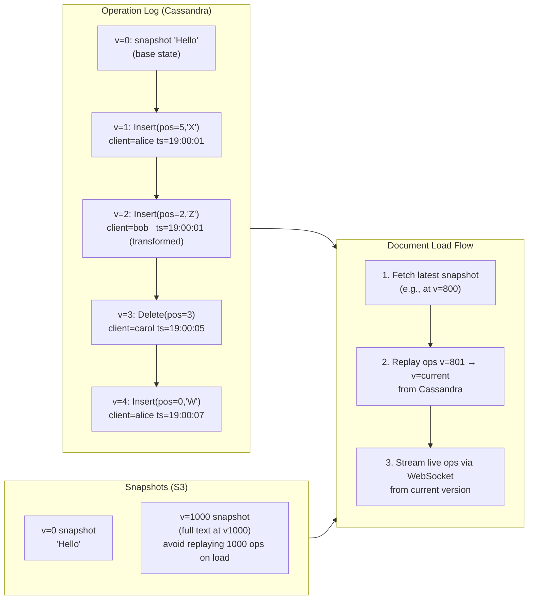
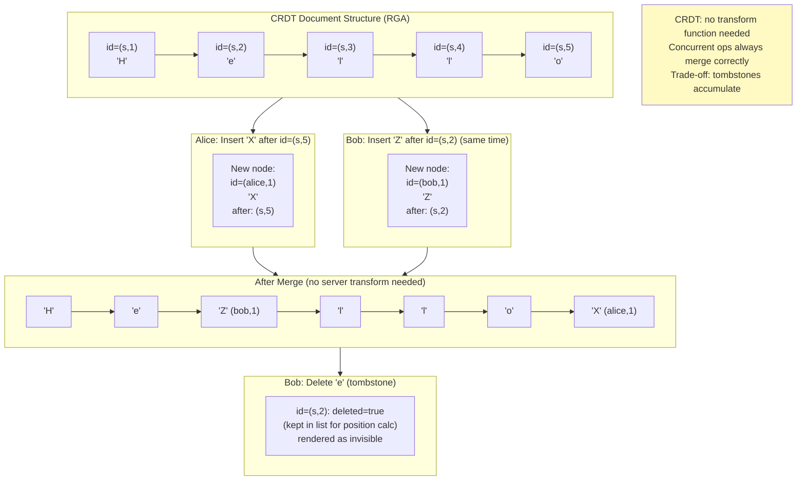
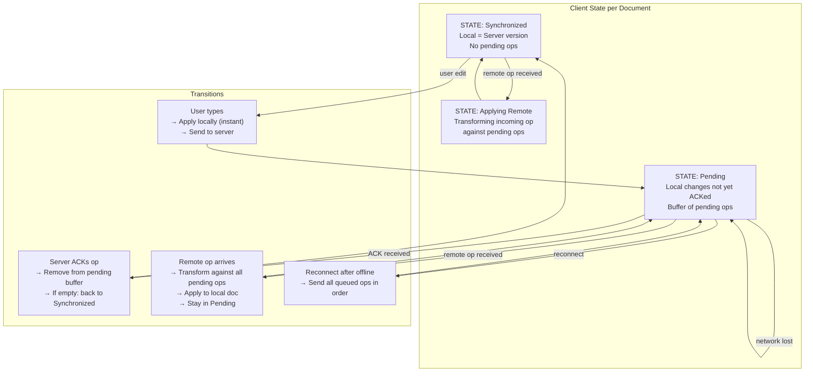
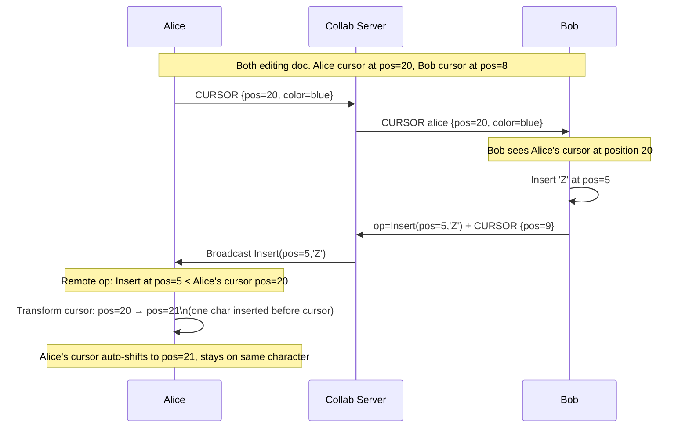
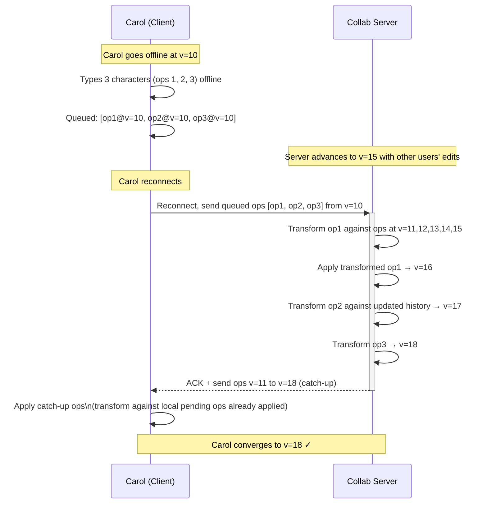

# Collaborative Document Editing — Architecture Diagrams

---

## 1. High-Level System Architecture

---

## 2. Operational Transformation — Core Transform Rules

---

## 3. Concurrent Edit Convergence (Alice & Bob)

---

## 4. Operation Log and Versioning

---

## 5. CRDT Alternative — Unique Character IDs

---

## 6. Client State Machine

---

## 7. Cursor Position Synchronization

---

## 8. Offline Sync on Reconnect

