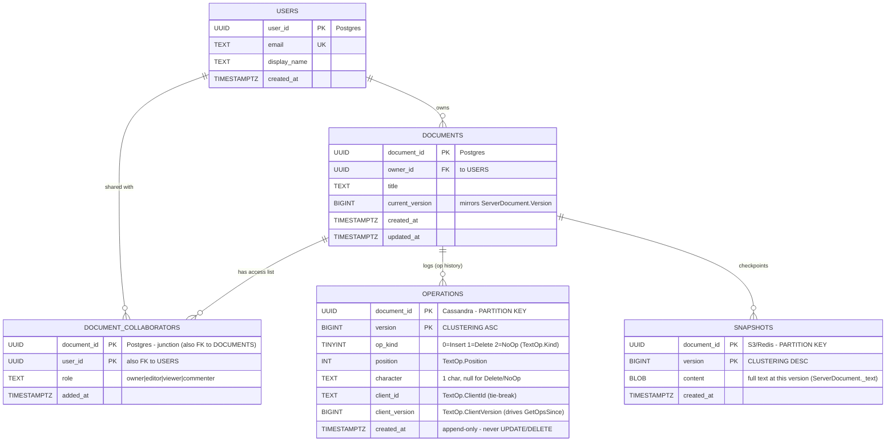

# Collaborative Document Editing — Database Design (ER Diagram)

This is the **data model** view. It is a **polyglot** design — different data has radically
different access patterns, so it lives in different stores. Every table is grounded in the actual
code (`TextOp` fields, `ServerDocument._opLog`, the snapshot / Cassandra notes in the comments).
For the system view see [HLD.md](HLD.md); for the class view see [LLD.md](LLD.md).

> **How to view the diagram below:** open this file in VS Code's Markdown preview
> (`Cmd+Shift+V`). If it doesn't render, install the **Markdown Preview Mermaid Support**
> extension (`bierner.markdown-mermaid`). It also renders automatically on GitHub.

---

## Entity-Relationship Diagram



> **Not shown (ephemeral, not a durable table):** `presence / awareness` lives in **Redis** as
> `doc:{document_id}:presence` (a HASH of `user_id → {cursor_pos, color, last_seen}`) with a
> heartbeat TTL — live cursors and "who's editing," worthless after disconnect, exactly like the
> chat system's presence keys.

---

## Relationships

| From | To | Cardinality | Meaning |
|------|-----|-------------|---------|
| `USERS` | `DOCUMENTS` | 1 → many | a user owns many documents |
| `USERS` ⇄ `DOCUMENTS` | via `DOCUMENT_COLLABORATORS` | many ↔ many | sharing: a doc has many collaborators; a user edits many docs |
| `DOCUMENTS` | `OPERATIONS` | 1 → many | a doc has an ordered op log (its full edit history) |
| `DOCUMENTS` | `SNAPSHOTS` | 1 → many | a doc has periodic text checkpoints |

## Why this schema — the design decisions

- **`OPERATIONS` is the heart, and it's Cassandra-shaped.** Partition key = `document_id`,
  clustering key = `version ASC`. That's a *direct* encoding of the two queries the engine makes:
  "all ops for this doc" (one partition) and `GetOpsSince(v)` (a range scan within it). It is
  **append-only and immutable** — the op log is the source of truth, never updated or deleted. This
  is the table that maps to `ServerDocument._opLog`.
- **`SNAPSHOTS` exist purely to bound replay cost.** Without them, opening a doc means replaying
  *every* op from version 0. Instead: load the latest snapshot (e.g., v1000) + replay only ops
  1001…current. Stored as blobs in S3 (durable) or Redis (hot), keyed by `(document_id, version)`.
- **Metadata is relational (Postgres).** `DOCUMENTS`, `USERS`, and `DOCUMENT_COLLABORATORS` have
  rich relationships, need transactions (permission checks, ownership transfer), and are low-volume
  compared to the op stream. A relational DB fits; Cassandra would not.
- **`DOCUMENT_COLLABORATORS` is the permission junction.** Many-to-many between users and documents,
  with a `role` column carrying the access level the gateway checks before letting an op through.
- **`presence` is deliberately NOT a durable table.** Live cursors and "who's editing" are
  ephemeral, high-churn, and worthless after disconnect — Redis with a heartbeat TTL.
- **Polyglot persistence is the theme.** Append-heavy op log → Cassandra; relational metadata →
  Postgres; large text blobs → S3; ephemeral cursors → Redis. Each store is chosen for its access
  pattern, not for uniformity.

## What each column traces back to in code

| Table.column | Code |
|--------------|------|
| `documents.current_version` | `ServerDocument._version` / `.Version` |
| `operations.(op_kind, position, character)` | `TextOp.(Kind, Position, Character)` |
| `operations.client_id` | `TextOp.ClientId` (the tie-break key) |
| `operations.client_version` | `TextOp.ClientVersion` (drives `GetOpsSince`) |
| `operations` (partition + clustering) | `ServerDocument._opLog` + `GetOpsSince()` |
| `snapshots.content` | `ServerDocument._text` |

## Key query patterns

```sql
JOIN a document:
   SELECT content, version FROM snapshots
     WHERE document_id = ? ORDER BY version DESC LIMIT 1;        -- latest checkpoint
   SELECT * FROM operations
     WHERE document_id = ? AND version > ? ORDER BY version ASC; -- replay the tail

APPLY an edit (after OT transform):
   INSERT INTO operations (document_id, version, op_kind, position,
                           character, client_id, client_version, created_at)
     VALUES (?, ?, ?, ?, ?, ?, ?, now());                       -- append-only

PERMISSION check (before accepting an op):
   SELECT role FROM document_collaborators
     WHERE document_id = ? AND user_id = ?;                     -- editor? viewer?

SNAPSHOT (every N ops, background job):
   INSERT INTO snapshots (document_id, version, content, created_at)
     VALUES (?, ?, ?, now());                                   -- checkpoint current text
```
