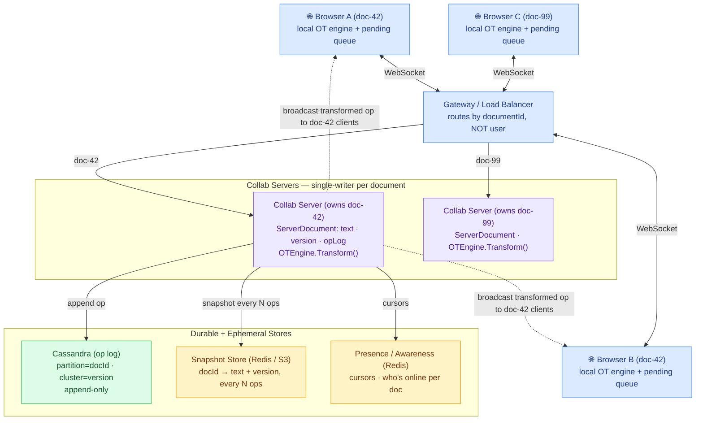
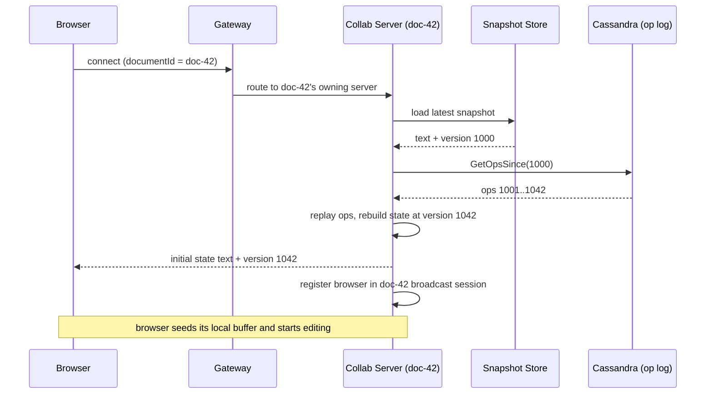
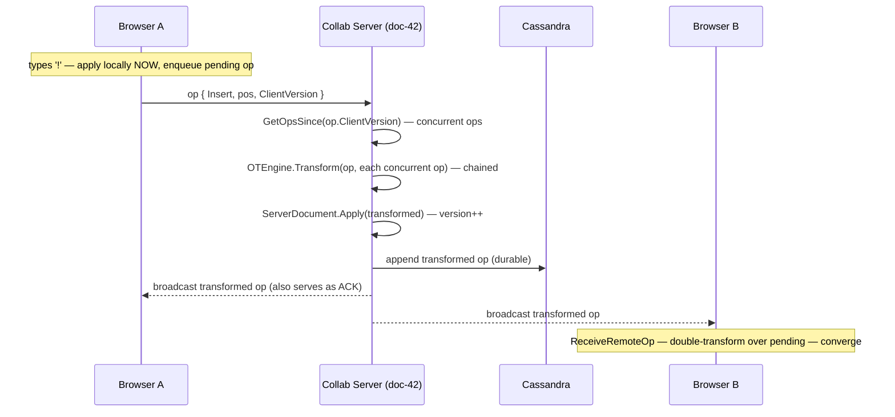

# Collaborative Document Editing — High-Level Design (System Architecture)

This is the **system-level** view: the production infrastructure behind the OT design
(WebSocket gateway, single-writer-per-document sharding, op log in Cassandra, periodic snapshots).
For the class-level view see [LLD.md](LLD.md).

The single most important constraint shapes everything: **all edits for one document must funnel
through one server** (single-writer per doc), because OT only converges with one agreed total order.

> **How to view the diagrams below:** open this file in VS Code's Markdown preview
> (`Cmd+Shift+V`). If they don't render, install the **Markdown Preview Mermaid Support**
> extension (`bierner.markdown-mermaid`). They also render automatically on GitHub.

---

## System Architecture



---

## ① Join a document (open the doc) — WebSocket connect



## ② Edit a character — optimistic local apply + server serialize



---

## Why each component exists

| Component | Role | Maps to in code |
|-----------|------|-----------------|
| **Client OT engine + pending queue** | Optimistic local apply; integrate remote ops | `EditingClient` + `OTEngine` |
| **Gateway (route by docId)** | Send every edit for a doc to its one owning server | *(prod-only)* |
| **Collab Server (single-writer)** | Serialize concurrent ops into one total order | `CollabServer` |
| **ServerDocument** | Authoritative text + version + op log | `ServerDocument` |
| **OTEngine** | The transform — *same code* on client and server | `OTEngine` |
| **Cassandra (op log)** | Durable append-only ledger, partitioned by docId | `_opLog` → durable |
| **Snapshot store (Redis/S3)** | Periodic text snapshot so joins don't replay from 0 | *(prod-only)* |
| **Presence / Awareness** | Live cursors, who's editing (ephemeral) | *(not in demo)* |

## Key HLD design decisions

- **Single-writer per document — the whole game.** Every edit for one doc must hit one server so
  there's a single agreed total order. The gateway routes **by documentId**, not by user (the
  opposite of the chat system, which routes by user). Two servers on one doc = divergent transform
  chains = corruption.
- **Op log + periodic snapshot** — replaying millions of ops from version 0 on every join is too
  slow. Snapshot the text every N ops; a join loads the snapshot and replays only the tail.
- **OTEngine is identical on client and server** — convergence depends on both computing the *same*
  position adjustments. This is why it's a pure, stateless, dependency-free function.
- **Optimistic local apply** — a 100–300 ms round-trip per keystroke would feel like typing
  telegrams. The client applies instantly and reconciles via double-transform when remote ops arrive.
- **Reconnect = `GetOpsSince(clientVersion)`** — a client that dropped at v=5 and rejoins at v=42
  just fetches ops 6–42 and transforms its pending work; it can even reconnect to a different server
  instance for that doc.
- **OT vs CRDT** — this design uses OT (central server transforms). CRDTs (Yjs / Automerge) trade a
  larger per-character data model for true peer-to-peer merging; OT keeps ops tiny but requires the
  single-writer server.

## Capacity sketch (back-of-envelope)

| Metric | Estimate |
|--------|----------|
| Concurrent docs | ~10 M open documents |
| Editors per doc | typically 1–10 (long tail to ~100s) |
| Op rate | ~5–20 ops/sec per active editor (keystrokes) |
| Op size | ~50 bytes/op → op log grows fast → snapshot + TTL / compaction |
| Snapshot cadence | every ~100–1000 ops or ~30 s per doc |
```
