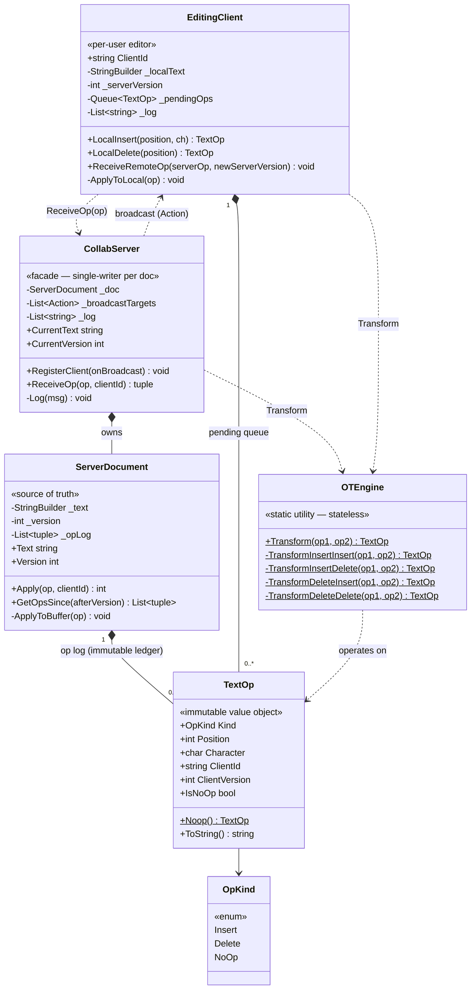

# Collaborative Document Editing — Low-Level Design (UML Class Diagram)

This is the **class-level** view of the OT-based collaborative editor. The defining structural
feature: **`OTEngine` is a stateless transform used symmetrically by both `CollabServer` and
`EditingClient`** — running the *same* transform logic on every machine is exactly what
guarantees all copies converge to an identical document.

> **How to view the diagram below:** open this file in VS Code's Markdown preview
> (`Cmd+Shift+V`). If it doesn't render, install the **Markdown Preview Mermaid Support**
> extension (`bierner.markdown-mermaid`). It also renders automatically on GitHub.

---

## Class Diagram



---

## Reading the relationships

| Notation | Relationship | In this design |
|----------|--------------|----------------|
| `*--` | **Composition** (owns its parts) | `CollabServer` owns its one `ServerDocument` + broadcast list + log; `ServerDocument` owns its `_opLog` of `TextOp`s; `EditingClient` owns its `_pendingOps` queue of `TextOp`s. |
| `..>` | **Dependency** (uses, no field) | **Both** `CollabServer` and `EditingClient` call the static `OTEngine.Transform` — no instance, no stored reference. `OTEngine` operates on `TextOp`. |
| `..>` (loop) | **Interaction** (call + callback) | `EditingClient` calls `CollabServer.ReceiveOp`; `CollabServer` broadcasts the *transformed* op back through the registered `Action<TextOp,int>` callbacks. A request/broadcast cycle, not a shared store. |
| `-->` | **has-a enum** | `TextOp` carries an `OpKind` (Insert / Delete / NoOp). |

## The structural story (the "why" behind the shape)

- **`OTEngine` is the linchpin — and it's symmetric.** Unlike systems where a shared *store* is the
  substrate, here the shared thing is a **stateless function**. `EditingClient` runs `Transform` to
  integrate remote ops over its pending queue; `CollabServer` runs the *same* `Transform` to
  serialize concurrent ops. Convergence is only guaranteed because both sides compute identical
  adjustments — so `OTEngine` is deliberately a pure static utility with no state to drift.
- **`ServerDocument` is the source of truth, and it's two things at once.** `_opLog` (immutable,
  append-only ledger) is the *real* truth; `_text` is a *derived cache* you could rebuild by
  replaying the log. That split makes reconnection a simple `GetOpsSince(v)` range read.
- **`CollabServer` is single-writer per document.** It owns exactly one `ServerDocument` and is the
  only thing that mutates it. OT only converges if every op flows through one agreed total order.
  (In production you shard *by document*, never two servers on one doc.)
- **`EditingClient` mirrors the server, optimistically.** It has its own `StringBuilder` (like
  `ServerDocument._text`) and its own `Queue<TextOp>` of unacked edits. The `_pendingOps` queue is
  the crux of the **double-transform**: incoming remote ops transform over pending ops, and pending
  ops transform under the remote op.
- **`TextOp` is an immutable value object** threading through everything — created by
  `EditingClient`, transformed by `OTEngine`, applied/logged by `ServerDocument`, broadcast by
  `CollabServer`. The `NoOp` variant is what a transform returns when two edits cancel (e.g., both
  delete the same char).

## Call flow at a glance

```
LOCAL EDIT  alice types '!' at pos 5:
   EditingClient.LocalInsert(5,'!')
     → apply to _localText optimistically (instant on screen)
     → _pendingOps.Enqueue(Insert(5,'!', ver=0))
     → send op to CollabServer.ReceiveOp(...)

SERVER      CollabServer.ReceiveOp(op, "alice"):
   1. serverOps = ServerDocument.GetOpsSince(op.ClientVersion)   ← concurrent ops
   2. for each serverOp: op = OTEngine.Transform(op, serverOp)   ← chained, early-exit on NoOp
   3. newVersion = ServerDocument.Apply(op, "alice")             ← mutate + append to ledger
   4. for each target: target(transformedOp, newVersion)         ← broadcast to ALL clients

REMOTE      bob's EditingClient.ReceiveRemoteOp(serverOp, ver):
   if serverOp.ClientId == me → ACK: dequeue pending, advance _serverVersion
   else → DOUBLE-TRANSFORM:
       ① incoming   = Transform(incoming, pending[i])     ← land remote op over my pending
       ② pending[i] = Transform(pending[i], serverOp)     ← keep my pending valid after remote
       → apply incoming to _localText
   ⇒ every client converges to the identical string
```
