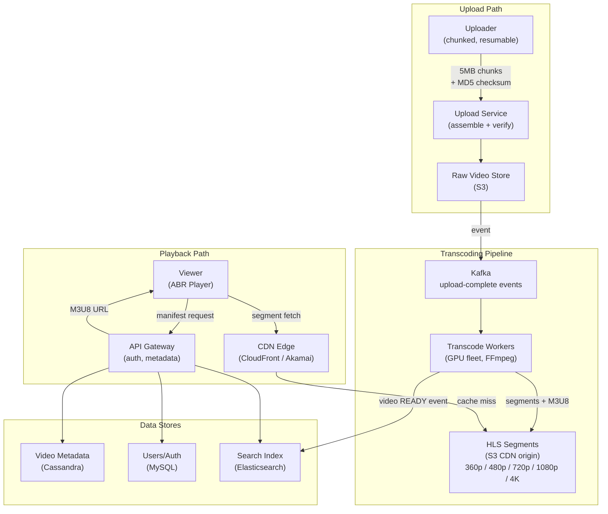
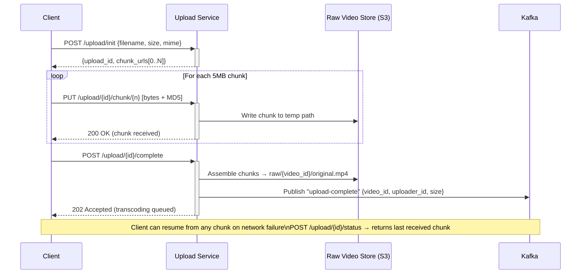
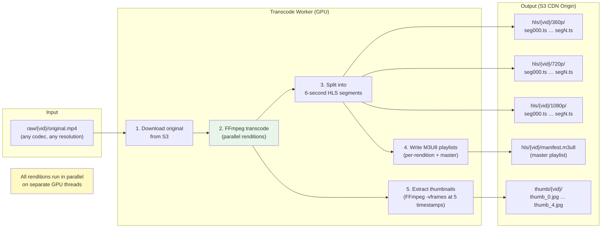
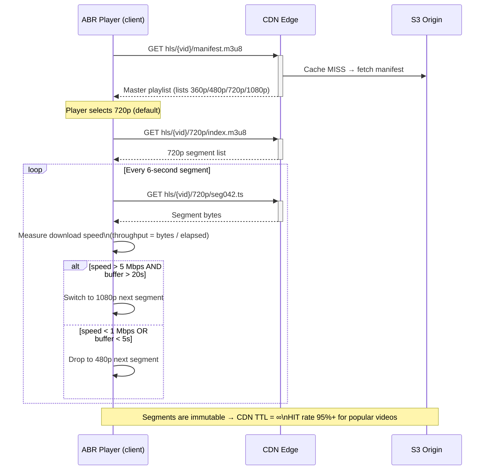
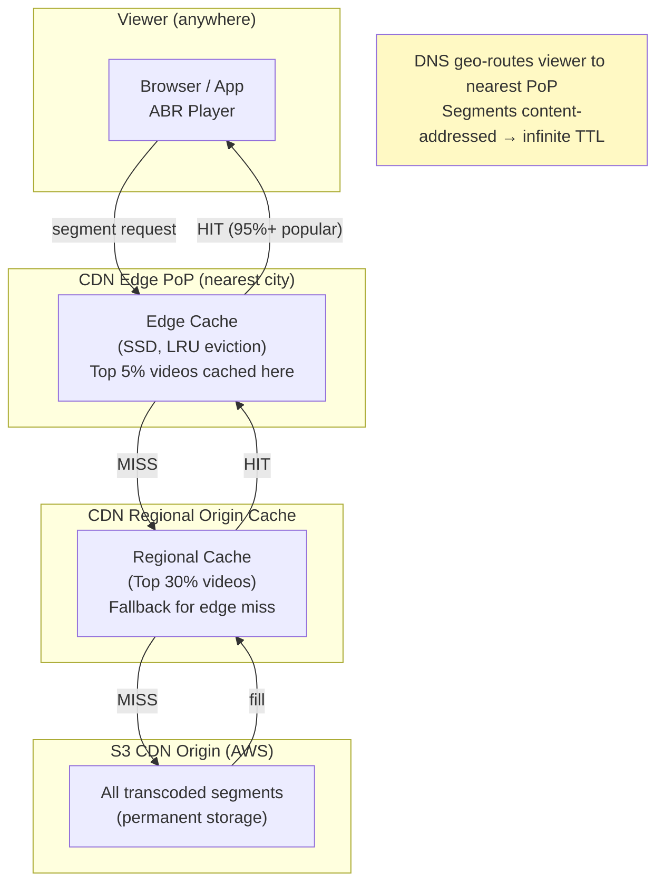
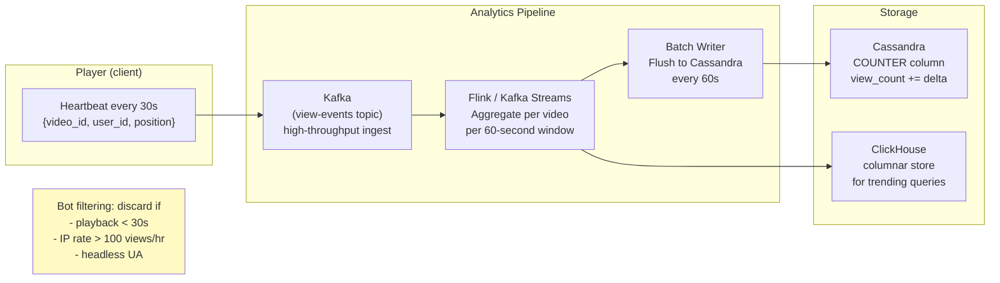
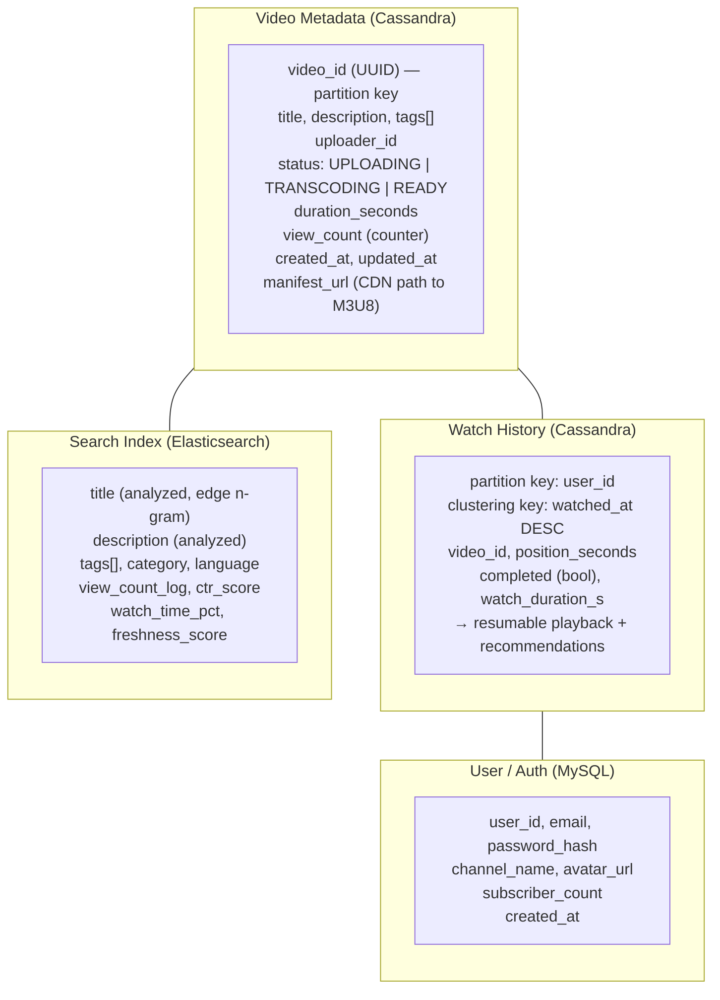
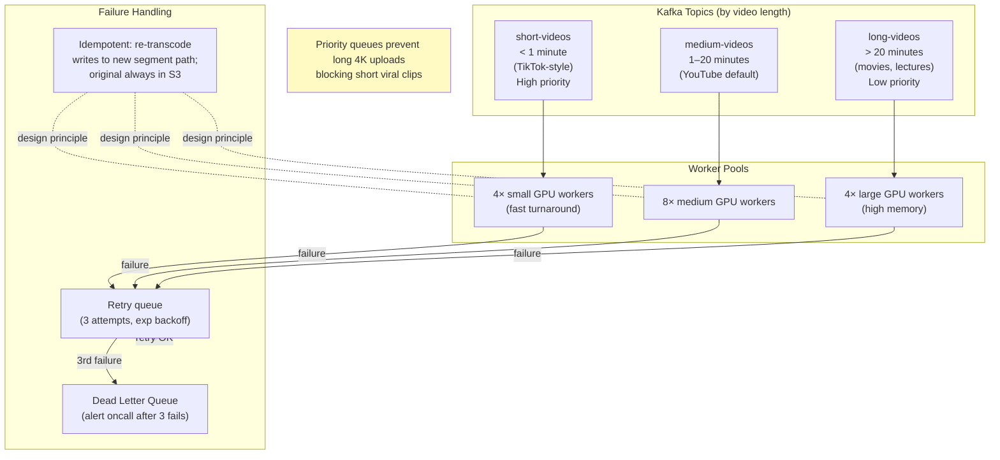

# Video Streaming — Architecture Diagrams

---

## 1. High-Level System Architecture

---

## 2. Chunked Resumable Upload

---

## 3. Transcoding Pipeline

---

## 4. HLS Adaptive Bitrate Playback

---

## 5. CDN Strategy and Cache Tiers

---

## 6. View Count Buffered Pipeline

---

## 7. Metadata and Data Model

---

## 8. Transcoding Queue — Priority and Failure Handling

