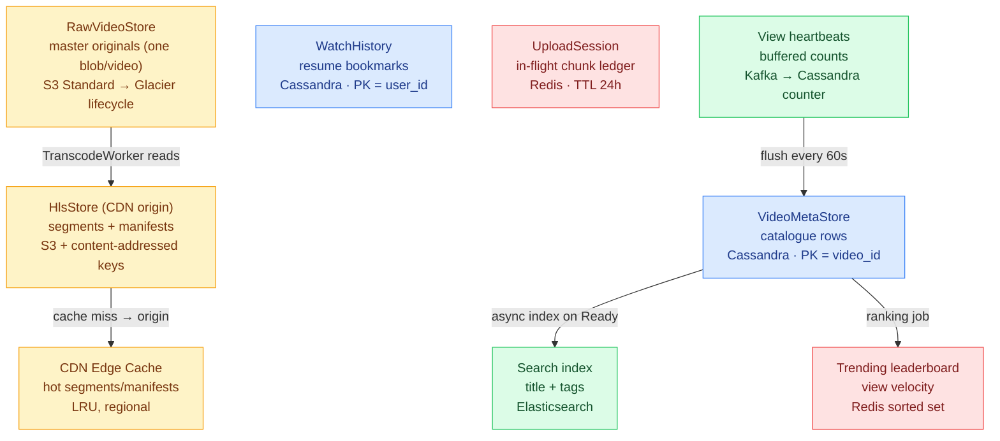
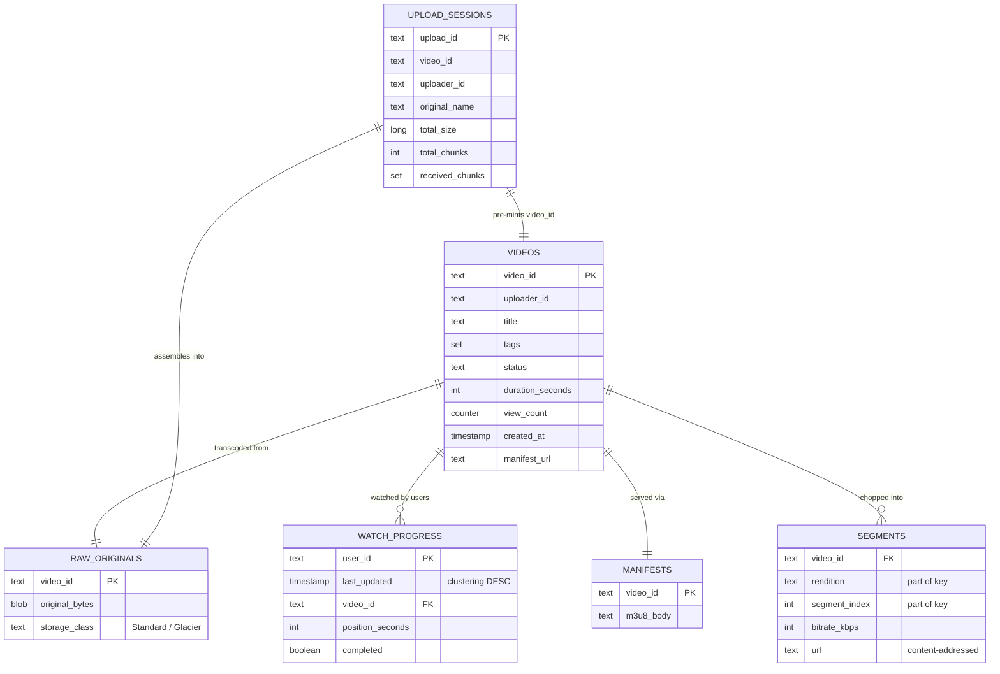

# Video Streaming — Database Design

The Video Streaming platform spreads its data across **five different storage technologies**,
each chosen for one access pattern. Blob stores (S3) hold the heavy bytes; Cassandra holds the
catalogue and per-user bookmarks; Redis holds ephemeral upload sessions and the trending
leaderboard; Elasticsearch powers search; the CDN caches segments at the edge. The guiding
principle: **store each kind of data the way it is read** — one giant write-once blob is stored
very differently from a row read millions of times or a counter incremented thousands of times
per second. For the class-level view see [LLD.md](LLD.md); for the system architecture see
[HLD.md](HLD.md).

> **How to view the diagrams below:** open this file in VS Code's Markdown preview
> (`Cmd+Shift+V`). If they don't render, install the **Markdown Preview Mermaid Support**
> extension (`bierner.markdown-mermaid`). They also render automatically on GitHub.

---

## Storage technology map

| Data concern | Demo implementation | Production store | Why this store |
|---|---|---|---|
| **Master originals** | `RawVideoStore._store: Dictionary<string, byte[]>` | S3 Standard → Glacier | Write-once, read-rarely, never by viewers; cheap durable cold storage |
| **HLS segments + manifests** | `HlsStore._segments` + `_manifests` | S3 (origin) + CDN edge | Immutable, content-addressed → cache forever; read constantly by all viewers |
| **Video catalogue** | `VideoMetaStore._db: Dictionary<string, VideoMetadata>` | Cassandra, PK = `video_id` | Reads ≫ writes; primary-key lookup; horizontally scalable; naturally partitioned |
| **Resume bookmarks** | `WatchHistory._db: Dictionary<string, WatchProgress>` | Cassandra, PK = `user_id`, clustering `last_updated DESC` | "Continue Watching" = one partition scan, pre-sorted |
| **Upload sessions** | `UploadService._sessions: Dictionary<string, UploadSession>` | Redis, TTL 24h | Ephemeral; abandoned uploads auto-expire; fast chunk-receive lookups |
| **View counts** | `ViewCounter._heartbeats` + `VideoMetadata.ViewCount` | Kafka buffer → Cassandra counter | Avoid per-view hotspot; batch-flush aggregates |
| **Search** | `VideoMetaStore.Search()` linear scan | Elasticsearch inverted index | Substring/keyword search in ms, not O(all videos) |
| **Trending** | `VideoMetaStore.Trending()` linear scan | Redis sorted set | Precomputed leaderboard; read a tiny set, never scan catalogue |

---

## Entity schemas

### `videos` — the catalogue (Cassandra, PK = video_id)

| Column | Type | Notes |
|---|---|---|
| `video_id` | text | **Partition key** — 12-char hex; routes every lookup to one node |
| `uploader_id` | text | Creator; access control + analytics |
| `title` | text | Indexed in Elasticsearch for search |
| `tags` | set\<text\> | Searchable labels; ES indexes each as a keyword |
| `status` | text (enum) | `Uploading` / `Transcoding` / `Ready` / `Deleted` — the playability gate |
| `duration_seconds` | int | Drives segment count = `ceil(duration / 6)` |
| `view_count` | counter | Approximate; batch-incremented by ViewCounter flush |
| `created_at` | timestamp | Set when `Status` flips to `Ready`, not at upload start |
| `manifest_url` | text | Null until `Ready`; CDN path to master M3U8 |

### `watch_progress` — resume bookmarks (Cassandra, PK = user_id)

| Column | Type | Notes |
|---|---|---|
| `user_id` | text | **Partition key** — all of a user's bookmarks on one node |
| `last_updated` | timestamp | **Clustering key DESC** — newest-watched first, pre-sorted |
| `video_id` | text | Which video this bookmark is for |
| `position_seconds` | int | Playhead; written every ~6s segment tick |
| `completed` | boolean | Explicit "watched to end"; drives "Watch Again" vs "Continue" |

### `upload_sessions` — in-flight chunk ledger (Redis, TTL 24h)

| Field | Type | Notes |
|---|---|---|
| `upload_id` | string | **Key** — ephemeral session token (distinct from `video_id`) |
| `video_id` | string | Pre-minted permanent public ID |
| `uploader_id` | string | Carried through to `videos.uploader_id` |
| `original_name` | string | Display only; never a storage key |
| `total_size` | long | Drives `total_chunks` |
| `total_chunks` | int | `ceil(total_size / chunk_size)` |
| `received_chunks` | set\<int\> | Redis SET — idempotent adds, O(1) completeness |

### HLS objects — S3 blob store (content-addressed keys, no table)

| Object | S3 key pattern | Cache-Control | Notes |
|---|---|---|---|
| Master original | `raw/{video_id}/original.mp4` | private | Glacier after 30 days |
| Segment | `hls/{video_id}/{rendition}/seg{NNN}.ts` | `max-age=31536000` (1 yr) | Immutable → cache forever |
| Master manifest | `hls/{video_id}/manifest.m3u8` | `max-age=5` (5 s) | Mutable → short TTL |
| Rendition playlist | `hls/{video_id}/{rendition}/index.m3u8` | `max-age=5` | Per-rendition segment list |

---

## ER diagram

> **Note on relationships:** `UPLOAD_SESSIONS` lives in Redis and is deleted after `Complete`,
> so its links to `VIDEOS`/`RAW_ORIGINALS` are *logical* (shared `video_id`), not enforced
> foreign keys. Cassandra and S3 do not enforce referential integrity either — these edges
> document how the application joins the data, not database-level constraints.

---

## Key access patterns → which store answers

| Query | Store | Cost |
|---|---|---|
| "Is video X ready? where's its manifest?" | `videos` Get(video_id) | O(1) partition read |
| "Stream segment N of video X at 720p" | CDN edge → S3 origin on miss | O(1) by content-addressed URL |
| "Where did Bob leave off in video X?" | `watch_progress` Get(user_id, video_id) | O(1) single row |
| "Bob's Continue Watching row" | `watch_progress` partition scan by user_id | O(rows for user), pre-sorted |
| "Resume a dropped upload" | `upload_sessions` Get(upload_id) | O(1) Redis lookup |
| "Search videos about cats" | Elasticsearch inverted index | O(matching results) |
| "What's trending now?" | Redis sorted set (top-N) | O(log N + top) |
| "Increment view count for X" | Kafka buffer → Cassandra counter flush | Batched, amortised |

---

## Key design decisions

- **Separate blob store from catalogue (different access patterns).** One 15 MB master original
  is write-once / read-rarely / never-by-viewers → S3 blob. A `videos` row is written twice and
  read millions of times → Cassandra. Serving the raw file to viewers would mean no seeking, no
  ABR, and 15 MB of bandwidth per view instead of ~2 MB per 6s segment. Splitting the two lets
  each be optimised independently.

- **Content-addressed segment keys = zero cache invalidation.** A segment's S3 key is a pure
  function of `(video_id, rendition, segment_index)` — the same triple always means the same
  bytes. Segments get a 1-year `Cache-Control`; a re-transcode produces a new `video_id` → new
  keys, and old segments age out naturally. No global CDN purge ever needed.

- **Two TTL regimes in one store (segments vs manifests).** Segments are immutable (cache 1
  year); manifests can change when a rendition is added (cache 5 seconds). The code mirrors this
  with `HlsStore`'s two separate dictionaries. One combined store would force the conservative
  short TTL onto everything, destroying segment cache efficiency.

- **Cassandra partition keys chosen by read pattern.** `videos` is partitioned by `video_id`
  because the dominant query is Get-by-id. `watch_progress` is partitioned by `user_id` (not
  `video_id`) because the dominant query is "all of this user's bookmarks" — clustering by
  `last_updated DESC` makes "Continue Watching" a single pre-sorted partition scan with no sort
  step.

- **`view_count` as a Cassandra counter, fed by a batched buffer.** A viral video takes
  thousands of views/second; incrementing one row per view saturates the partition. Heartbeats
  are buffered (Kafka) and flushed as aggregated increments every 60s, with a 30s-playback
  anti-fraud floor. The count lags real-time by ≤ one flush window — invisible to users.

- **Upload sessions in Redis with TTL, not Cassandra.** Sessions are ephemeral — relevant only
  during the minutes/hours of an active upload. A 24h TTL auto-reclaims abandoned uploads with
  no GC job. `received_chunks` as a Redis SET gives idempotent retries and O(1) completeness for
  free, exactly mirroring the demo's `HashSet<int>`.

- **`video_id` minted before any bytes arrive (stable identity).** `UploadService.Init` assigns
  `video_id` at session creation so the client has a permanent public URL immediately, a dropped
  upload resumes to the *same* ID, and transcode/CDN slots can be provisioned in parallel.
  `upload_id` is kept separate and ephemeral so a leaked upload token can't be used against a
  live video.

- **Search and trending offloaded to purpose-built stores.** The demo's `Search()`/`Trending()`
  linear scans are O(all videos) — fine for a handful, catastrophic at billions. Production
  pushes title+tags to Elasticsearch on the `Ready` flip (search = index lookup) and maintains a
  Redis sorted set of view-velocity (trending = read a tiny precomputed set). Neither ever scans
  the `videos` table.

---

## Capacity sketch

| Metric | Estimate |
|---|---|
| `videos` row size | ~few hundred bytes; tiny vs the blobs it points to |
| Master original | 15 MB–several GB per video; Glacier after 30 days (~$0.004/GB·mo) |
| Segments per video | `ceil(duration/6)` × renditions (300s × 4 = 200 objects) |
| Segment object size | ~bitrate × 6s ÷ 8 (R720p ≈ 1.9 MB; R1080p ≈ 3.75 MB) |
| `watch_progress` write rate | 1 per active viewer per ~6s (production debounces to ~10s) |
| `view_count` freshness | Lags ≤ 60s (one flush); ≥30s playback to count |
| Upload session lifetime | TTL 24h; `received_chunks` set holds `total_chunks` ints |
| Search latency | ms (Elasticsearch index) vs O(all videos) linear scan in demo |
| Trending read | O(top-N) from Redis sorted set vs full catalogue scan in demo |
| Catalogue read | O(1) Cassandra partition read by `video_id` |
