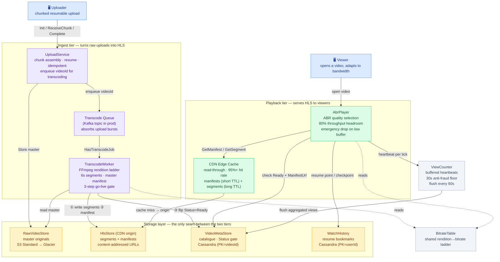
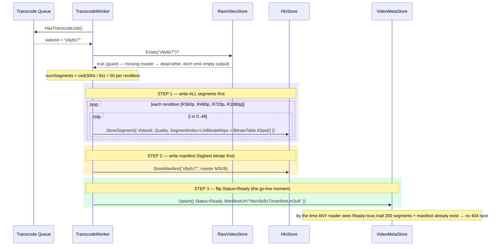
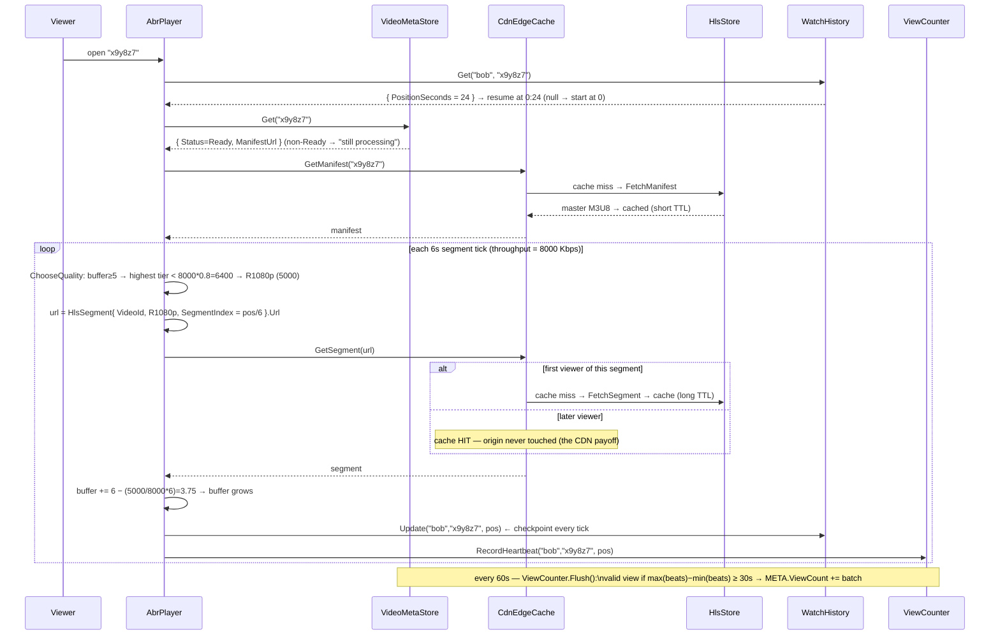
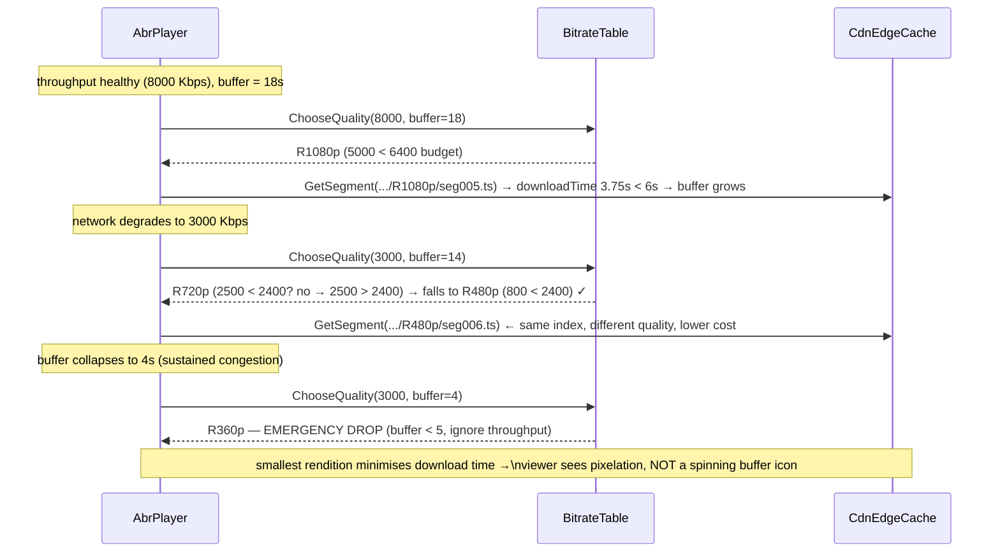

# Video Streaming — High-Level Design (System Architecture)

This is the **system-level** view: the production architecture behind a video streaming
platform (think YouTube, Netflix, or Twitch VOD). Two orthogonal concerns drive the whole
design: **ingest** — turning one raw upload into an adaptive rendition ladder and writing it
durably — and **playback** — serving that content from the network edge while adapting quality
to each viewer's bandwidth in real time. The two halves are deliberately decoupled: they share
only a storage layer, so each can scale and fail independently. For the class-level view see
[LLD.md](LLD.md); for the storage schema see [DB_DESIGN.md](DB_DESIGN.md).

> **How to view the diagrams below:** open this file in VS Code's Markdown preview
> (`Cmd+Shift+V`). If they don't render, install the **Markdown Preview Mermaid Support**
> extension (`bierner.markdown-mermaid`). They also render automatically on GitHub.

---

## System Architecture



---

## ① Upload path — chunked, resumable ingest

```mermaid
sequenceDiagram
    participant C  as Uploader (client)
    participant US as UploadService
    participant RAW as RawVideoStore
    participant TQ as Transcode Queue

    C->>US: Init("alice", "vacation.mp4", 15 MB)
    US->>US: mint VideoId + UploadId; TotalChunks = ceil(15MB ÷ 5MB) = 3
    US-->>C: UploadSession { VideoId="x9y8z7", UploadId="a1b2", TotalChunks=3 }
    Note over C: client stores VideoId → stable public URL even before bytes land

    C->>US: ReceiveChunk(uploadId, 0, bytes)
    US-->>C: true  (ReceivedChunks = {0})
    C->>US: ReceiveChunk(uploadId, 1, bytes)
    Note over C,US: connection drops before chunk 2
    C->>US: GetResumePoint(uploadId)
    US-->>C: 2   ← first missing index (scan {0,1})
    C->>US: ReceiveChunk(uploadId, 1, bytes)  [retry — safety]
    Note over US: HashSet.Add(1) on existing member → silent no-op (idempotent)
    C->>US: ReceiveChunk(uploadId, 2, bytes)
    US-->>C: true  (ReceivedChunks = {0,1,2}, IsComplete=true)

    C->>US: Complete(uploadId, fullData)
    US->>US: guard IsComplete? → true (don't trust client; verify the set)
    US->>RAW: Store("x9y8z7", fullData)   ← master archived, once, ever
    US->>TQ: Enqueue("x9y8z7")            ← async hand-off; does NOT transcode inline
    US-->>C: (ok=true, videoId="x9y8z7")
```

---

## ② Transcode path — the three-step go-live gate



---

## ③ Playback path — ABR with CDN edge cache and resume



---

## ④ Quality adaptation — how AbrPlayer reacts to a network drop



---

## Why each component exists

| Component | Role | Maps to in code |
|-----------|------|-----------------|
| **UploadService** | Chunked, resumable, idempotent ingest; assembles master and enqueues a transcode job | `UploadService` |
| **UploadSession** | Per-upload ledger of received chunks; `HashSet` gives idempotency + O(1) completeness | `UploadSession` |
| **Transcode Queue** | Async hand-off that decouples upload rate from transcode capacity; absorbs bursts | `UploadService._transcodeQueue` *(Kafka in prod)* |
| **TranscodeWorker** | Re-encodes master into a rendition ladder, chops into 6s segments, enforces go-live gate | `TranscodeWorker` |
| **BitrateTable** | Single source of truth for rendition→bitrate; read by both encoder and player | `BitrateTable` |
| **RawVideoStore** | Lossless master archive; the only source that can produce new formats without generation loss | `RawVideoStore` *(S3 → Glacier)* |
| **HlsStore** | CDN origin holding content-addressed segments + manifests; two TTL regimes | `HlsStore` |
| **HlsSegment** | One ~6s independently-decodable slice; content-addressed URL = immutable cache key | `HlsSegment` |
| **VideoMetaStore** | Catalogue keyed by videoId; `Status=Ready` is the playability gate for every reader | `VideoMetaStore` *(Cassandra)* |
| **CdnEdgeCache** | Read-through edge node; serves repeat traffic without crossing to origin | `CdnEdgeCache` |
| **AbrPlayer** | Client-side adaptive bitrate selection + resume + heartbeat emission | `AbrPlayer` |
| **WatchHistory** | Per-(user,video) resume bookmark; powers "Continue Watching" | `WatchHistory` *(Cassandra PK=userId)* |
| **ViewCounter** | Buffered, fraud-filtered view aggregation; avoids per-view hotspot writes | `ViewCounter` |
| **VideoStatus** | One-way lifecycle gate (Uploading→Transcoding→Ready→Deleted) | `VideoStatus` enum |
| **Rendition** | Discrete quality tier; index into `BitrateTable` and part of segment URL | `Rendition` enum |

---

## Key HLD design decisions

- **HLS adaptive bitrate instead of a single progressive file (viewer experience floor).**
  A single 1080p file buffers endlessly for a viewer on weak mobile data; a single 360p file
  wastes a fibre connection. By transcoding into a rendition ladder (360p→4K) and chopping each
  into independently-decodable 6s segments, `AbrPlayer` picks the best quality the current
  network can sustain and switches between segments as conditions change. This is the core of
  every modern streaming platform.

- **6-second segments (the master HLS trade-off).** Too short (1–2s) and a 2-hour film becomes
  thousands of HTTP requests per viewer — high CDN overhead. Too long (30s) and ABR can't react
  to a bandwidth change for up to 30 seconds, and seeking downloads a huge block for a few
  frames. 6s is Apple's HLS default (used by Netflix, YouTube, Twitch): a 2-hour film is ~1,200
  requests, ABR reacts within ~6s, and worst-case seek waste is 6s of data.

- **Three-step go-live gate: segments → manifest → Status=Ready (no partial-video race).**
  `TranscodeWorker` writes all segments first, then the master manifest, then flips
  `Status=Ready` — always in that order. Every reader (`Search`, `HasVideo`, `AbrPlayer.Play`)
  gates on Ready/manifest-exists, so by the time any viewer can discover a video, 100% of its
  content already exists. Reversing the order would let a player load a manifest and 404 on a
  segment, crashing playback on a video that looks ready.

- **Content-addressed segment URLs (no CDN cache invalidation, ever).** A segment's URL is a
  pure function of `(videoId, quality, segmentIndex)` — the same triple always yields the same
  URL and the same bytes. This makes segments immutable in the CDN: an edge can cache them for a
  year. A re-transcode produces a *new* videoId → new URLs; old cached segments age out
  naturally. Without this, every re-encode would require a global purge across thousands of edge
  nodes — minutes of propagation and a window of mixed old/new segments.

- **Async transcode queue decouples upload rate from transcode capacity.** `Complete` stores
  bytes and enqueues a videoId; it does **not** transcode inline. A worker pool drains the queue
  at its own pace. A spike of 10,000 simultaneous uploads cannot overload the GPU transcoding
  fleet — the queue absorbs the burst and workers catch up. Upload and transcode tiers scale
  and deploy independently.

- **Keep the master original forever (future-proofing against generation loss).** Transcoding
  from already-compressed HLS segments into a new codec is like photocopying a photocopy — each
  pass degrades quality. Keeping the lossless master in cold storage (S3 Glacier, ~$0.0004/month
  per 100 MB) means any future re-encode — new codec (H.264→H.265 saves 40%), new tier (4K/8K
  added years later), or an encoder bug fix — starts from a pristine source.

- **CDN edge cache with content-addressed long-TTL segments + short-TTL manifests.** Segments
  are immutable → cache for a year. Manifests can change (a rendition added) → cache for seconds
  so edges re-validate quickly. Splitting the two TTL regimes (mirrored in `HlsStore`'s two
  dictionaries) keeps segment hit-rates near 100% for popular content without ever serving a
  stale manifest. The first viewer of a segment pays the origin fetch; everyone after hits the
  edge.

- **Buffered, fraud-filtered view counting (avoid a per-view write hotspot).** A viral video can
  take thousands of views/second. Incrementing one `VideoMetadata` row per view would saturate a
  single Cassandra partition. `ViewCounter` buffers heartbeats and flushes aggregated counts
  every 60s, and only counts a view after ≥30s of actual playback (anti-bot floor). The count
  lags real-time by at most one flush window — an approximation users never notice.

- **80% throughput headroom + emergency buffer drop (stall avoidance over picture quality).**
  `ChooseQuality` only picks a tier whose bitrate is below 80% of measured throughput, so a
  short dip doesn't immediately starve the buffer. If the buffer still falls below 5s, the player
  drops straight to 360p regardless of throughput — a small pixelated picture beats a frozen
  spinner. Preserving playback continuity is the priority; quality is secondary.

---

## CAP / consistency positioning

```
Different data, different consistency needs:

  VideoMetaStore (Status, ManifestUrl)  → strong-ish read-your-write on the Ready flip
     The go-live gate must be observed consistently: once Ready, every reader sees it.
     Reads vastly outnumber writes (written ~twice, read millions of times) → Cassandra,
     primary-key lookup by videoId, no cross-video joins.

  HlsStore segments  → immutable, so consistency is trivial
     Content-addressed + write-once → no update conflicts possible → cache anywhere forever.

  ViewCount  → eventually consistent, intentionally approximate
     Buffered + batch-flushed; lags real-time by ≤ one flush window. Trading accuracy for
     write throughput is correct here — nobody needs an exact-to-the-second view count.

  WatchHistory  → per-user, last-writer-wins
     Each Update overwrites the (user,video) bookmark. Losing ≤6s of position on a crash is
     imperceptible. Partitioned by userId so "Continue Watching" is one fast partition scan.
```

---

## Capacity sketch

| Metric | Estimate |
|--------|----------|
| Upload chunk size | 5 MB default (8–16 MB on fast pipes); balances round-trips vs retry cost |
| Segments per video | `ceil(durationSeconds / 6)` per rendition × rendition count (e.g. 300s × 4 tiers = 200) |
| Rendition ladder | 400 / 800 / 2500 / 5000 / 16000 Kbps (~2× spacing → clean ABR switches) |
| Segment file size | ~bitrate × 6s; e.g. R720p = 2500 Kbps × 6 ÷ 8 ≈ 1.9 MB |
| CDN hit rate target | 95%+ for popular content; first viewer per segment pays origin fetch |
| Master storage cost | S3 Standard 0–30 days ($0.023/GB·mo) → Glacier 30 days+ ($0.004/GB·mo) |
| View count freshness | Lags real-time by ≤ 60s (one flush window); ≥30s playback required to count |
| Watch checkpoint loss | ≤ 6s of position on crash (one segment tick); production debounces to ~10s |
| Metadata read pattern | O(1) primary-key lookup by videoId (Cassandra partition); search → Elasticsearch |
| Transcode parallelism | One FFmpeg process per rendition on a GPU cluster; queue-bounded, not upload-bounded |
| ABR reaction time | ~6s (one segment) to a bandwidth change; emergency drop to 360p below 5s buffer |
