# Video Streaming — Low-Level Design (UML Class Diagram)

This is the **class-level** view of the Video Streaming platform (a YouTube/Netflix-style
system). The defining structural feature: the system is **two pipelines that never call each
other directly** — they meet only through a shared storage layer. The **write/ingest
pipeline** (`UploadService → TranscodeWorker`) turns a raw upload into an HLS rendition
ladder and writes it down. The **read/playback pipeline** (`AbrPlayer → CdnEdgeCache`)
reads that content back and adapts quality to the viewer's bandwidth. Four storage classes
(`RawVideoStore`, `HlsStore`, `VideoMetaStore`, `WatchHistory`) are the only contact surface
between them. This decoupling is what lets the ingest tier and the serving tier scale, deploy,
and fail independently. For the system-level view see [HLD.md](HLD.md); for the storage schema
see [DB_DESIGN.md](DB_DESIGN.md).

> **How to view the diagram below:** open this file in VS Code's Markdown preview
> (`Cmd+Shift+V`). If it doesn't render, install the **Markdown Preview Mermaid Support**
> extension (`bierner.markdown-mermaid`). It also renders automatically on GitHub.

---

## Class Diagram

```mermaid
classDiagram
    direction TB

    class UploadService {
        «ingest orchestrator»
        -RawVideoStore _raw
        -Dictionary~string,UploadSession~ _sessions
        -Queue~string~ _transcodeQueue
        +Init(uploaderId, filename, totalSize, chunkSize) UploadSession
        +ReceiveChunk(uploadId, chunkIndex, data) bool
        +Complete(uploadId, fullData) ValueTuple~bool,string~
        +GetResumePoint(uploadId) int
        +HasTranscodeJob(out videoId) bool
    }

    class TranscodeWorker {
        «raw → HLS encoder»
        -RawVideoStore _raw
        -HlsStore _hls
        -VideoMetaStore _meta
        -int SegmentSeconds$
        +Process(videoId, durationSeconds, title, uploaderId, renditions) void
        -BuildManifest(videoId, renditions) string
    }

    class AbrPlayer {
        «client adaptive streaming»
        -CdnEdgeCache _cdn
        -WatchHistory _history
        -ViewCounter _counter
        -Rendition _currentQuality
        -double _bufferSeconds
        +string UserId
        +string VideoId
        +int PositionSeconds
        +Play(numSegments, simulatedThroughputKbps) void
        -ChooseQuality(throughputKbps, bufferSeconds) Rendition
    }

    class ViewCounter {
        «buffered view aggregator»
        -Dictionary~string,List~int~~ _heartbeats
        -VideoMetaStore _meta
        -int MinPlaybackSeconds$
        +RecordHeartbeat(userId, videoId, positionSeconds) void
        +Flush() void
    }

    class CdnEdgeCache {
        «edge cache node»
        -HlsStore _origin
        -Dictionary~string,HlsSegment~ _cache
        -Dictionary~string,string~ _manifestCache
        +int Hits
        +int Misses
        +double HitRate
        +GetManifest(videoId) string
        +GetSegment(url) HlsSegment
    }

    class RawVideoStore {
        «master archive»
        -Dictionary~string,byte[]~ _store
        +Store(videoId, data) void
        +Exists(videoId) bool
        +Fetch(videoId) byte[]
    }

    class HlsStore {
        «CDN origin»
        -Dictionary~string,HlsSegment~ _segments
        -Dictionary~string,string~ _manifests
        +StoreSegment(seg) void
        +StoreManifest(videoId, m3u8) void
        +FetchSegment(url) HlsSegment
        +FetchManifest(videoId) string
        +HasVideo(videoId) bool
        +GetRenditionSegments(videoId, r) List~HlsSegment~
    }

    class VideoMetaStore {
        «catalogue»
        -Dictionary~string,VideoMetadata~ _db
        +Upsert(v) void
        +Get(videoId) VideoMetadata
        +Search(query) List~VideoMetadata~
        +Trending(top) List~VideoMetadata~
    }

    class WatchHistory {
        «resume bookmarks»
        -Dictionary~string,WatchProgress~ _db
        +Update(userId, videoId, positionSeconds, completed) void
        +Get(userId, videoId) WatchProgress
        +GetHistory(userId) List~WatchProgress~
    }

    class BitrateTable {
        «static bitrate ladder»
        +Dictionary~Rendition,int~ Kbps$
    }

    class UploadSession {
        «resumable upload ledger»
        +string UploadId
        +string VideoId
        +string UploaderId
        +string OriginalName
        +long TotalSize
        +int TotalChunks
        +HashSet~int~ ReceivedChunks
        +bool IsComplete
        +int LastReceivedChunk
    }

    class VideoMetadata {
        «catalogue record»
        +string VideoId
        +string UploaderId
        +string Title
        +List~string~ Tags
        +VideoStatus Status
        +int DurationSeconds
        +long ViewCount
        +DateTime CreatedAt
        +string ManifestUrl
    }

    class HlsSegment {
        «6-second media slice»
        +string VideoId
        +Rendition Quality
        +int SegmentIndex
        +byte[] Data
        +int BitrateKbps
        +string Url
    }

    class WatchProgress {
        «playhead bookmark»
        +string UserId
        +string VideoId
        +int PositionSeconds
        +bool Completed
        +DateTime LastUpdated
    }

    class VideoStatus {
        «enumeration»
        Uploading
        Transcoding
        Ready
        Deleted
    }

    class Rendition {
        «enumeration»
        R360p
        R480p
        R720p
        R1080p
        R4K
    }

    %% ── Ingest pipeline: services hold stores (aggregation) ──
    UploadService o-- RawVideoStore
    TranscodeWorker o-- RawVideoStore
    TranscodeWorker o-- HlsStore
    TranscodeWorker o-- VideoMetaStore

    %% ── Playback pipeline: services hold stores (aggregation) ──
    AbrPlayer o-- CdnEdgeCache
    AbrPlayer o-- WatchHistory
    AbrPlayer o-- ViewCounter
    ViewCounter o-- VideoMetaStore
    CdnEdgeCache o-- HlsStore

    %% ── Composition: stores own their records ──
    UploadService *-- UploadSession
    HlsStore *-- HlsSegment
    VideoMetaStore *-- VideoMetadata
    WatchHistory *-- WatchProgress

    %% ── Dependency: producers create transient records ──
    TranscodeWorker ..> HlsSegment : builds
    TranscodeWorker ..> VideoMetadata : writes
    TranscodeWorker ..> BitrateTable : reads
    AbrPlayer ..> HlsSegment : computes URL
    AbrPlayer ..> BitrateTable : reads
    CdnEdgeCache ..> HlsSegment : caches

    %% ── Enums referenced by records ──
    VideoMetadata ..> VideoStatus
    HlsSegment ..> Rendition
    BitrateTable ..> Rendition
```



---

## Reading the relationships

| Notation | Relationship | In this design |
|----------|--------------|----------------|
| `o--` | **Aggregation** (holds a reference, independent lifetime) | Every service holds the stores it needs, injected via its constructor. `UploadService` holds `RawVideoStore`; `TranscodeWorker` holds all three of `RawVideoStore`/`HlsStore`/`VideoMetaStore`; `AbrPlayer` holds `CdnEdgeCache`/`WatchHistory`/`ViewCounter`; `CdnEdgeCache` holds its `HlsStore` origin. The stores outlive any single service call and are shared across the whole process — they are the system's backbone. |
| `*--` | **Composition** (owns, same lifetime) | Each store owns the records it holds. `HlsStore` owns its `HlsSegment` dictionary; `VideoMetaStore` owns its `VideoMetadata` rows; `WatchHistory` owns its `WatchProgress` bookmarks; `UploadService` owns the `UploadSession` ledgers it creates in `Init` and discards after `Complete`. The records have no meaning outside their store. |
| `..>` | **Dependency** (uses or creates, no stored field) | `TranscodeWorker` constructs `HlsSegment` and `VideoMetadata` objects and hands them to stores — it keeps no reference. `AbrPlayer` builds a throwaway `HlsSegment` purely to compute its content-addressed `Url`, then discards it. Both `TranscodeWorker` and `AbrPlayer` read the static `BitrateTable`. `CdnEdgeCache` caches `HlsSegment` references fetched from origin. |
| enum `..>` | **References an enum** | `VideoMetadata` carries a `VideoStatus` (lifecycle gate); `HlsSegment` carries a `Rendition` (quality tier); `BitrateTable` is keyed by `Rendition`. |

---

## The structural story (the "why" behind the shape)

- **Two pipelines, one storage seam.** The ingest pipeline (`UploadService → TranscodeWorker`)
  and the playback pipeline (`AbrPlayer → CdnEdgeCache`) share **no direct reference**. A
  segment written by `TranscodeWorker.Process` is read minutes or years later by
  `AbrPlayer.Play` — but the only thing connecting them is the `HlsStore` they both touch.
  This is deliberate: you can redeploy the entire transcoding fleet without a single playback
  session noticing, because playback only ever reads already-committed storage.

- **The `_transcodeQueue` is the async hand-off, not a method call.** `UploadService.Complete`
  does **not** call `TranscodeWorker`. It stores raw bytes and enqueues a `videoId` string.
  A worker later calls `HasTranscodeJob` to dequeue it. In production this `Queue<string>` is
  a Kafka topic — the structural shape (publish a job ID, a worker pool drains it) is identical.
  This is why a spike in uploads cannot overload transcoding: the queue absorbs the burst.

- **The three-step "go-live gate" lives in `TranscodeWorker`, enforced by storage order.**
  `Process` writes **all** `HlsSegment`s to `HlsStore`, **then** the master manifest, **then**
  flips `VideoMetadata.Status` to `Ready` via `VideoMetaStore.Upsert`. The ordering is the
  correctness invariant: every reader (`VideoMetaStore.Search`, `HlsStore.HasVideo`,
  `AbrPlayer.Play`) gates on `Ready`/manifest-exists, so no viewer can ever observe a half-
  written video. The structure encodes a happens-before relationship across two storage classes.

- **`AbrPlayer` constructs an `HlsSegment` just to ask it for a URL.** The segment's `Url` is
  a pure function of `(VideoId, Quality, SegmentIndex)`. Rather than duplicate that formula,
  `AbrPlayer` builds a transient `HlsSegment`, reads `.Url`, and throws it away. This is why
  the relationship is a dependency (`..>`), not a field — the player never holds segment state,
  it holds a *playhead* (`PositionSeconds`) and recomputes the address every tick.

- **`BitrateTable` is the shared contract between encoder and player.** `TranscodeWorker`
  reads it to stamp each segment's `BitrateKbps`; `AbrPlayer.ChooseQuality` reads the same
  table to decide which tier fits the measured throughput. Because it is a single `static`
  dictionary, the encoder and player can never disagree about what "720p" costs — a mismatch
  would cause either buffer starvation or wasted bandwidth. One source of truth, two readers.

- **`ViewCounter` and `WatchHistory` look alike but are deliberately separate classes.** Both
  are poked on every segment tick by `AbrPlayer`. But `WatchHistory` answers a *per-user*
  question ("where is Bob in this video?") and must be reasonably precise, while `ViewCounter`
  answers an *aggregate* question ("how many views?") and is intentionally approximate —
  buffered in `_heartbeats` and flushed in batches to avoid hammering one `VideoMetadata` row.
  Splitting them lets each pick its own consistency/throughput trade-off.

- **`CdnEdgeCache` mirrors `HlsStore`'s two-dictionary shape.** Origin holds `_segments` +
  `_manifests`; the edge caches the same two kinds with its own `_cache` + `_manifestCache`
  and a `Hits`/`Misses` tally. The cache is a strict read-through proxy: miss → fetch from
  `_origin` → populate → serve. This is why `AbrPlayer` holds a `CdnEdgeCache`, never the
  `HlsStore` directly — every read goes through the edge so the hit-rate metric reflects
  real viewer traffic.

- **`UploadSession.ReceivedChunks` as a `HashSet<int>` makes resumability fall out for free.**
  Idempotent retries (re-adding a chunk is a no-op), out-of-order arrival (set ignores order),
  and O(1) completeness (`Count == TotalChunks`) are all properties of the data structure
  choice — not extra logic. `GetResumePoint` is the only linear scan, and it runs only on
  reconnect.

---

## Call flow at a glance

```
INGEST  upload "vacation.mp4" (15 MB) → live video:

  UploadService:
    Init("alice", "vacation.mp4", 15 MB)        → UploadSession { VideoId="x9y8z7", TotalChunks=3 }
    ReceiveChunk(uploadId, 0..2, bytes)          → ReceivedChunks = {0,1,2}, IsComplete=true
    Complete(uploadId, fullData):
        _raw.Store("x9y8z7", fullData)           → RawVideoStore now holds the master
        _transcodeQueue.Enqueue("x9y8z7")        → async hand-off
    HasTranscodeJob(out vid)                     → vid="x9y8z7", dequeued

  TranscodeWorker.Process("x9y8z7", 300s, "Vacation 2024", "alice"):
    guard: _raw.Exists("x9y8z7")                 → true
    for each rendition [R360p,R480p,R720p,R1080p]:
        for i in 0..49:
            seg = HlsSegment { VideoId, Quality=r, SegmentIndex=i,
                               BitrateKbps = BitrateTable.Kbps[r] }
            _hls.StoreSegment(seg)               → 200 segments written  (STEP 1)
    _hls.StoreManifest("x9y8z7", BuildManifest(...))  → master M3U8     (STEP 2)
    _meta.Upsert(VideoMetadata { Status=Ready, ManifestUrl=... })       (STEP 3 — go live)


PLAYBACK  Bob streams "x9y8z7" at 8000 Kbps:

  AbrPlayer constructor:
    _history.Get("bob", "x9y8z7")                → null → PositionSeconds = 0  (fresh start)

  AbrPlayer.Play(numSegments=4, throughput=8000):
    _cdn.GetManifest("x9y8z7")                   → miss → HlsStore → cached
    loop each segment tick:
        _currentQuality = ChooseQuality(8000, buffer):
            buffer ≥ 5 → highest tier with Kbps < 8000*0.8=6400 → R1080p (5000)
        url = HlsSegment{ VideoId, R1080p, SegmentIndex = PositionSeconds/6 }.Url
        seg = _cdn.GetSegment(url)               → miss first time → HlsStore → cached
        buffer += 6 − (5000/8000*6)              → buffer grows (downloadTime 3.75s < 6s)
        PositionSeconds += 6
        _counter.RecordHeartbeat("bob", "x9y8z7", PositionSeconds)
        _history.Update("bob", "x9y8z7", PositionSeconds)   → bookmark overwritten each tick


VIEW COUNT  batch job every 60s:

  ViewCounter.Flush():
    for each (user:video) in _heartbeats:
        if max(beats) − min(beats) ≥ 30s        → valid view (anti-fraud floor)
            toCount[videoId]++
    for each videoId: _meta.Get(videoId).ViewCount += count
    _heartbeats.Clear()


RESUME  Bob reopens the app:

  AbrPlayer constructor:
    _history.Get("bob", "x9y8z7")                → { PositionSeconds=24 } → resumes at 0:24
```

---

## Layer summary

```
┌──────────────────────────────────────────────────────────────────────────────┐
│  INGEST PIPELINE                          PLAYBACK PIPELINE                   │
│  ┌────────────────┐                       ┌────────────────┐                  │
│  │ UploadService  │                       │   AbrPlayer    │ ← BitrateTable   │
│  │  UploadSession │                       │   (playhead)   │   (shared)       │
│  └───────┬────────┘                       └───┬────────┬───┘                  │
│          │ Queue<videoId>                     │        │                      │
│  ┌───────▼────────┐                  ┌────────▼──┐  ┌──▼──────────┐           │
│  │ TranscodeWorker│ ← BitrateTable   │CdnEdgeCache│  │ ViewCounter │           │
│  └───────┬────────┘   (shared)       └────────┬──┘  └──┬──────────┘           │
│          │                                    │        │                      │
├──────────┼────────────────────────────────────┼────────┼──────────────────────┤
│          ▼            STORAGE SEAM (the only contact surface between pipelines)│
│  ┌─────────────┐  ┌─────────────┐  ┌─────────────┐  ┌─────────────┐           │
│  │RawVideoStore│  │  HlsStore   │  │VideoMetaStore│  │ WatchHistory│           │
│  │  byte[]     │  │ HlsSegment  │  │ VideoMetadata│  │WatchProgress│           │
│  │ (master)    │  │ + manifests │  │ (catalogue)  │  │ (bookmarks) │           │
│  └─────────────┘  └─────────────┘  └─────────────┘  └─────────────┘           │
│   write: Upload    write: Trans     write: Trans      write: Player           │
│   read:  Trans     read:  Cdn       read:  Player     read:  Player           │
└──────────────────────────────────────────────────────────────────────────────┘
   enums: VideoStatus (lifecycle gate)   Rendition (quality tier)
```
