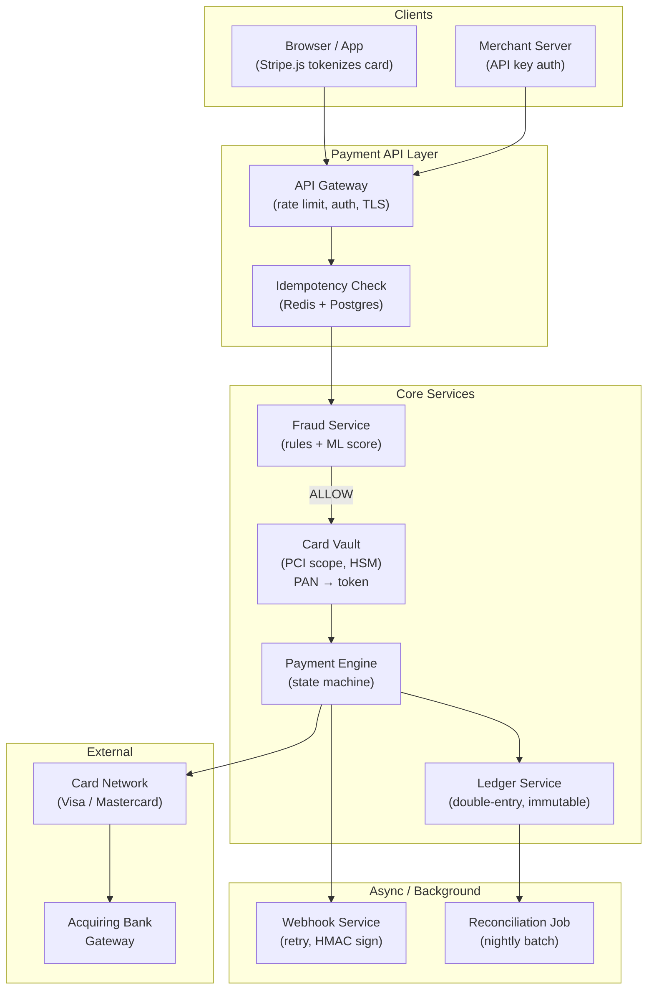
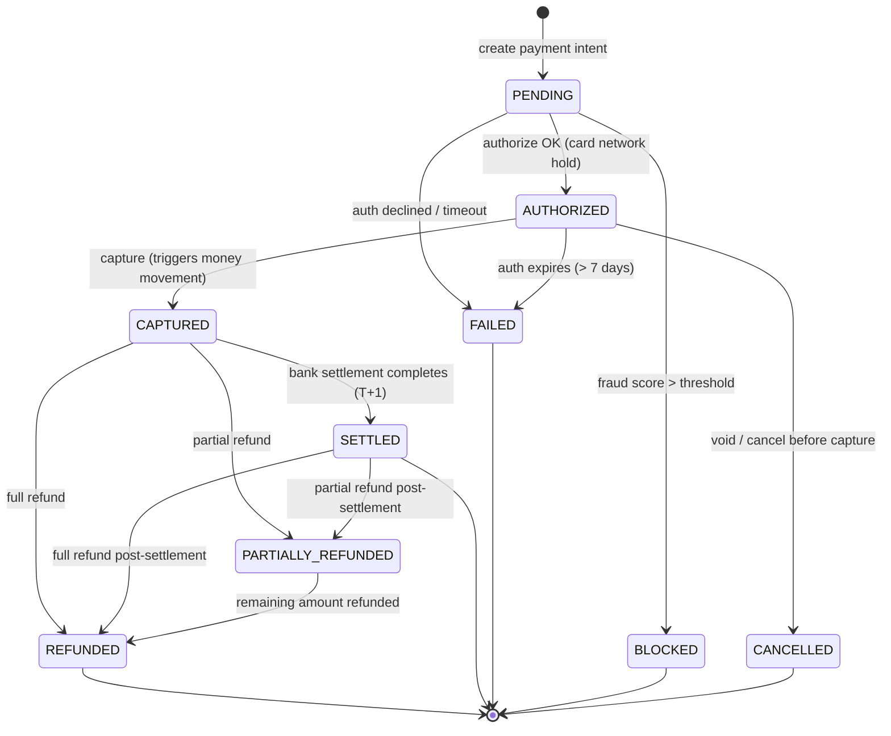
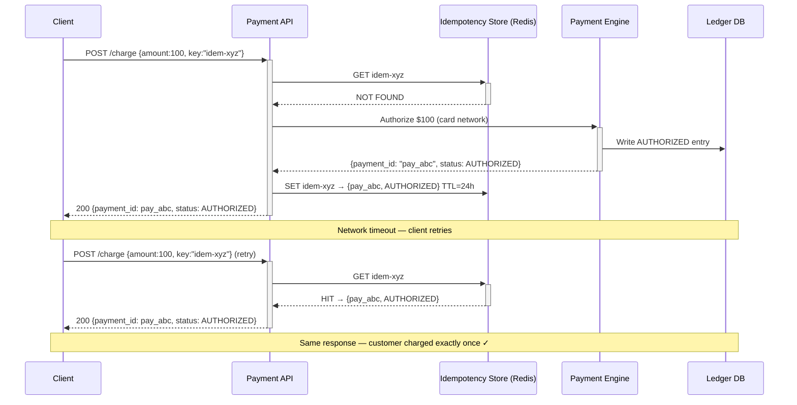
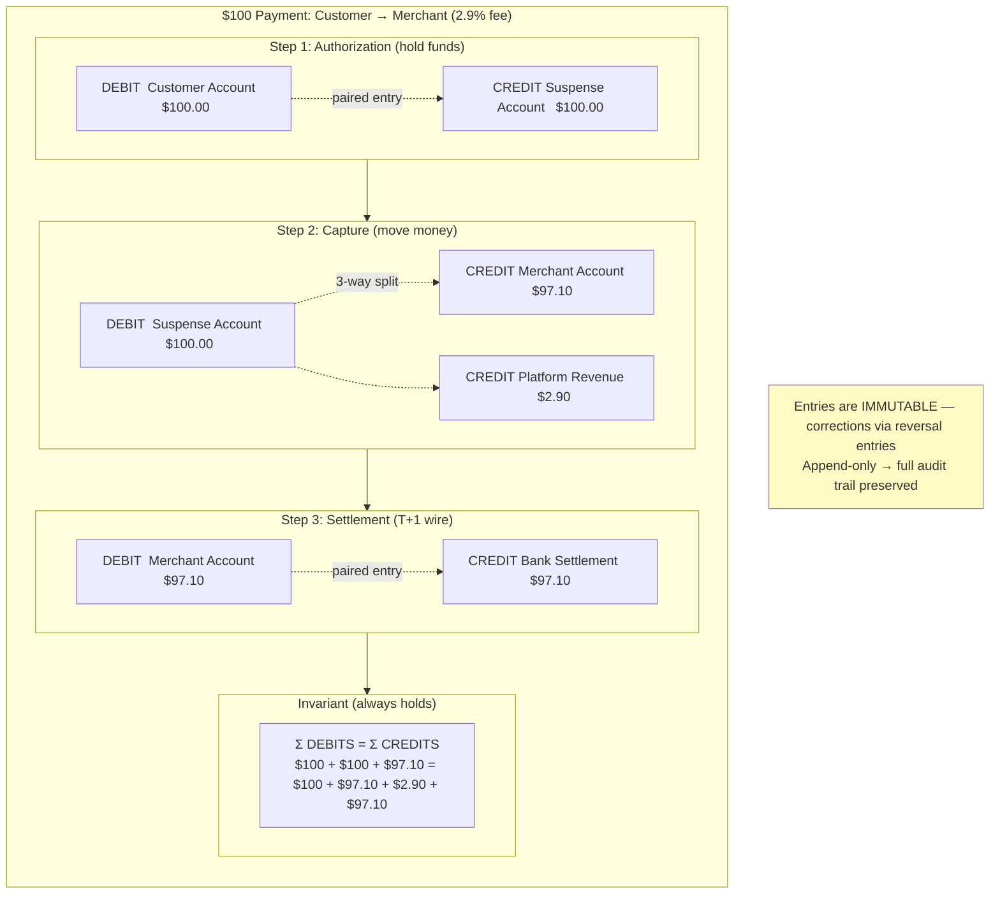
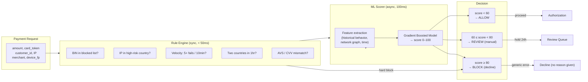
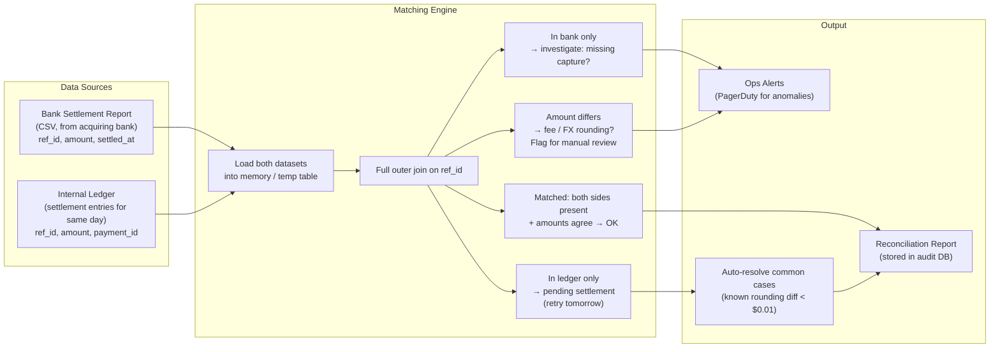

# Payment Processing — Architecture Diagrams

---

## 1. High-Level System Architecture



---

## 2. Payment State Machine



---

## 3. Idempotency — Prevent Double Charge



---

## 4. Double-Entry Ledger



---

## 5. Fraud Detection Pipeline



---

## 6. Webhook Delivery with Retry

```mermaid
sequenceDiagram
    participant PE  as Payment Engine
    participant WDB as Webhook DB
    participant WW  as Webhook Worker
    participant M   as Merchant URL

    PE->>WDB: INSERT webhook_event {id, payload, status=PENDING}
    Note over PE,WDB: Write-first — event survives worker crash

    WW->>WDB: Poll PENDING events
    WDB-->>WW: webhook_event {id, payload, merchant_url}

    WW->>WW: Sign payload: HMAC-SHA256(payload, merchant_secret)
    WW->>+M: POST /webhook {payload, X-Signature: hmac}

    alt 2xx response
        M-->>-WW: 200 OK
        WW->>WDB: UPDATE status=DELIVERED, delivered_at=now
    else timeout / 5xx
        M-->>-WW: 503 / timeout
        WW->>WDB: UPDATE attempt_count++, next_retry=now+backoff
        Note over WW,WDB: Backoff: 10s → 1min → 5min → 30min → 2h → 12h → 24h
    end

    Note over WW,M: After 7 failures → status=FAILED\nMerchant alerted; can replay from dashboard
```

---

## 7. Refund Flow

```mermaid
sequenceDiagram
    participant M   as Merchant
    participant API as Payment API
    participant PE  as Payment Engine
    participant LD  as Ledger Service
    participant NET as Card Network

    M->>+API: POST /refund {payment_id, amount:50.00, key:"ref-xyz"}

    API->>PE: Validate: amount ≤ remaining_captured?
    Note over PE: remaining = captured - already_refunded\n$100.00 - $0 = $100.00 ≥ $50.00 ✓

    PE->>+NET: Refund request (using original auth reference)
    NET-->>-PE: Refund accepted, ref_id=REF123

    PE->>LD: Write reversal entries:
    Note over LD: DEBIT  Merchant Account  $50.00\nCREDIT Customer Account $50.00\n(fee reversal: DEBIT Revenue $1.45, CREDIT Merchant $1.45)

    PE->>PE: Update payment status → PARTIALLY_REFUNDED
    PE-->>-API: {refund_id: ref_123, status: REFUNDED, amount: 50.00}
    API-->>M: 200 OK

    Note over NET,M: Customer sees credit in 3–7 business days\n(bank processing time, not our system)
```

---

## 8. Reconciliation — Nightly Batch


