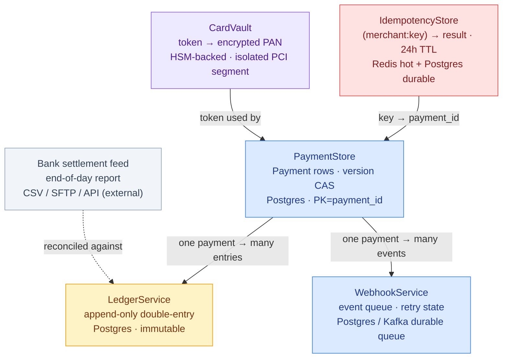
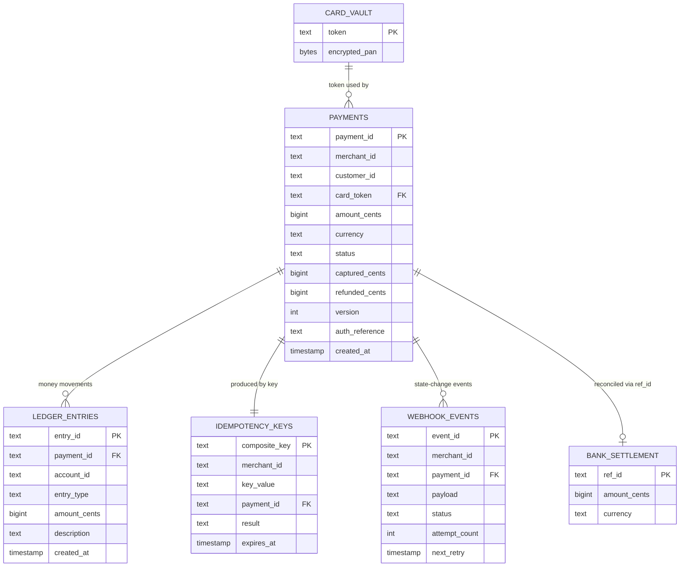

# Payment Processing — Database Design

A payment system's database has one job above all others: **never lose or duplicate money, and
always be able to prove where every cent went.** That requirement shapes every storage choice
here. The catalogue of payments lives in a strongly-consistent relational store with an
optimistic-lock column; money movements live in an **append-only double-entry ledger** that can
be replayed to reconstruct any balance; raw card numbers live behind an HSM in their own PCI
segment; idempotency keys and webhook queues get purpose-built stores. The guiding principle:
**money state is never overwritten — it is versioned, appended, and reconciled.** For the
class-level view see [LLD.md](LLD.md); for the system architecture see [HLD.md](HLD.md).

> **How to view the diagrams below:** open this file in VS Code's Markdown preview
> (`Cmd+Shift+V`). If they don't render, install the **Markdown Preview Mermaid Support**
> extension (`bierner.markdown-mermaid`). They also render automatically on GitHub.

---

## Storage technology map



| Data concern | Demo implementation | Production store | Why this store |
|---|---|---|---|
| **Payment records** | `PaymentStore._db: Dictionary<string, Payment>` | Postgres, PK = `payment_id`, `version` column | Strongly consistent; row-level CAS; one source of truth for money owed |
| **Money movements** | `LedgerService._entries: List<LedgerEntry>` | Postgres append-only table (single-writer) | Immutable audit trail; replayable to any balance; `debits == credits` invariant |
| **Idempotency keys** | `IdempotencyStore._store: Dictionary<string, IdempotencyEntry>` | Redis (hot path) + Postgres (durable fallback), 24h TTL | O(1) retry lookup before any side effect; bounded "same request" window |
| **Card numbers (PAN)** | `CardVault._tokenToPan: Dictionary<string, string>` | HSM-encrypted store in an isolated PCI segment | Shrinks PCI scope to one component; leak yields useless tokens |
| **Webhook events** | `WebhookService._events: List<WebhookEvent>` | Postgres / Kafka durable queue with retry columns | Persist-then-deliver; survives crashes; drives backoff schedule |
| **Bank settlement** | `List<BankSettlementRecord>` passed to `Run()` | External CSV / SFTP / API feed (read-only) | The independent "what actually moved" truth for reconciliation |

---

## Entity schemas

### `payments` — source of truth for money owed (Postgres, PK = payment_id)

| Column | Type | Notes |
|---|---|---|
| `payment_id` | text | **Primary key** — `pay_` + 8 hex chars |
| `merchant_id` | text | Owning merchant; access control + payout target |
| `customer_id` | text | Payer; ledger account `customer:{id}` |
| `card_token` | text | **Vault token, never the raw PAN** |
| `amount_cents` | bigint | Authorized ceiling; capture/refund move within it |
| `currency` | text | ISO 4217 |
| `status` | text (enum) | 9-state lifecycle (see below); every transition is status-guarded |
| `captured_cents` | bigint | Tracked separately so partial capture composes |
| `refunded_cents` | bigint | Cumulative; `Refunded` once it reaches `captured_cents` |
| `version` | int | **Optimistic lock** — `UPDATE … WHERE version = ?` |
| `auth_reference` | text | Bank's hold id; reused by capture + refund |
| `created_at` | timestamp | |

> **Derived (not stored):** `remaining_refundable = captured_cents − refunded_cents` — the guard
> checked before every refund so a balance can never go negative.

### `ledger_entries` — append-only double-entry money log (Postgres, immutable)

| Column | Type | Notes |
|---|---|---|
| `entry_id` | text | **Primary key** — 8 hex chars |
| `payment_id` | text | **FK** → `payments`; groups all entries for one charge |
| `account_id` | text | Chart-of-accounts key (see below) |
| `entry_type` | text | `DEBIT` or `CREDIT` |
| `amount_cents` | bigint | Always positive; direction comes from `entry_type` |
| `description` | text | Human-readable reason, for audit |
| `created_at` | timestamp | Insertion order = replay order |

> **Never updated or deleted.** A correction is a new offsetting entry. Across the whole table,
> `Σ DEBIT == Σ CREDIT` at all times (`IsBalanced()`).

### `idempotency_keys` — dedupe cache (Redis + Postgres, 24h TTL)

| Column | Type | Notes |
|---|---|---|
| `merchant_id` + `key` | text | **Composite primary key** — `merchant_id:key`; merchant-scoped so keys can't collide |
| `payment_id` | text | **FK** → `payments`; returned on a repeat |
| `result` | text | `AUTHORIZED` / `BLOCKED` / `FAILED` |
| `expires_at` | timestamp | 24h TTL; expired entry is treated as absent |

### `webhook_events` — at-least-once delivery queue (Postgres / Kafka)

| Column | Type | Notes |
|---|---|---|
| `event_id` | text | **Primary key** — `evt_` + 8 hex; merchant dedupes on this |
| `merchant_id` | text | Delivery target + HMAC secret lookup |
| `merchant_url` | text | POST destination |
| `payload` | text | JSON body, e.g. `{"event":"payment.authorized",...}` |
| `status` | text | `PENDING` / `DELIVERED` / `FAILED` |
| `attempt_count` | int | Drives the backoff index; caps at 7 |
| `next_retry` | timestamp? | Due time; null once `DELIVERED`/`FAILED` |
| `created_at` | timestamp | |

### `card_vault` — isolated PCI segment (HSM-backed)

| Column | Type | Notes |
|---|---|---|
| `token` | text | **Primary key** — `tok_` + 16 hex; opaque, carries no PAN info |
| `encrypted_pan` | bytes | AES-256 under HSM-managed key; never logged; quarterly rotation |

---

## The chart of accounts (why double-entry)

The ledger's `account_id` values form a **chart of accounts**. Every operation moves money
between them, and the balanced set of entries is what guarantees money is conserved:

| Account | Meaning | Balance sign |
|---|---|---|
| `customer:{id}` | What the customer owes / is owed | DEBIT on charge, CREDIT on refund |
| `suspense` | Temporary hold between authorize and capture | CREDIT on auth, DEBIT on capture |
| `merchant:{id}` | Merchant's earned balance | CREDIT (net) on capture, DEBIT on settle |
| `platform:revenue` | Platform's fee income (2.9%) | CREDIT on capture, DEBIT on refund |
| `bank:settlement` | Money wired out to the bank | CREDIT on settle (the reconciliation anchor) |

```
Lifecycle of a $100 charge (fee 2.9% = $2.90), as balanced ledger entries:

  AUTHORIZE   DEBIT  customer:c   10000   │  CREDIT suspense          10000   ✓ balanced
  CAPTURE     DEBIT  suspense     10000   │  CREDIT merchant:m         9710
                                          │  CREDIT platform:revenue    290   ✓ balanced
  SETTLE      DEBIT  merchant:m    9710   │  CREDIT bank:settlement    9710   ✓ balanced
  REFUND $50  DEBIT  merchant:m    5000   │  CREDIT customer:c          5000
              DEBIT  platform:rev   145   │  CREDIT merchant:m           145   ✓ balanced (fee reversed)

  GetBalance(account) = Σ CREDIT − Σ DEBIT for that account.
  IsBalanced() = (Σ all DEBIT == Σ all CREDIT) — the global canary.
```

---

## ER diagram



> **Note on referential integrity:** these links are *logical*. `card_vault` sits in an isolated
> PCI segment (a separate database entirely); `bank_settlement` is an external read-only feed
> matched by `ref_id = payment_id`; `idempotency_keys` lives in Redis with a Postgres fallback.
> The application joins these on shared ids — they are not enforced cross-database foreign keys.

---

## Key access patterns → which store answers

| Query | Store | Cost |
|---|---|---|
| "Is this a retry? return the cached result" | `idempotency_keys` TryGet(merchant:key) | O(1) Redis lookup |
| "Load a payment to capture / refund" | `payments` Get(payment_id) | O(1) PK read |
| "Commit a state change without double-spend" | `payments` Update WHERE version=? | O(1) CAS |
| "All ledger lines for one charge (audit)" | `ledger_entries` WHERE payment_id | index scan |
| "Balance of one account" | `ledger_entries` Σ credits − Σ debits WHERE account_id | aggregate |
| "Is the whole ledger balanced?" | `ledger_entries` Σ DEBIT vs Σ CREDIT | full aggregate (canary) |
| "Token → PAN for authorization" | `card_vault` Detokenize(token) | O(1), isolated segment |
| "Events due for delivery now" | `webhook_events` WHERE status=PENDING AND next_retry≤now | index scan |
| "Settled payments vs bank report" | `ledger_entries` (bank:settlement) ⋈ `bank_settlement` | two-pass dict match |

---

## Key design decisions

- **Money state is versioned, never overwritten (optimistic concurrency).** `payments.version`
  is an optimistic-lock column: every transition reads it, mutates, bumps it, and the write
  commits only via `UPDATE … WHERE version = ?`. Two concurrent captures can't both succeed — the
  affected-row count is the compare-and-swap. No held locks across the slow bank call, no
  deadlocks, no double-spend.

- **Append-only double-entry ledger, not a mutable balance column.** Storing a single
  `balance` field and mutating it would destroy history and make audit impossible. Instead every
  movement is a balanced set of immutable entries; a balance is *derived* by replaying entries
  (`Σ credit − Σ debit`). Corrections are new offsetting entries. `IsBalanced()` over the whole
  table is the canary that catches any lopsided post before money is lost.

- **Separate `captured_cents` / `refunded_cents`, never overwrite `amount_cents`.** Partial
  captures and multiple partial refunds must compose without losing history. Keeping the three
  amounts independent lets status be *derived* (`PartiallyRefunded` until `refunded_cents` reaches
  `captured_cents`) and lets `remaining_refundable` guard every refund against going negative.

- **Idempotency keyed by `(merchant_id, key)` with a 24h TTL.** The key is merchant-chosen and
  human-readable (`order-1001`), so scoping it by merchant prevents cross-merchant collisions. The
  24h TTL (Stripe's convention) bounds how long a key means "the same request" — after that the
  same string is a genuinely new charge. Redis serves the hot retry path; Postgres is the durable
  fallback so a Redis flush can't cause a double-charge.

- **Card numbers in their own HSM-backed PCI segment.** `card_vault` is a *separate database* from
  `payments` — the only place a PAN exists, encrypted under an HSM key, accessed once per charge
  (`Detokenize` during authorize), never logged. Every other table stores only the opaque token.
  A breach of the main payment database yields tokens that are useless without the vault. This is
  the highest-leverage schema decision for compliance and blast-radius reduction.

- **Webhook queue carries its own retry state.** `attempt_count` + `next_retry` columns drive the
  exponential backoff (10s → 24h over 7 attempts) directly from the row, so the delivery worker is
  stateless — it just queries `status=PENDING AND next_retry≤now`. Persisting the event before any
  HTTP guarantees at-least-once delivery; `event_id` is the merchant's dedupe key.

- **Bank settlement is an external feed, reconciled out-of-band.** The bank's report is read-only
  and matched against `ledger_entries` (the `bank:settlement` credits) by `ref_id = payment_id`.
  Three discrepancy classes fall out of comparing two keyed sets: `IN_LEDGER_ONLY` (timing),
  `IN_BANK_ONLY` (investigate), `MISMATCH` (fee/FX drift). Keeping it separate means the safety net
  has no dependency on the live transaction path.

---

## Capacity sketch

| Metric | Estimate |
|---|---|
| `payments` row size | a few hundred bytes; PK lookup O(1) |
| Ledger entries per charge | 2 (auth) + 3 (capture) + 2 (settle) + 4 (refund) — all balanced |
| Ledger growth | append-only, O(total money movements); never deleted (partitioned by month in prod) |
| Optimistic-lock contention | only on concurrent ops against the *same* payment_id |
| Idempotency TTL | 24h; entry treated as absent past `expires_at` |
| Idempotency read | O(1) Redis (hot) → Postgres fallback on miss |
| Vault access | O(1); exactly one `Detokenize` per charge, in an isolated segment |
| Webhook backoff | 10s → 1m → 5m → 30m → 2h → 12h → 24h; 7 attempts (~3 days) then FAILED |
| Reconciliation | nightly; O(settlements + bank rows) two-pass dictionary match |
| Balance query | `Σ credit − Σ debit` over an account's entries; indexed by `account_id` |
| Global balance check | full-table `Σ DEBIT vs Σ CREDIT`; the canary, run after batches |
