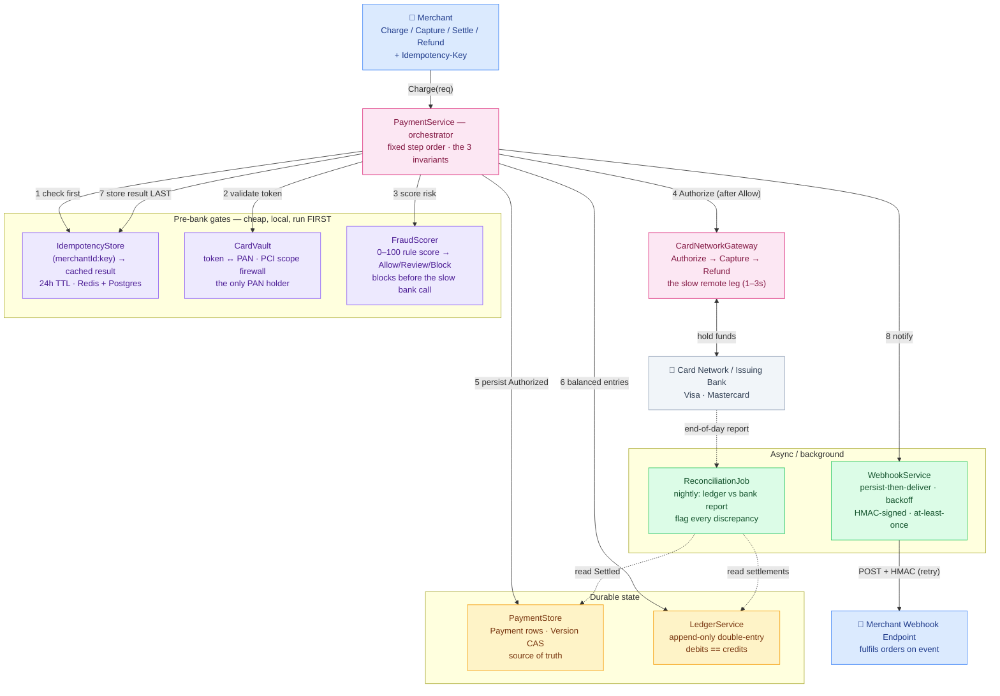
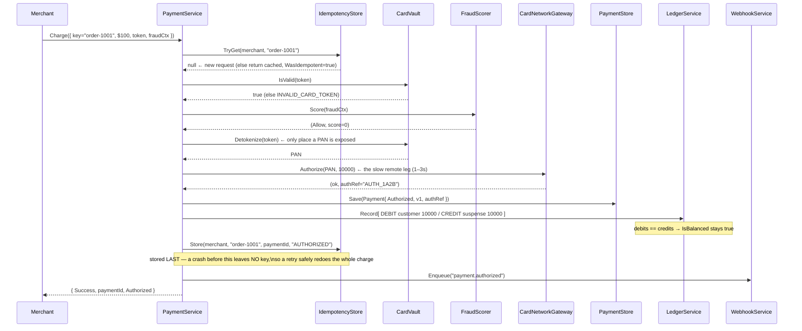
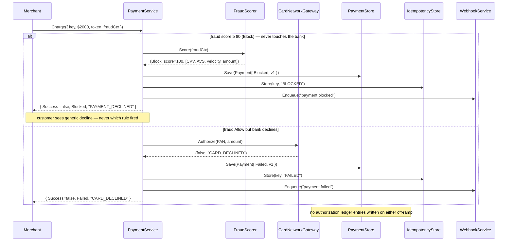

# Payment Processing — High-Level Design (System Architecture)

This is the **system-level** view: the production architecture behind a payment processor
(think Stripe, Adyen, or Braintree). The whole design exists to make one thing true — **money
is moved exactly once, and every cent is accounted for** — even when requests are retried,
run concurrently, or crash mid-flight. Three invariants enforce that promise end to end:
**idempotency** (a retry never double-charges), **optimistic locking** (concurrent captures
can't double-spend), and a **balanced double-entry ledger** (debits always equal credits).
For the class-level view see [LLD.md](LLD.md); for the storage schema see [DB_DESIGN.md](DB_DESIGN.md).

> **How to view the diagrams below:** open this file in VS Code's Markdown preview
> (`Cmd+Shift+V`). If they don't render, install the **Markdown Preview Mermaid Support**
> extension (`bierner.markdown-mermaid`). They also render automatically on GitHub.

---

## System Architecture



---

## ① Charge — the happy path (idempotency stored LAST)



---

## ② Charge rejected — fraud Block / bank decline short-circuit



---

## ③ Capture — optimistic-lock compare-and-swap under concurrency

```mermaid
sequenceDiagram
    participant A  as Caller A
    participant B  as Caller B (race)
    participant SVC as PaymentService
    participant GW as CardNetworkGateway
    participant PAY as PaymentStore
    participant LED as LedgerService

    Note over PAY: Payment pay_X currently Authorized, Version=1

    A->>SVC: Capture(pay_X)
    B->>SVC: Capture(pay_X)   ← same instant

    SVC->>GW: Capture(authRef, amount)  [A]
    GW-->>SVC: ok
    Note over SVC: A reads expectedVersion=1; sets Captured, Version=2
    SVC->>PAY: Update(payment, expectedVersion=1)  [A]
    PAY-->>SVC: true  (db was at v1 → commit, now v2)
    SVC->>LED: Record[ DEBIT suspense 10000 / CREDIT merchant 9710 + CREDIT platform 290 ]

    Note over SVC: B also read expectedVersion=1; sets Version=2
    SVC->>PAY: Update(payment, expectedVersion=1)  [B]
    PAY-->>SVC: false  (db now at v2, not v1 → CONCURRENT_UPDATE)
    SVC-->>B: (false, "CONCURRENT_UPDATE — retry")
    Note over B,PAY: B re-reads → sees Captured already done → no double-capture
```

---

## ④ Refund — bounded by RemainingRefundable, fee reversed

```mermaid
sequenceDiagram
    participant M  as Merchant
    participant SVC as PaymentService
    participant GW as CardNetworkGateway
    participant PAY as PaymentStore
    participant LED as LedgerService

    Note over PAY: pay_X Captured $150 (CapturedCents=15000, RefundedCents=0)

    M->>SVC: Refund(pay_X, 5000)
    SVC->>SVC: guard Status in {Captured, Settled, PartiallyRefunded}
    SVC->>SVC: guard 5000 ≤ RemainingRefundable (15000) ✓
    SVC->>GW: Refund(authRef, 5000)
    GW-->>SVC: (ok, "REF_9C8D")
    SVC->>PAY: RefundedCents += 5000 → 5000; Status = PartiallyRefunded; Version++ ; Update(CAS)
    SVC->>LED: Record[ DEBIT merchant 5000 / CREDIT customer 5000,\nDEBIT platform feeRefund / CREDIT merchant feeRefund ]
    Note over LED: 4 balanced entries — return money AND reverse fee proportionally

    M->>SVC: Refund(pay_X, 5000)   ← second $50
    SVC-->>M: PartiallyRefunded (RefundedCents=10000, remaining=5000)
    M->>SVC: Refund(pay_X, 10000)  ← over-refund attempt
    SVC-->>M: REFUND_EXCEEDS_CAPTURED (10000 > 5000 remaining) — rejected, Version unchanged
```

---

## ⑤ Webhook delivery + nightly reconciliation

```mermaid
sequenceDiagram
    participant WH as WebhookService
    participant M1 as Merchant1 (up)
    participant M2 as Merchant2 (down)
    participant RECON as ReconciliationJob
    participant LED as LedgerService
    participant BANK as Bank Report

    Note over WH: ProcessDue() picks events with NextRetry ≤ now
    WH->>M1: POST payload + HMAC-SHA256 sig
    M1-->>WH: 200 → Status=DELIVERED (attempt 1)
    WH->>M2: POST payload + HMAC sig
    M2--xWH: timeout → AttemptCount=1, NextRetry = now+10s (backoff)
    Note over WH,M2: backoff 10s→1m→5m→30m→2h→12h→24h ; after 7 tries → FAILED (manual replay)

    Note over RECON: nightly, out-of-band — reads recorded state only
    RECON->>LED: AllEntries where account="bank:settlement" & CREDIT
    LED-->>RECON: { pay_X → 9710 }
    BANK-->>RECON: [ {pay_X, 9710}, {pay_unknown99, 2000} ]
    RECON->>RECON: pass 1: pay_X matches 9710 → OK
    RECON->>RECON: pass 2: pay_unknown99 has no ledger entry → IN_BANK_ONLY → INVESTIGATE
    Note over RECON: matched=1 mismatches=0 bank_only=1 ; IsBalanced() = true
```

---

## Why each component exists

| Component | Role | Maps to in code |
|-----------|------|-----------------|
| **PaymentService** | Orchestrator; runs the fixed step order that keeps all three invariants true | `PaymentService` |
| **IdempotencyStore** | Dedupe cache keyed by `(merchantId, key)`; turns unreliable retries into exactly-once | `IdempotencyStore` *(Redis + Postgres)* |
| **CardVault** | PCI scope firewall — the only component that maps a token back to a raw PAN | `CardVault` *(HSM-encrypted)* |
| **FraudScorer** | Cheap local 0–100 rule score; Blocks obvious fraud before the slow bank call | `FraudScorer` *(+ ML in prod)* |
| **CardNetworkGateway** | Boundary to Visa/Mastercard; Authorize → Capture → Refund against an `authRef` | `CardNetworkGateway` |
| **PaymentStore** | Source of truth for `Payment` rows; `Update` is a version compare-and-swap | `PaymentStore` *(relational)* |
| **LedgerService** | Append-only double-entry ledger; `IsBalanced()` guards the global invariant | `LedgerService` *(Postgres)* |
| **WebhookService** | Persist-then-deliver merchant notifications; backoff + HMAC; at-least-once | `WebhookService` |
| **ReconciliationJob** | Nightly match of ledger vs bank report; flags every discrepancy | `ReconciliationJob` |
| **Payment.Version** | The optimistic-lock counter — the concurrency-control mechanism, not metadata | `Payment.Version` |
| **RemainingRefundable** | `CapturedCents − RefundedCents`; the guard that keeps refunds from exceeding capture | `Payment.RemainingRefundable` |
| **PaymentStatus** | 9-state lifecycle gate; every transition is guarded by the current status | `PaymentStatus` enum |
| **FraudDecision** | Allow / Review / Block bucket from the risk score | `FraudDecision` enum |

---

## Key HLD design decisions

- **Idempotency key stored LAST, never first (crash-safe exactly-once).** The charge flow checks
  the idempotency key before any side effect, but *stores* the result only after the payment,
  ledger, and authorization are all committed. If the key were stored early and the process
  crashed mid-flight, a retry would get "already done" for a charge that never finished — a lost
  payment. Storing it last means a crash leaves no key, so the retry safely redoes the entire
  charge. Exactly-once is an *ordering* property, not a single component.

- **Fraud scoring runs before the bank call (cheap gate before slow leg).** `FraudScorer` is
  local, deterministic, and microsecond-fast; `CardNetworkGateway.Authorize` is a 1–3 second
  remote round-trip. Scoring first means obvious fraud (`Block`, score ≥ 80) is rejected without
  ever contacting the bank — saving latency, network fees, and the issuer's fraud-rate metrics
  (too many declined auths gets a merchant flagged). The hard rules are the fast floor; an ML
  model handles the 60–79 gray zone in production.

- **Optimistic locking instead of pessimistic locks (throughput under contention).** Two
  concurrent captures of one authorization would double-spend if both committed. Rather than lock
  the row (which serialises all access and risks deadlocks across the slow bank call),
  `PaymentStore.Update` is a compare-and-swap on `Version`: the winner commits, the loser gets
  `CONCURRENT_UPDATE` and retries against fresh state. In production this is literally
  `UPDATE … WHERE version = ?` — the affected-row count *is* the CAS. No held locks, no deadlocks.

- **Double-entry append-only ledger (auditability + a built-in canary).** Every money movement is
  a set of entries whose debits equal its credits; nothing is ever updated or deleted — a
  correction is a new offsetting entry. This gives auditors a replayable, permanent trail (the
  reason banks work this way), and `IsBalanced()` turns the global "debits == credits" invariant
  into a canary that flips false the instant any future bug posts a lopsided set — *before* money
  is actually lost.

- **Tokenisation isolates PCI scope to one component (blast-radius reduction).** Raw card numbers
  put any system that touches them under the full weight of PCI DSS. `CardVault` is the only class
  that ever holds a PAN or reverses a token; everything else — `Payment`, requests, ledger, logs —
  carries only an opaque `tok_…`. If the main database leaks, the attacker gets useless tokens.
  Shrinking the sensitive surface to one tightly-controlled, audit-logged, HSM-backed component is
  the single highest-leverage security decision in the system.

- **Separate money fields, never overwrite (partial capture/refund compose).** `AmountCents`,
  `CapturedCents`, and `RefundedCents` are tracked independently so a partial capture and multiple
  partial refunds compose without losing history. Status is *derived* — `PartiallyRefunded` until
  cumulative refunds reach the captured amount, then `Refunded`. Refunds post offsetting ledger
  entries rather than mutating the capture, preserving the audit trail.

- **Persist-then-deliver webhooks with at-least-once + HMAC (no lost events, no forgeries).**
  `Enqueue` persists the event as `PENDING` *before* any HTTP, so a crash can never silently drop
  a notification — only delay or duplicate it (merchants dedupe on `EventId`). Exponential backoff
  (10s → 24h over 7 attempts) rides out transient outages without hammering a down endpoint, and
  HMAC-SHA256 signing proves authenticity so a forged `payment.captured` can't trick a merchant
  into shipping an unpaid order.

- **Nightly reconciliation as an independent safety net (trust, but verify).** The ledger records
  what we *think* moved; the bank's settlement report records what *actually* moved. They drift —
  dropped captures, duplicates, FX rounding. `ReconciliationJob` reads recorded state out-of-band
  (no service logic) and classifies every mismatch: `IN_LEDGER_ONLY` (usually benign timing),
  `IN_BANK_ONLY` (always investigate), `MISMATCH` (fee/FX drift). This catches the errors that slip
  past every in-line guard.

---

## Consistency and correctness positioning

```
Different data, different consistency needs:

  PaymentStore (Payment rows)   → strongly consistent, linearisable per row
     Money state cannot be eventually consistent. Version CAS guarantees a single
     winner for every transition; a stale read can never commit a double-spend.

  LedgerService (entries)       → strongly consistent, append-only, immutable
     The global debits==credits invariant must hold at every instant. Production: a
     single-writer Postgres ledger; corrections are new entries, never edits.

  IdempotencyStore              → read-your-write within the 24h window
     The cached result must be visible to a retry the moment the first request commits.
     Redis hot path + Postgres durable fallback; TTL bounds the "same request" window.

  WebhookService                → eventually delivered, at-least-once
     Merchants tolerate late/duplicate events (dedupe on EventId). Trading exactly-once
     delivery for guaranteed-eventually is the right call — the alternative loses events.

  ReconciliationJob             → eventually correct (out-of-band repair)
     Catches whatever slips past the in-line invariants. The last line of defence, not
     the first — runs nightly, flags for human/automated repair.

Failure-mode summary:
  crash before idempotency store → retry redoes charge (no lost/double charge)
  concurrent capture             → CAS picks one winner, loser retries
  bank declines after fraud Allow→ Payment=Failed, no ledger entries, merchant notified
  webhook endpoint down          → backoff retries up to ~3 days, then manual replay
  ledger vs bank drift           → reconciliation flags IN_BANK_ONLY / MISMATCH
```

---

## Capacity sketch

| Metric | Estimate |
|--------|----------|
| Fraud score latency | microseconds (local rule evaluation) — runs before the bank call |
| Authorize latency | 1–3 s (remote issuer round-trip) — the dominant leg of a charge |
| Idempotency TTL | 24 h (Stripe convention); after which a key is a genuinely new charge |
| Optimistic-lock retry | loser re-reads + retries; contention only on same-payment concurrent ops |
| Ledger entries per charge | 2 (authorize) + 3 (capture) + 2 (settle) + 4 (refund) — all balanced |
| Platform fee | 2.9% taken at capture; reversed proportionally on refund |
| Webhook backoff schedule | 10s → 1m → 5m → 30m → 2h → 12h → 24h; 7 attempts (~3 days) then FAILED |
| Webhook delivery guarantee | at-least-once; merchant dedupes on `EventId` |
| Reconciliation cadence | nightly; O(settlements + bank rows) two-pass dictionary match |
| PAN exposure surface | exactly one component (`CardVault`); one call (`Detokenize`) per charge |
| Refund bound | `CapturedCents − RefundedCents`; never negative, checked before the bank call |
