# Payment Processing — Low-Level Design (UML Class Diagram)

This is the **class-level** view of the Payment Processing system (a Stripe-style charge →
capture → settle → refund engine). The defining structural feature: one **orchestrator**
(`PaymentService`) wires together seven single-responsibility collaborators, and **three
invariants** — enforced across those collaborators — carry the entire design:

1. **Idempotency** — a retried charge never charges twice (`IdempotencyStore`: check first, store last).
2. **Optimistic locking** — concurrent captures/refunds can't double-spend (`PaymentStore`: version CAS).
3. **Balanced ledger** — every operation posts debits that equal its credits (`LedgerService`).

Each collaborator does exactly one thing; the orchestrator's job is to call them in the one
order that keeps all three invariants true even under retries and races. For the system-level
view see [HLD.md](HLD.md); for the storage schema see [DB_DESIGN.md](DB_DESIGN.md).

> **How to view the diagram below:** open this file in VS Code's Markdown preview
> (`Cmd+Shift+V`). If it doesn't render, install the **Markdown Preview Mermaid Support**
> extension (`bierner.markdown-mermaid`). It also renders automatically on GitHub.

---

## Class Diagram

```mermaid
classDiagram
    direction TB

    class PaymentService {
        «orchestrator»
        -IdempotencyStore _idem
        -CardVault _vault
        -FraudScorer _fraud
        -CardNetworkGateway _network
        -PaymentStore _payments
        -LedgerService _ledger
        -WebhookService _webhooks
        -double PlatformFeeRate$
        +Charge(req) ChargeResult
        +Capture(paymentId) ValueTuple~bool,string~
        +Settle(paymentId) ValueTuple~bool,string~
        +Refund(paymentId, refundCents, idempotencyKey) ValueTuple~bool,string,string~
        -CreatePayment(req, status, authRef) string
        -Notify(req, paymentId, eventName) void
    }

    class FraudScorer {
        «risk rules engine»
        -HashSet~string~ HighRiskCountries$
        +Score(ctx) ValueTuple~FraudDecision,int,List~
    }

    class CardNetworkGateway {
        «external rails boundary»
        -HashSet~string~ _declinedPans
        +Authorize(pan, amountCents) ValueTuple~bool,string,string~
        +Capture(authRef, amountCents) ValueTuple~bool,string~
        +Refund(authRef, amountCents) ValueTuple~bool,string,string~
    }

    class WebhookService {
        «at-least-once delivery»
        -List~WebhookEvent~ _events
        -Dictionary~string,string~ _merchantSecrets
        -int[] BackoffSeconds$
        +Enqueue(merchantId, url, payload) void
        +ProcessDue() void
        +GetByStatus(status) List~WebhookEvent~
        -Sign(payload, secret) string$
    }

    class ReconciliationJob {
        «nightly audit»
        -LedgerService _ledger
        -PaymentStore _payments
        +Run(bankRecords) void
    }

    class CardVault {
        «PCI scope reducer»
        -Dictionary~string,string~ _tokenToPan
        +Tokenize(pan) string
        +Detokenize(token) string
        +IsValid(token) bool
    }

    class IdempotencyStore {
        «dedupe cache»
        -Dictionary~string,IdempotencyEntry~ _store
        -TimeSpan Ttl$
        +TryGet(merchantId, key) IdempotencyEntry
        +Store(merchantId, key, paymentId, result) void
    }

    class PaymentStore {
        «source of truth + CAS»
        -Dictionary~string,Payment~ _db
        +Save(p) void
        +Get(paymentId) Payment
        +Update(updated, expectedVersion) bool
        +GetByStatus(status) List~Payment~
    }

    class LedgerService {
        «double-entry ledger»
        -List~LedgerEntry~ _entries
        +Record(paymentId, entries) void
        +IsBalanced() bool
        +GetBalance(accountId) long
        +GetPaymentEntries(paymentId) List~LedgerEntry~
        +AllEntries List~LedgerEntry~
    }

    class Payment {
        «charge record»
        +string PaymentId
        +string MerchantId
        +string CustomerId
        +string CardToken
        +long AmountCents
        +PaymentStatus Status
        +long CapturedCents
        +long RefundedCents
        +long RemainingRefundable
        +int Version
        +string AuthReference
    }

    class LedgerEntry {
        «immutable money line»
        +string EntryId
        +string PaymentId
        +string AccountId
        +string EntryType
        +long AmountCents
        +string Description
    }

    class IdempotencyEntry {
        «cached outcome»
        +string Key
        +string MerchantId
        +string Result
        +string PaymentId
        +DateTime ExpiresAt
    }

    class FraudContext {
        «scoring signals»
        +string CustomerId
        +long AmountCents
        +string Country
        +int FailedAttempts
        +bool AvsMatch
        +bool CvvMatch
        +long AvgOrderCents
    }

    class WebhookEvent {
        «queued notification»
        +string EventId
        +string MerchantId
        +string Payload
        +string Status
        +int AttemptCount
        +DateTime? NextRetry
    }

    class BankSettlementRecord {
        «bank report row»
        +string RefId
        +long AmountCents
        +string Currency
    }

    class ChargeRequest {
        «API input»
        +string IdempotencyKey
        +string MerchantId
        +string CardToken
        +long AmountCents
        +FraudContext FraudCtx
    }

    class ChargeResult {
        «API output»
        +bool Success
        +string PaymentId
        +PaymentStatus Status
        +bool WasIdempotent
    }

    class PaymentStatus {
        «enumeration»
        Pending Authorized Captured Settled
        Failed Blocked Cancelled
        Refunded PartiallyRefunded
    }

    class FraudDecision {
        «enumeration»
        Allow Review Block
    }

    %% ── Orchestrator aggregates its seven collaborators (injected) ──
    PaymentService o-- IdempotencyStore
    PaymentService o-- CardVault
    PaymentService o-- FraudScorer
    PaymentService o-- CardNetworkGateway
    PaymentService o-- PaymentStore
    PaymentService o-- LedgerService
    PaymentService o-- WebhookService

    %% ── ReconciliationJob shares two stores with the orchestrator ──
    ReconciliationJob o-- LedgerService
    ReconciliationJob o-- PaymentStore

    %% ── Stores own their records (composition) ──
    PaymentStore    *-- Payment
    LedgerService   *-- LedgerEntry
    IdempotencyStore *-- IdempotencyEntry
    WebhookService  *-- WebhookEvent

    %% ── Dependencies: consume/produce transient DTOs ──
    PaymentService ..> ChargeRequest : consumes
    PaymentService ..> ChargeResult : produces
    FraudScorer ..> FraudContext : reads
    FraudScorer ..> FraudDecision : returns
    ReconciliationJob ..> BankSettlementRecord : matches
    ChargeRequest ..> FraudContext
    Payment ..> PaymentStatus
    ChargeResult ..> PaymentStatus
```



---

## Reading the relationships

| Notation | Relationship | In this design |
|----------|--------------|----------------|
| `o--` | **Aggregation** (holds a reference, independent lifetime) | `PaymentService` is constructor-injected with all seven collaborators — it owns none of them; they are shared singletons wired up in `Program.cs`. `ReconciliationJob` shares the *same* `LedgerService` and `PaymentStore` instances the orchestrator writes to — that shared state is exactly what lets the nightly job audit what the charge flow recorded. |
| `*--` | **Composition** (owns, same lifetime) | Each store owns its records: `PaymentStore` owns the `Payment` map, `LedgerService` owns the append-only `LedgerEntry` list, `IdempotencyStore` owns its `IdempotencyEntry` map, `WebhookService` owns its `WebhookEvent` queue. The records have no life outside their store. |
| `..>` | **Dependency** (uses or creates, no stored field) | `PaymentService.Charge` consumes a `ChargeRequest` and produces a `ChargeResult` — neither is stored. `FraudScorer.Score` reads a `FraudContext` and returns a `FraudDecision`. `ReconciliationJob.Run` takes a list of `BankSettlementRecord`s to match against the ledger. |
| enum `..>` | **References an enum** | `Payment` and `ChargeResult` carry a `PaymentStatus`; `FraudScorer` returns a `FraudDecision`. |

---

## The structural story (the "why" behind the shape)

- **One orchestrator, seven single-responsibility collaborators.** `PaymentService` contains
  almost no domain data of its own — it is pure sequencing logic. Every actual capability lives
  in a focused collaborator: tokenisation in `CardVault`, risk in `FraudScorer`, the bank call in
  `CardNetworkGateway`, durability in `PaymentStore`, money-movement in `LedgerService`, dedupe in
  `IdempotencyStore`, notification in `WebhookService`. This is what makes each piece independently
  testable and the hard part — *ordering* — concentrated in one place.

- **The Charge step order is the design, and it is load-bearing.** The eight steps run in a fixed
  sequence: idempotency check → token validate → fraud score → authorize → persist payment → write
  ledger → **store idempotency LAST** → notify. Storing the idempotency key last is the subtle
  invariant: if it were stored earlier and the process crashed mid-flight, a retry would get
  "already done" for a charge that never finished. Storing it only after all side effects commit
  means a crash leaves no key, so the retry safely redoes the whole charge. The class structure
  exists to make this ordering enforceable in exactly one method.

- **`PaymentStore.Update` is a compare-and-swap, not a plain write.** Two concurrent captures of the
  same authorization would double-spend if both committed. Each caller reads `Version`, mutates,
  bumps it, and `Update` commits only if the record is still at `expectedVersion` — the loser gets
  `CONCURRENT_UPDATE` and retries against fresh state. `Payment.Version` is therefore not metadata;
  it is the concurrency-control mechanism, mirrored in production by `UPDATE … WHERE version = ?`.

- **`LedgerService` is append-only and globally self-checking.** Entries are never updated or
  deleted — a correction is a new offsetting entry. `IsBalanced()` verifies the global invariant
  (total debits == total credits) after every `Record`, acting as a canary: a lopsided post from
  any future bug flips it false *before* money is actually lost. `PaymentService` does the
  per-transaction math; `LedgerService` guards the system-wide truth.

- **`CardVault` is the PCI blast-radius firewall.** It is the *only* class that ever maps a token
  back to a raw PAN (`Detokenize`, called once, during `Authorize`). Every other class — `Payment`,
  `ChargeRequest`, the ledger, the logs — holds only the opaque token. If the main payment database
  leaks, the attacker gets tokens, useless without the vault. The narrow interface (`Tokenize` /
  `Detokenize` / `IsValid`) is the encapsulation that keeps PCI scope to one component.

- **`ReconciliationJob` shares stores rather than calling the orchestrator.** It reads the same
  `LedgerService` and `PaymentStore` the charge flow writes, and matches them against an external
  `BankSettlementRecord` feed. It depends on no service logic — just the recorded state — so "what
  we think happened" (ledger) can be checked against "what actually moved" (bank) entirely
  out-of-band. The three discrepancy classes (`IN_LEDGER_ONLY`, `IN_BANK_ONLY`, `MISMATCH`) fall
  directly out of comparing two dictionaries.

- **`WebhookService` is persist-then-deliver with backoff.** `Enqueue` persists a `WebhookEvent`
  as `PENDING` *before* any HTTP, so no notification is ever lost on a crash — only possibly
  delivered late or twice (at-least-once; merchants dedupe on `EventId`). `ProcessDue` walks the
  exponential backoff schedule (`BackoffSeconds`), and HMAC signing proves authenticity so a forged
  `payment.captured` can't trick a merchant into shipping an unpaid order.

- **Transient DTOs vs durable records.** `ChargeRequest`/`ChargeResult`/`FraudContext`/
  `BankSettlementRecord` are dependencies (`..>`) — they flow through method calls and vanish. The
  records inside stores (`Payment`/`LedgerEntry`/`IdempotencyEntry`/`WebhookEvent`) are compositions
  (`*--`) — they outlive any single call. The diagram's two arrow styles encode exactly which data
  is durable and which is in-flight.

---

## Call flow at a glance

```
CHARGE  Charge({ IdempotencyKey="order-1001", AmountCents=10000, CardToken=tok, FraudCtx }):

  PaymentService:
    1. _idem.TryGet(merchant, "order-1001")     → null (new) ; else return cached, WasIdempotent=true
    2. _vault.IsValid(tok)                       → true ; else Fail("INVALID_CARD_TOKEN")
    3. _fraud.Score(FraudCtx)                     → (Allow, 0, [])
         decision == Block → save Blocked, store idem, webhook, return PAYMENT_DECLINED
    4. pan = _vault.Detokenize(tok)
       _network.Authorize(pan, 10000)            → (true, "AUTH_1A2B", null)
         !authOk → save Failed, store idem, webhook, return decline
    5. paymentId = CreatePayment(req, Authorized, "AUTH_1A2B")   → Payment v1
    6. _ledger.Record(paymentId, [
           DEBIT  customer:c  10000  "Authorization hold",
           CREDIT suspense    10000  "Authorization hold"])      ← debits == credits
    7. _idem.Store(merchant, "order-1001", paymentId, "AUTHORIZED")   ← LAST, after side effects
    8. Notify → _webhooks.Enqueue("payment.authorized")
    return { Success=true, paymentId, Authorized }


CAPTURE  Capture(paymentId):              ← fee = 2.9% = 290 ; net = 9710

  payment = _payments.Get(paymentId)
  guard Status == Authorized              ← else INVALID_STATUS
  _network.Capture(AuthReference, amount) → ok
  expectedVersion = payment.Version (1)
  payment.Status = Captured ; CapturedCents = 10000 ; Version = 2
  _payments.Update(payment, 1)            → CAS: commits iff db still at v1, else CONCURRENT_UPDATE
  _ledger.Record([ DEBIT suspense 10000 / CREDIT merchant 9710 + CREDIT platform 290 ])
  Notify("payment.captured")


SETTLE  Settle(paymentId):
  guard Status == Captured
  payment.Status = Settled ; Version = 3 ; _payments.Update(payment, 2)
  _ledger.Record([ DEBIT merchant 9710 / CREDIT bank:settlement 9710 ])


REFUND  Refund(paymentId, 5000):
  guard Status in {Captured, Settled, PartiallyRefunded}
  guard 5000 <= payment.RemainingRefundable          ← never refund more than captured
  _network.Refund(AuthReference, 5000)   → (true, "REF_9C8D")
  payment.RefundedCents += 5000
  payment.Status = RefundedCents >= CapturedCents ? Refunded : PartiallyRefunded
  Version++ ; _payments.Update(payment, expectedVersion)
  _ledger.Record([ DEBIT merchant 5000 / CREDIT customer 5000,
                   DEBIT platform feeRefund / CREDIT merchant feeRefund ])   ← reverse fee


RECONCILE  ReconciliationJob.Run(bankRecords):     ← nightly, out-of-band
  internal = _ledger.AllEntries where account="bank:settlement" & CREDIT   → {paymentId → cents}
  bank     = bankRecords keyed by RefId
  pass 1: each internal settlement → matched | IN_LEDGER_ONLY | MISMATCH
  pass 2: each bank row with no internal match → IN_BANK_ONLY → INVESTIGATE
  print summary + _ledger.IsBalanced()
```

---

## Layer summary

```
┌──────────────────────────────────────────────────────────────────────────────┐
│  PaymentService  (orchestrator — sequencing & the three invariants)          │
│    Charge · Capture · Settle · Refund                                         │
└──┬───────┬────────┬─────────┬──────────┬───────────┬──────────┬──────────────┘
   │       │        │         │          │           │          │
   ▼       ▼        ▼         ▼          ▼           ▼          ▼
┌──────┐┌──────┐┌────────┐┌─────────┐┌──────────┐┌────────┐┌──────────┐
│Card  ││Fraud ││CardNet ││Idempot- ││Payment   ││Ledger  ││Webhook   │
│Vault ││Scorer││Gateway ││encyStore││Store     ││Service ││Service   │
│PCI   ││rules ││ext rails││dedupe   ││CAS/lock  ││balanced││at-least- │
│token ││0-100 ││Authorize││24h TTL  ││Version   ││debits= ││once +    │
│↔ PAN ││→ deci││Capture  ││         ││          ││credits ││backoff   │
│      ││sion  ││Refund   ││         ││          ││        ││          │
└──────┘└──────┘└────────┘└─────────┘└────┬─────┘└───┬────┘└──────────┘
                                          │          │
                          ReconciliationJob ◀────────┘  (shares LedgerService + PaymentStore;
                          matches ledger vs BankSettlementRecord feed, out-of-band)

  durable records (owned by stores):  Payment · LedgerEntry · IdempotencyEntry · WebhookEvent
  transient DTOs (flow through calls): ChargeRequest · ChargeResult · FraudContext · BankSettlementRecord
  enums: PaymentStatus (9-state lifecycle) · FraudDecision (Allow/Review/Block)
```
