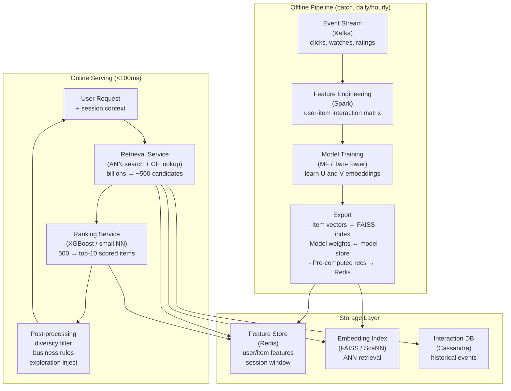
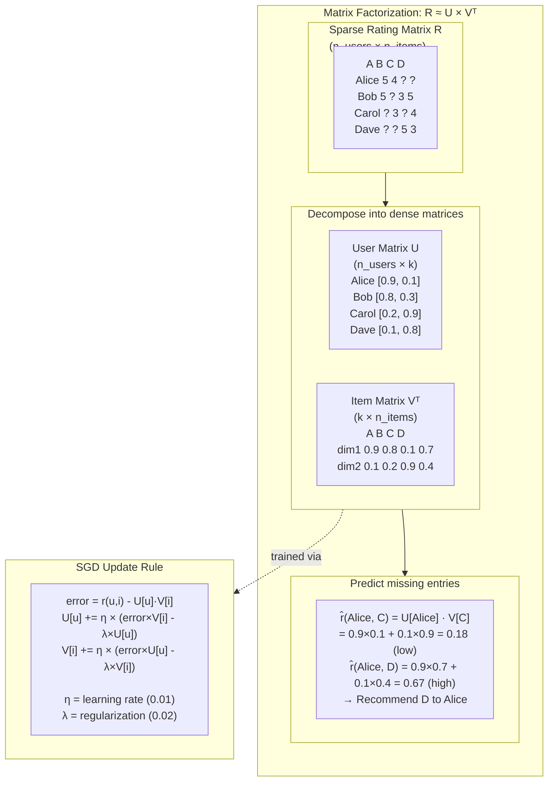
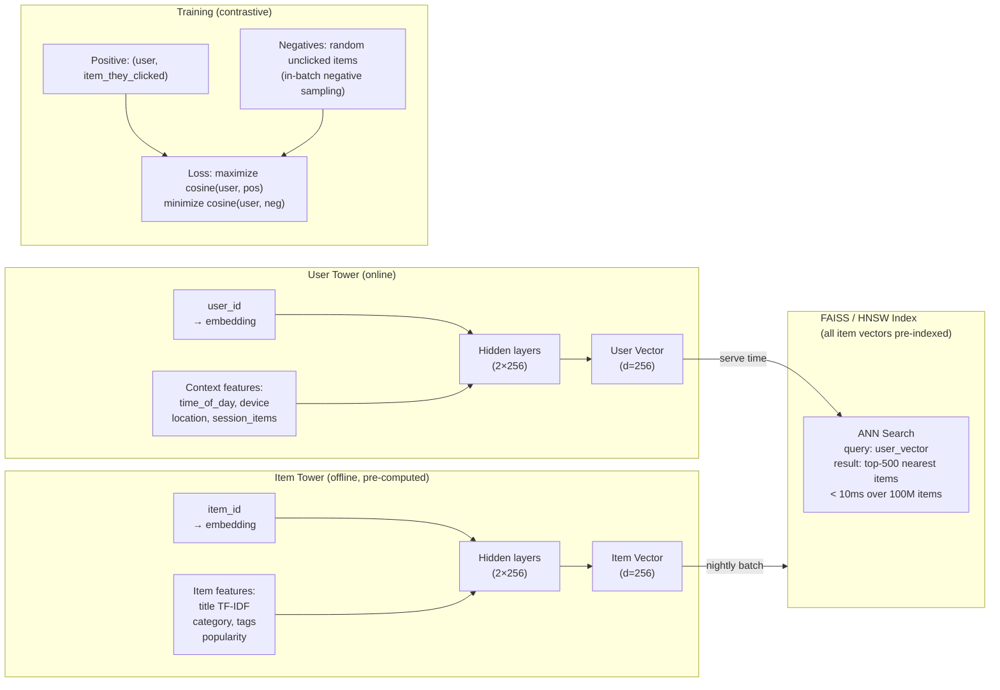
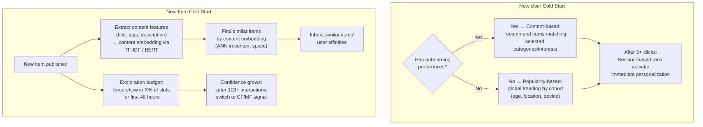
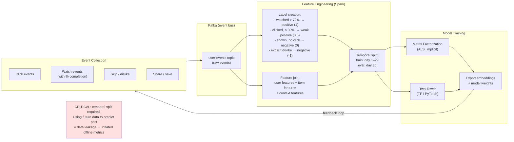
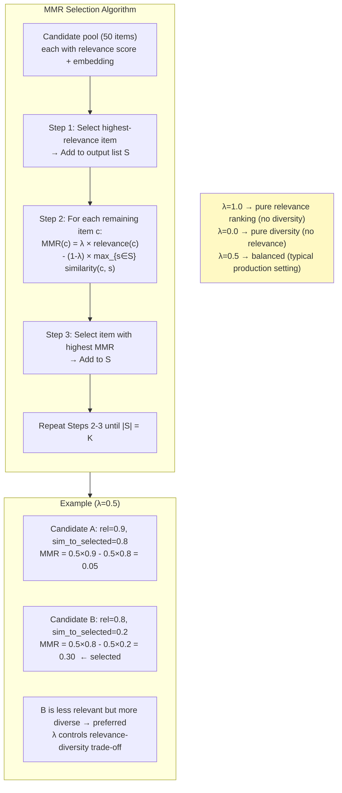

# Recommendation System — Architecture Diagrams

---

## 1. High-Level System Architecture



---

## 2. Collaborative Filtering — User vs Item Based

```mermaid
flowchart TB
    subgraph UB["User-Based CF"]
        direction LR
        UB1["Target user Alice\nrated: [A=5, B=4, C=3]"]
        UB2["Similar users:\n- Bob (sim=0.9): [A=5, B=4, D=5]\n- Carol (sim=0.7): [B=3, D=4, E=5]"]
        UB3["Unrated by Alice:\nD: 0.9×5 + 0.7×4 / (0.9+0.7) = 4.59\nE: 0.7×5 / 0.7 = 5.0"]
        UB4["Recommend E, then D"]
        UB1 --> UB2 --> UB3 --> UB4
    end

    subgraph IB["Item-Based CF (preferred)"]
        direction LR
        IB1["Alice liked: [A=5, B=4]"]
        IB2["Item similarities (pre-computed):\nsim(A, D) = 0.85\nsim(A, E) = 0.60\nsim(B, D) = 0.75\nsim(B, F) = 0.80"]
        IB3["Score D = (0.85×5 + 0.75×4) / (0.85+0.75) = 4.59\nScore F = (0.80×4) / 0.80 = 4.0\nScore E = (0.60×5) / 0.60 = 5.0"]
        IB4["Recommend E, D, F"]
        IB1 --> IB2 --> IB3 --> IB4
    end

    note["Item-based preferred:\nitem similarity is STABLE (recompute weekly)\nuser similarity changes with every new rating"]
    style note fill:#fff9c4
```



---

## 3. Matrix Factorization



---

## 4. Two-Tower Retrieval Architecture



---

## 5. Retrieval + Ranking Pipeline

```mermaid
sequenceDiagram
    participant U   as User (request)
    participant RS  as Retrieval Service
    participant RNK as Ranking Service
    participant PP  as Post-Processing
    participant FS  as Feature Store (Redis)
    participant IDX as Embedding Index (FAISS)

    U->>+RS: GET /recommendations {user_id, context}

    par ANN search
        RS->>IDX: user_vector → top-200 nearest items
        IDX-->>RS: [item_ids with similarity scores]
    and CF lookup
        RS->>FS: recent interactions of user
        FS-->>RS: item-based CF candidates (top-150)
    and trending
        RS->>FS: global trending list (top-100)
        FS-->>RS: trending items
    end

    RS->>RS: Merge + deduplicate → ~500 candidates
    RS->>-RNK: Forward 500 candidates

    RNK->>+FS: Fetch features (item freshness, CTR, user affinity)
    FS-->>-RNK: Feature vectors

    RNK->>RNK: Score each candidate:\nrelevance + freshness + engagement\n- position_bias_correction
    RNK->>-PP: Top-50 scored candidates

    PP->>PP: Diversity filter (max 2 per category)
    PP->>PP: Inject 1 exploration item (ε-greedy)
    PP->>PP: Apply business rules (promotions, blocks)

    PP->>U: Top-10 personalized recommendations
```

---

## 6. Cold Start Handling



---

## 7. Training Data Pipeline and Feedback Loop



---

## 8. Diversity — Maximal Marginal Relevance (MMR)


