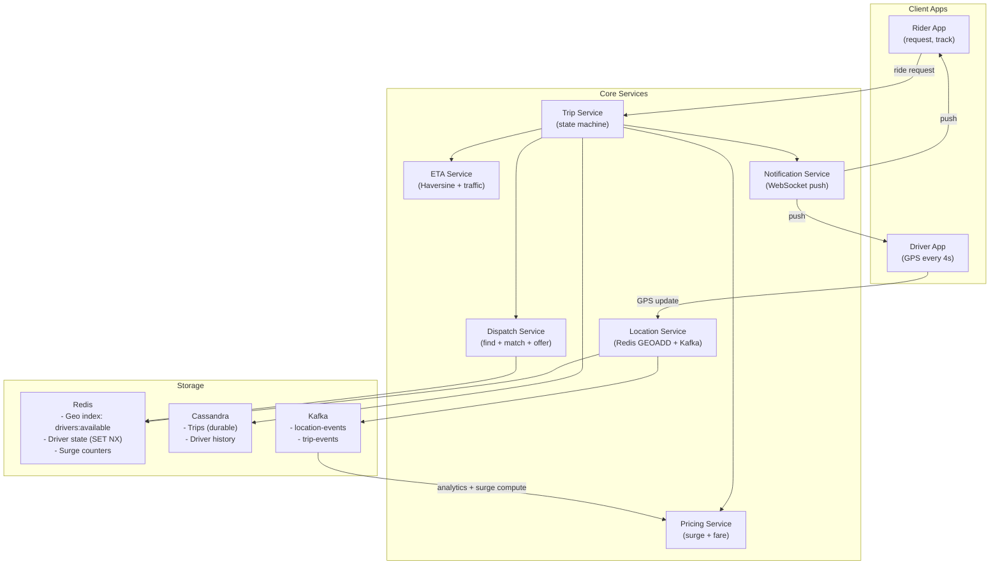
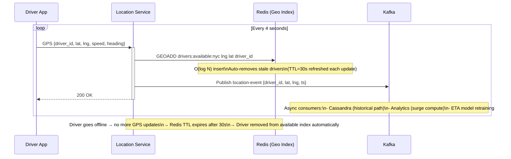
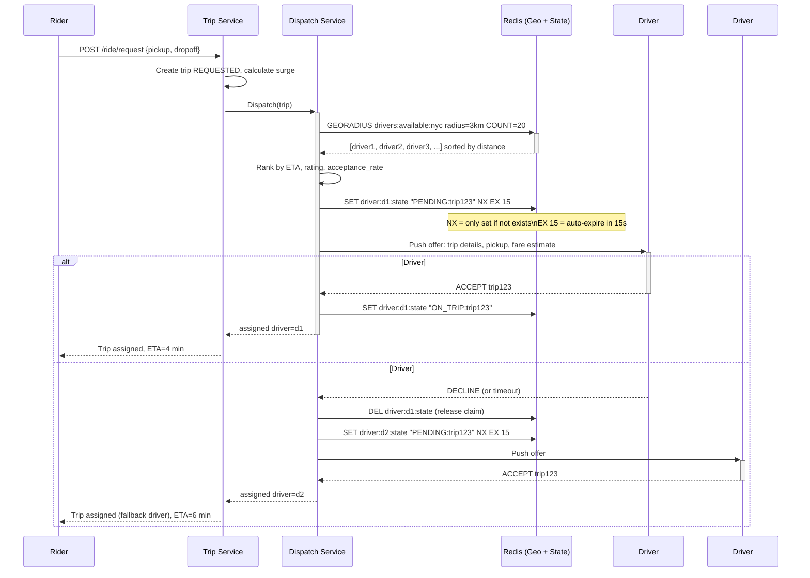
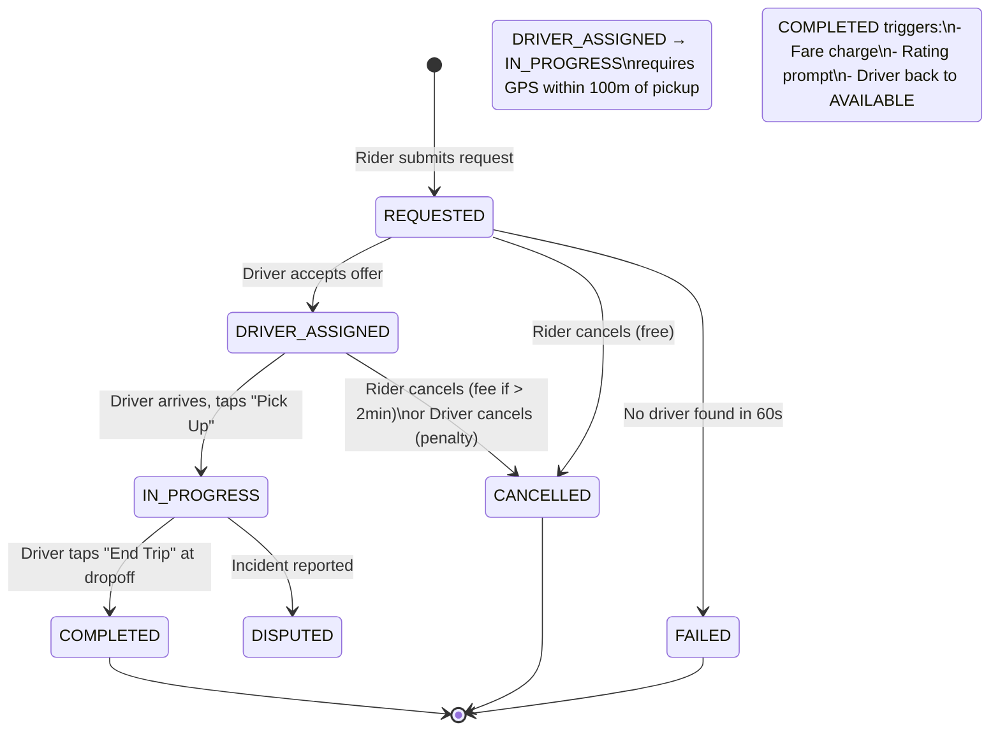
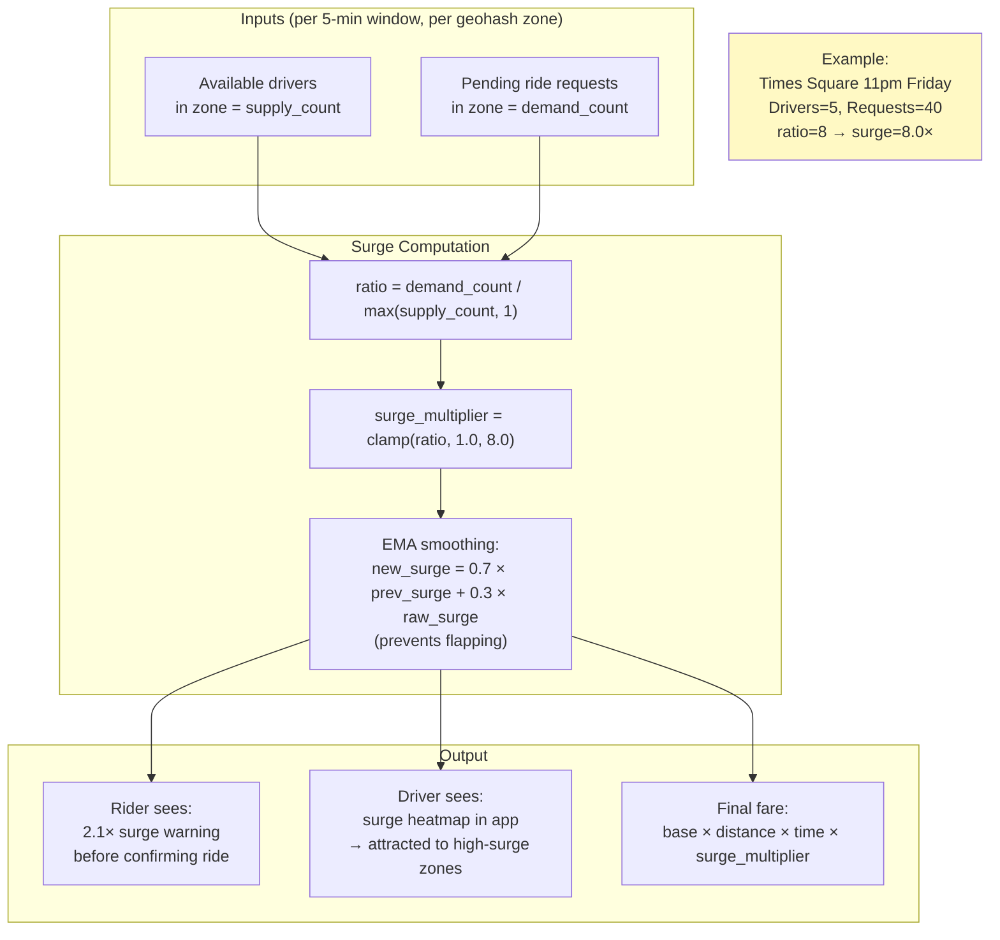
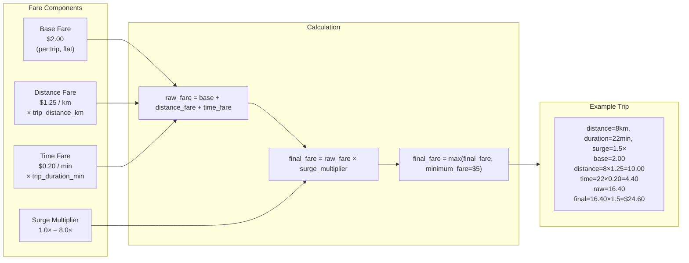
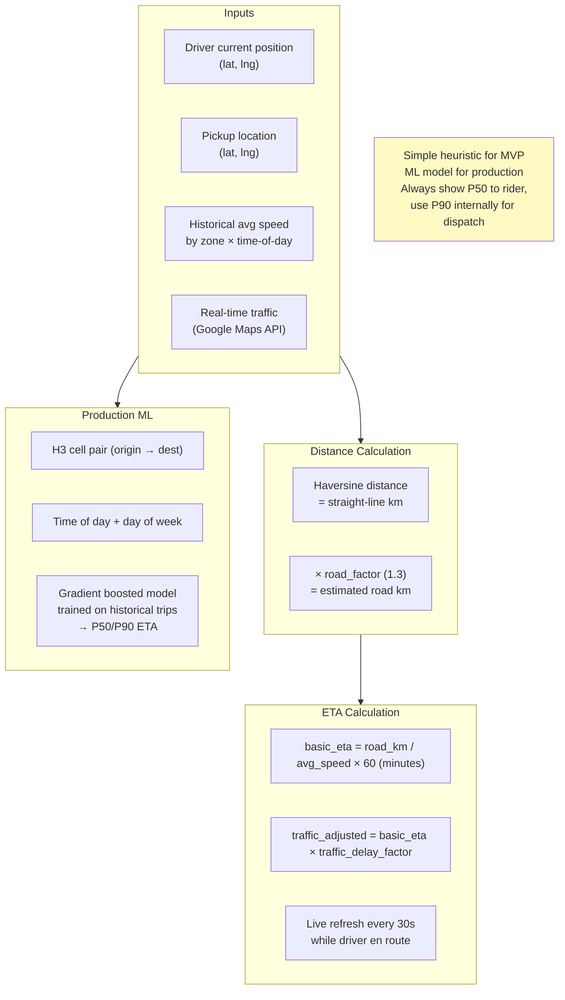
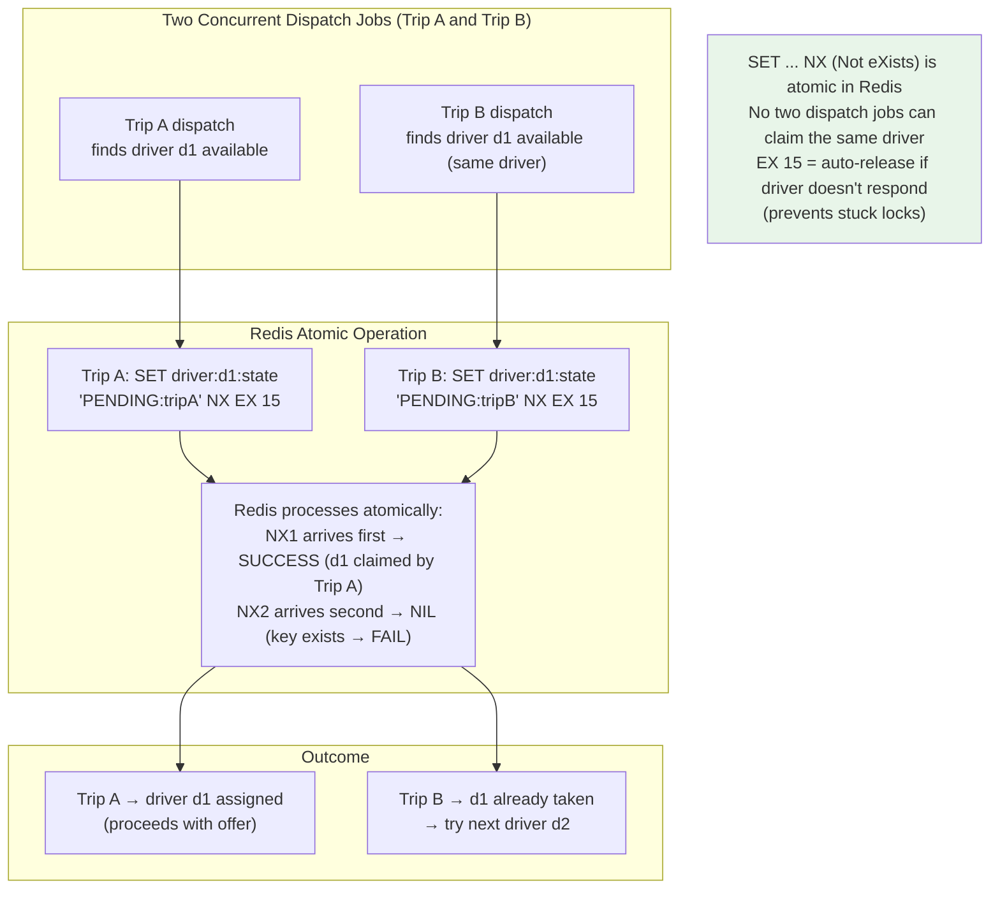

# Ridesharing Backend — Architecture Diagrams

---

## 1. High-Level System Architecture

---

## 2. Driver Location Update and Indexing

---

## 3. Trip Dispatch — Sequential Offer Flow

---

## 4. Trip State Machine

---

## 5. Surge Pricing — Supply/Demand Computation

---

## 6. Fare Calculation

---

## 7. ETA Estimation

---

## 8. Atomic Driver Assignment — Preventing Double-Booking

